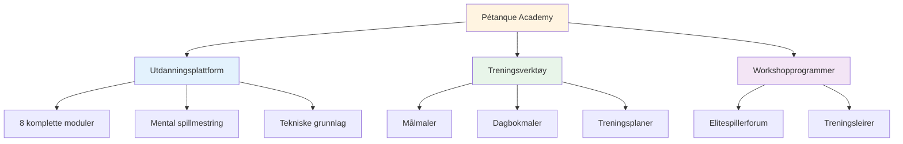
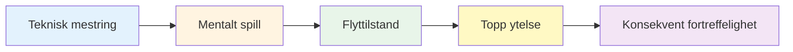

# Nyheter og oppdateringer

## Velkommen til Pétanque-akademiet

::: tip Plattformen er nå live! 🎉
**Petanque-akademiet er nå i full drift!**

Vi har lansert en omfattende plattform dedikert til å hjelpe elite-petanquespillere med å nå sitt fulle potensial gjennom mental spillmestring, strukturert trening og praktiske verktøy.
:::

## Hva er tilgjengelig nå

### 📚 Komplett utdanningsplattform

Vi har lansert **8 omfattende opplæringsmoduler** som dekker alt fra flyttilstander til ernæring:

| Modul | Hva er inni | Viktige funksjoner |
|--------|---------------|--------------|
| **[Sonen](/no/utdanning/sonen/)** | Flyttilstandsmestring | 4 detaljerte veiledninger om hvordan man starter og opprettholder flyt |
| **[Mental styrke](/no/utdanning/mental-styrke/)** | Trykkhåndtering | Rutiner før opptak, håndtering av indre kritiker |
| **[Mindfulness](/no/utdanning/mindfulness/)** | Bevissthet i nåtiden | Daglig trening, konkurranseteknikker |
| **[Goals](/no/education/goals/)** | Strategisk planlegging | SMART-mål, hierarki, sporingssystemer |
| **[Taktikk](/no/utdanning/taktikk/)** | Spillstrategi | Beslutningstaking, sannsynlighet, posisjonering |
| **[Lagspiller](/no/utdanning/lagspiller/)** | Samarbeidsevner | Kommunikasjon, tillit, teamdynamikk |
| **[Opplæring](/no/utdanning/opplæring/)** | Øvingsmetoder | Øvelser, bevisst øving, progresjon |
| **[Ernæring](/no/utdanning/ernæring/)** | Ytelsesdrivstoff | Blodsukkerhåndtering, konkurranseernæring |

### 🛠️ Praktiske verktøy

**Bruksklare maler og programmer:**

- **[Workshop](/no/workshop)** - Strukturerte 3-timers økter for mental spillutvikling
- **[Treningsleir](/no/treningsleir)** - Intensivhelgeprogrammer for elitespillere
- **[Opplæring](/no/opplæring)** - 2–3 timers øvingsrammeverk
- **[Målmal](/no/målmal)** - Komplett system for målsetting og sporing
- **[Mal for dagbok](/no/mal-for-dagbok)** - Daglig øvings- og refleksjonsdagbok

### 🎯 Teknisk veiledning

**[Teknisk rådgivning](/no/technical/)**-delen inneholder:
- Komplett guide til alle petanquekast
- Strategier for valg av bane
- Teknikker for spinnkontroll
- Rammeverk for skuddutvalg

### 🍽️ Ernæring for ytelse

**[Mat](/no/mat)** - Omfattende guide til:
- Blodsukkerkontroll for stabilt fokus
- Ernæringsstrategier før konkurranse
- Energioptimalisering for turneringer

### 📝 Artikler og innsikt

**NYTT: 14 dyptgående artikler** som dekker emner innen mentale spill:

| Kategori | Artikler |
|----------|----------|
| **Å forstå den indre kritikeren** | [Indre kritiker](/no/blogg/indre-kritiker) - Mestre din indre dialog |
| **Bygge rutiner før innspilling** | [Rutiner før fotografering](/no/blogg/rutiner-før-fotografering) - Skap konsistens |
| **Trykkhåndtering** | [Presshåndtering](/no/blogg/presshåndtering) - Prestere under stress |
| **Ytelsespsykologi** | [Flyttilstander](/no/blogg/flyttilstandsvitenskap) • [Mindfulness](/no/blogg/mindfulness-konkurranse) • [Målsetting](/no/blogg/elitemålsetting) • [Mental motstandskraft](/no/blogg/mental-motstandskraft) |
| **Teamdynamikk** | [Kommunikasjon](/no/blogg/teamkommunikasjon) • [Teamkjemi](/no/blogg/teamkjemi) • [Ledelse](/no/blogg/teamledelse) |
| **Opplæring og utvikling** | [Feil i mental trening](/no/blogg/feil i mental trening) • [Øvingsstruktur](/no/blogg/øvingsstruktur) • [Konkurranseforberedelse](/no/blogg/konkurranseforberedelse) |

➡️ **[Bla gjennom alle artikler](/no/blogg/)**

### 📖 Ressurser

**Casestudier og attester:**

- **[Casestudier](/no/casestudier)** - Ekte eksempler på elitespillere som bruker mental spilltrening
- **[Anbefalinger](/no/anbefalinger)** - Tilbakemeldinger fra spillere som har implementert disse metodene

## Vårt oppdrag

::: tip Det neste nivået
Elitespillere har allerede mestret teknikken. Det neste gjennombruddet kommer fra det **mentale spillet** – å lære å få tilgang til flyttilstander, håndtere press og prestere konsekvent på sitt beste.

**Pétanque Academy tilbyr den komplette veibeskrivelsen.**
:::

## Plattformstatistikk

::: info Det vi har bygget
- ✅ **8 utdanningsmoduler** med over 30 detaljerte guider
- ✅ **5 praktiske verktøy** klare til bruk
- ✅ **10 språk** – tilgjengelig over hele verden
- ✅ **100+ sider** med innhold på elitenivå
- ✅ **Havfruediagrammer** for visuell læring
- ✅ **Kopier-lim-maler** for umiddelbar bruk
:::

## Slik kommer du i gang

### For nye besøkende

**Start med det grunnleggende:**

1. **[Ambisjon](/no/ambisjon)** - Forstå filosofien bak eliteutvikling
2. **[Sonen](/no/utdanning/sonen/)** - Lær om flyttilstander
3. **[Målmal](/no/målmal)** – Sett dine første strukturerte mål

### For erfarne spillere

**Fordyp deg i avanserte emner:**

1. **[Mental styrke](/no/utdanning/mental-styrke/)** - Mestre pressede situasjoner
2. **[Taktikk](/no/utdanning/taktikk/)** - Forbedre strategisk beslutningstaking
3. **[Workshop](/no/workshop)** - Implementer strukturerte mentale spilløkter

### For lag

**Bygg kollektiv fortreffelighet:**

1. **[Lagspiller](/no/utdanning/lagspiller/)** - Forbedre lagdynamikken
2. **[Treningsleir](/no/treningsleir)** - Organiser helgeintensivkurs
3. **[Treningsøkt](/no/treningsøkt)** - Strukturere teamøvelser

## Hva gjør dette annerledes

::: warning Hvorfor Pétanque Academy skiller seg ut
**Mesteparten av treningen fokuserer på teknikk. Vi fokuserer på hva elitespillere faktisk trenger:**

1. **Mental spillmestring** – Den virkelige differensiatoren på høye nivåer
2. **Praktiske verktøy** – Ikke bare teori, men også ferdige maler
3. **Strukturerte programmer** - Tydelige rammer for workshops og leirer
4. **Evidensbasert** – Bygget på idrettspsykologi og forskning på flyttilstander
5. **Elitefokusert** – Utviklet for spillere som allerede mestrer det grunnleggende
:::

## Bli involvert

**Ønsker du å bidra eller gi tilbakemelding?**

Besøk siden vår **[Om](/no/about)** for å:
- Lær mer om plattformen
- Del tilbakemeldingen din
- Be om spesifikt innhold
- Ta kontakt med oss

---

::: tip Start reisen din i dag
Alt du trenger for å ta spillet ditt til neste nivå er allerede her. Velg en modul, hent en mal og begynn å implementere.

**Velkommen til Pétanque Academy – hvor elitespillere blir eksepsjonelle.**
:::

