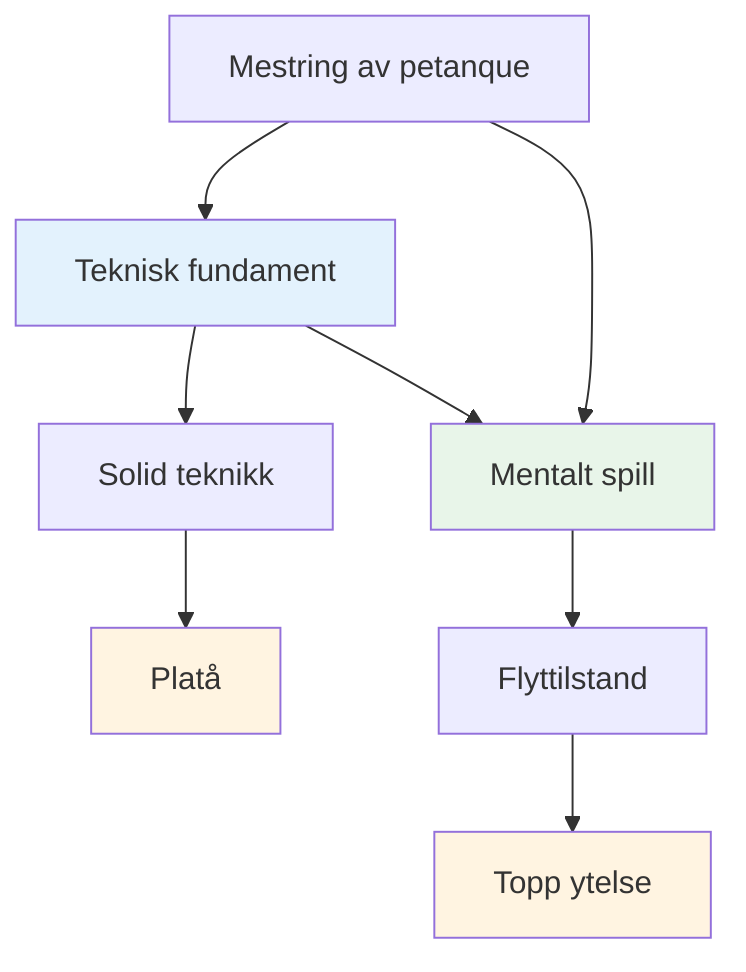
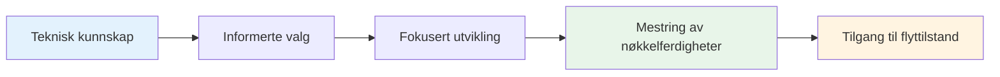

# Teknisk rådgivning
<AdBanner />

## En merknad om teknikk

Selv om vårt primære fokus er på det mentale spillet og flyttilstanden, erkjenner vi at teknikk er grunnlaget som alt annet er bygget på.

::: info Vår filosofi
**Teknikk er fundamentet, men flyt er taket.** Du trenger solid teknikk for å nå elitenivå, men mental mestring er det som tar deg videre.
:::

## Vårt perspektiv

<AdInArticle />

::: tip Du trenger ikke å mestre alt
**Du trenger ikke å mestre alle teknikkene**, men å forstå hele paletten av muligheter hjelper deg med å:

- ✅ Vit hva som er mulig
- ✅ Ta informerte valg om hva du skal utvikle
- ✅ Sette pris på spillet på et dypere nivå
- ✅ Forstå hva elitespillere kan gjøre
:::

::: info Målet
Hvis du har et teknisk fokus og ønsker å utvide repertoaret ditt, skisserer denne delen det endelige målet – den komplette paletten av kast som er tilgjengelig for en petanque-spiller.

**Husk:** Målet er ikke å mestre alt. Det handler om å ha nok teknisk grunnlag til at du kan komme inn i sonen og la kroppen velge riktig kast naturlig.
:::

## Emner

### [Palett av kast](/no/teknisk/kast)
Hva slags kast finnes det? En omfattende oversikt over de tekniske mulighetene innen petanque.

::: tip Etter teknikk, hva er det neste?
Når du har en solid teknikk, kommer den virkelige veksten fra:
- **[Sonen](/no/utdanning/sonen/)** - Tilgang til flyttilstander
- **[Mental styrke](/no/utdanning/mental-styrke/)** - Håndtering av press
- **[Opplæringsmetoder](/no/utdanning/opplæring/)** - Hvordan øve effektivt
:::

<AdBanner />
