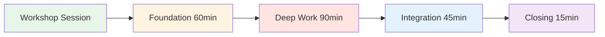
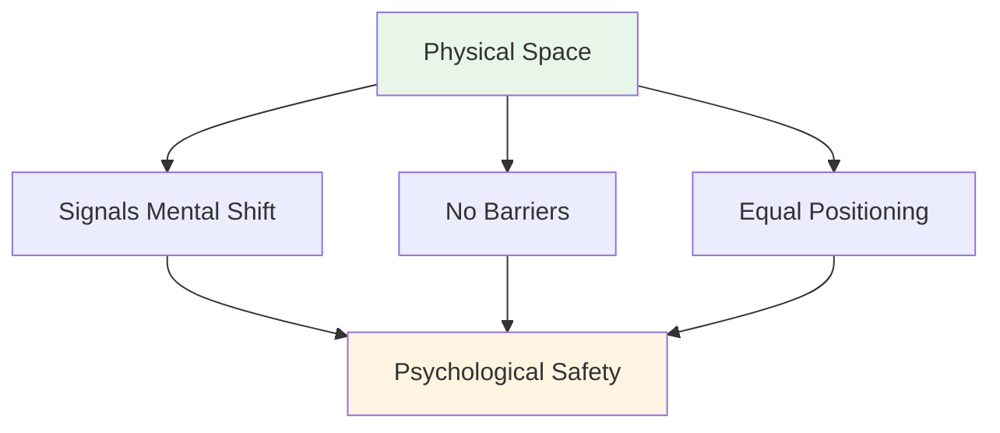
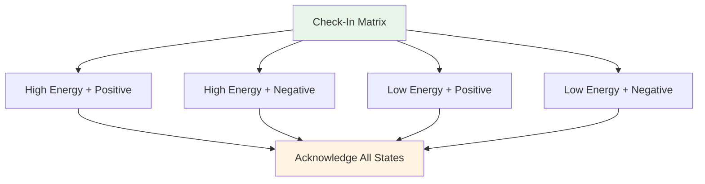
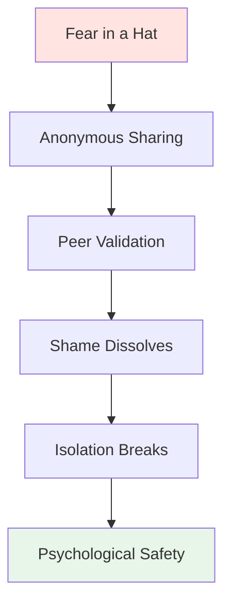

# Workshop: Teoretisk øktguide

<AdBanner />

## En omfattende veiledning for koordinatorer

Denne guiden hjelper deg med å gjennomføre en 3–4 timers teoretisk workshop med 6–8 elitespillere. Som **Mental Performance Coordinator (MPC)** vil du legge til rette for dype diskusjoner om det mentale spillet, og skape psykologisk trygghet som oversettes til ytelse i løypa.

::: warning Kritisk konsept
**Du er ikke en teknisk trener eller terapeut.** Din rolle er å legge til rette for sårbarhetsbasert læring som hjelper spillerne å forstå sammenhengen mellom deres indre tanker og deres prestasjoner.
:::

## Forberedelser før workshopen

### Koordinatorens rolle

::: info Dine ansvarsområder
- **Lede til, ikke foreles** - Du leder diskusjonen, ikke lærer bort teknikk
- **Hold rommet** - Skap og oppretthold psykologisk trygghet
- **Bro mellom teori og praksis** - Koble nettsidens innhold til indre erfaring
- **Overvåk gruppedynamikk** - Legg merke til hvem som er engasjert, hvem som er motstandsdyktig
- **Oppretthold grenser** - Vit når du skal oppsøke profesjonell hjelp
:::

### Essensielle kompetanser

| Kompetanse | Hva det betyr | Hvordan utvikle |
|------------|----------------|----------------|
| **Emosjonell intelligens** | Oppdage mikrouttrykk av ubehag | Øve aktiv observasjon |
| **Nøytral autoritet** | Skap respekt uten teknisk makt | Etabler troverdighet gjennom tilstedeværelse |
| **Sportskontekst** | Forstå trykkmekanikk | Lær petanque-terminologi og -kultur |
| **Verbal Aikido** | Innrett deg for motstand, ikke kjemp imot den | Øv på ikke-defensiv kommunikasjon |

::: details Viktige petanque-begreper du bør kjenne til
- **Carreau** - Perfekt skudd som forskyver motstanderens kule
- **Bibber** - «Jips» - ufrivillig skjelving under utløsning
- **Donnée** - Det «gitte» - å akseptere terrenget som det er
- **Portée** - Kasting uten sprett
- **Rulett** - Rullende skudd
- **Cochonnet** - Målballen (jack)
:::

## Fysisk oppsett: Den magiske sirkelen

### Krav til plassering

::: warning Kritisk oppsett
**Velg et nøytralt område UNNA løypa.** Dette signaliserer et skifte fra fysisk til mentalt arbeid.

Krav:
- ✅ Lydisolert eller privat
- ✅ Behagelig temperatur
- ✅ Ingen distraksjoner (telefonene er av)
- ✅ Naturlig lys hvis mulig
- ✅ Separat fra treningsområdet
:::

### Sirkelkonfigurasjonen

**Sitteplasser:**
- Perfekt sirkel av stoler
- **INGEN BORD** - Bord skaper barrierer og skjuler kroppsspråk
- Alle stoler i samme høyde (ingen elektriske posisjoner)
- Koordinator sitter som en del av sirkelen (ikke foran)

**Sentergjenstander:**
- Plasser boule og cochonett i midten
- Forankrer arbeidet til sporten
- Visuell påminnelse om felles formål

## Øktstruktur (3–4 timer)

### Fase 1: Grunnleggende (60 minutter)

#### 1. Velkomst og grunnregler (15 min)

**Den sosiale kontrakten:**

::: tipping av beholderen - Viktige grunnregler
Før noen deling starter, MÅ gruppen godta følgende:

1. **Konfidensialitet** – Det som blir sagt her, forblir her
2. **Vegas-regelen** - Leksjoner forlater rommet, historier blir værende
3. **Ingen fiksing** - Vær vitne til og forstå, ikke prøv å løse
4. **Rett til å passere** - Sårbarhet kan ikke tvinges frem
5. **Respekter prosessen** – Stol på ubehaget
:::

**Manuset ditt:**
&gt; «Velkommen. Dette området er annerledes enn løypa. Her utforsker vi hva som skjer *inne* når du står over det bildet. Alt som deles her er konfidensielt. Lærdommene du lærer kan forsvinne, men de personlige historiene blir værende. Dere er ikke her for å fikse hverandre – bare for å forstå. Og dere kan alltids si nei. Kan alle bli enige om dette?»

#### 2. Aktivitet: Innsjekkingsmatrisen (20 min)

**Mål:** Normalisere det å innrømme tretthet eller stress

**Materialer:** Tavle eller flippover, klistrelapper

**Prosedyre:**
1. Tegn en 2x2-matrise: Høy/lav energi (vertikal), positiv/negativ (horisontal)
2. Hver spiller skriver navnet sitt på en lapp
3. Plasser noten i sin nåværende kvadrant
4. Diskuter: «Vi har tre personer i «Lav energi/negativ». Hvordan påvirker dette økten vår i dag?»

**Tips for tilrettelegging:**
- Ikke døm noen kvadrant som «dårlig»
– Spør: «Hva trenger kroppen din akkurat nå?»
– Legg merke til mønstre: «Tre av dere er i samme rom – hva handler det om?»

#### 3. Aktivitet: Pétanque-isfjellet (25 min)

**Mål:** Visualiser skjulte indre tanker

**Materialer:** Stort papir, tusjer

**Prosedyre:**
1. Tegn et isfjell på papir
2. **Over vann:** Skriv «Teknikk, Kastet, Resultatet»
3. **Under vann:** Spør: «Hva skjer i tankene dine som ingen ser?»

**Oppfordringer:**
– «Hva er du redd for når du skal skyte?»
– «Hvilken dom er du bekymret for?»
– «Hva sier din indre stemme når du bommer?»

**Innsiktsspørsmålet:**
&gt; «Hva skjer med kastearmen din når «undervanns»-greiene blir for tunge?»

Dette knytter mental belastning til fysisk spenning (bibberen/yipsen).

::: details Vanlige svar på «under vann»
- Frykt for å skuffe laget
- Bekymre deg for å se dum ut
- Tvil om evner
- Sammenligning med andre
– Press for å bevise sin verdi
- Frykt for å bli dømt av trener/lagkamerater
- Impostorsyndrom
:::

<AdInArticle />

### Fase 2: Dyptgående arbeid (90 minutter)

#### 4. Aktivitet: Brukerhåndboken (30 min)

**Mål:** Operasjonalisere empati – hjelpe lagkamerater å forstå hverandre

**Materialer:** Arbeidsark (ett per spiller)

**Brukerhåndbokmal:**

| Seksjon | Spørsmål | Eksempel |
|---------|--------|---------|
| **Min stresssignatur** | &quot;Når jeg er engstelig,...&quot; | &quot;...blir jeg helt stille&quot; |
| **Hvordan håndtere meg** | &quot;Når jeg bommer på et avgjørende skudd, trenger jeg...&quot; | &quot;...stillhet, ikke oppmuntring&quot; |
| **Min indre tanke** | &quot;Løgnen jeg forteller meg selv er...&quot; | &quot;...at jeg ikke er god nok&quot; |
| **Min trigger** | &quot;Jeg blir defensiv når...&quot; | &quot;...noen stiller spørsmål ved slagvalget mitt&quot; |

**Prosedyre:**
1. Gi spillerne 10 minutter til å fullføre i stillhet
2. Gå rundt sirkelen – hver person deler ÉN seksjon
3. Andre kan stille oppklarende spørsmål (ikke råd!)
4. Koordinator validerer hver deling

**Tilretteleggingsmanus:**
&gt; «Dette er bruksanvisningen din. Når lagkameraten din vet at du blir stille når du er engstelig, vil de ikke ta det personlig. Når de vet at du trenger stillhet etter en bom, vil de ikke prøve å «fikse» deg. Slik bygger vi teamintelligens.»

#### 5. Koble nettsidens innhold til indre tanker (30 min)

**Mål:** Koble teknisk innhold til psykologisk erfaring

Velg 2–3 seksjoner fra akademiets nettside og utforsk det indre spillet:

**Eksempel 1: Teknikk - Grep og slipp**

**Tillitsspørsmålet:**
&gt; «Når du er på 12-12 i en turnering, *føles* hånden din som teknikkbeskrivelsen? Er det musklene som forandrer seg, eller tanken «Ikke slipp den» som endrer grepet ditt?»

**Mikroskjelvingen:**
&gt; «Hvem her føler angstens &#39;mikroskjelv&#39;? Hvilken indre tanke utløser det?»

**Eksempel 2: Taktikk - Peking vs. Skyting**

**Risikoprofil:**
&gt; «Når guiden sier «Skyt for å vinne», er reaksjonen din begeistring eller frykt? Hva forteller det deg om ditt forhold til risiko?»

**Bedrageren:**
&gt; «Peker du noen gang når du *vet* at du burde skyte, bare for å unngå å bomme? Hva koster den sikringen?»

**Eksempel 3: Ernæring - Konkurransedag**

**Trøstematfellen:**
&gt; &quot;Spiser du det kroppen din trenger eller det angsten din vil ha? Hvordan vet du forskjellen?&quot;

::: tip for tilretteleggingsteknikk
Ikke foreles om innholdet. Still spørsmål som knytter den tekniske informasjonen til deres levede erfaringer. Innsikten kommer fra DEM, ikke deg.
:::

#### 6. Aktivitet: Frykt i en hatt (30 min)

**Mål:** Bryt isolasjonssløyfen – vis at jevnaldrende deler dype usikkerheter

**Materialer:** Papir, penn, hatt/veske

**Prosedyre:**
1. Alle skriver en dyp karriere-/lagfrykt anonymt
2. Brett papirene og bland dem inn i hatten
3. Hver spiller trekker en lapp (ikke sin egen)
4. Les det høyt
5. Bekreft det: «Jeg kan forstå hvorfor noen ville føle det slik fordi...»

**Eksempel på frykt:**
– «Jeg er redd jeg har nådd toppen og aldri vil bli bedre»
– «Jeg er bekymret for at lagkameratene mine synes jeg er overvurdert»
– «Jeg er redd jeg skal kveles i det store øyeblikket»
– Jeg er redd for å bli erstattet av yngre spillere.

**Kraften:**
Når spillerne hører sin hemmelige frykt bli lest høyt og bekreftet av jevnaldrende, forsvinner skammen. De innser: «Jeg er ikke alene. Dette er normalt.»

**Koordinatorens rolle:**
- Valider ALLE frykter som legitime
- Ikke bagatellisere: «Det er ikke sant!» ugyldiggjør følelsen.
– Spør: «Hvor mange av dere har følt noe lignende?»

### Fase 3: Integrering (45 minutter)

#### 7. Aktivitet: Å omformulere den indre kritikeren (25 min)

**Mål:** Kognitiv restrukturering – endre den interne dialogen

**Materialer:** Arbeidsark

**Prosedyre:**

**Trinn 1: Identifiser kritikeren (10 min)**
&gt; «Skriv ned den EKSAKT setningen din indre kritiker sier etter en bom. Ikke den høflige versjonen – den brutale.»

Eksempler:
– «Du kveles alltid»
– «Alle ser på at du mislykkes»
– «Du gjør deg selv flau»
– «Du hører ikke hjemme her»

**Trinn 2: Omformuler som indre coach (10 min)**
&gt; «Omskriv det nå som din indre coach – bestemt, men støttende.»

Eksempler:
– Kritiker: «Du kveles alltid» → Trener: «Tilbakestill og pust. Neste skudd.»
- Kritiker: «Alle ser deg mislykkes» → Trener: «Fokuser på målet, ikke publikum»
- Kritiker: «Du gjør deg selv flau» → Trener: «Én sjanse om gangen. Du har gjort dette før.»

**Trinn 3: Partnerøving (5 min)**
&gt; «Del Coach-frasen din med en partner. De vil minne deg på den når de ser Kritikeren dukke opp.»

#### 8. Bro til løypa (20 min)

**Mål:** Lage handlingsrettede protokoller for konkurranse

**Diskusjonsspørsmål:**
1. «Hva er ÉN ting fra i dag du vil bruke i din neste konkurranse?»
2. «Hvordan vil lagkameratene dine vite at du trenger støtte?»
3. «Hva er signalet ditt for at &#39;jeg trenger en mental nullstilling&#39;?»

**Opprett teamprotokoller:**

| Situasjon | Protokoll | Eksempel |
|-----------|----------|---------|
| **Etter en bom** | Sjekk brukerhåndboken | &quot;Marc trenger stillhet, Lisa trenger en knyttnevestøt&quot; |
| **Føler press** | Bruk coachfrasen | «Tilbakestill og pust» |
| **Lagspenning** | Timeout for samtale | &quot;La oss ta 2 minutter&quot; |
| **Indre kritiker høylytt** | Fysisk tilbakestilling | Berøringsboule, dyp pust |

### Fase 4: Avslutning (15 minutter)

#### 9. Utsjekkingen (10 min)

**Prosedyre:**
Gå rundt sirkelen, hver person deler:
1. **Én ting du tar med deg:** «Hvilken innsikt eller hvilket verktøy går du ut med?»
2. **Én ting du legger bak deg:** «Hva gir du slipp på?»

**Koordinatorens rolle:**
- Takk hver enkelt person for deres bidrag
- Valider arbeidet som er utført
- Minn om taushetsplikt

#### 10. Oppfølgingsprotokoll (5 min)

::: warning Kritisk: Forhindre sårbarhet Bakrus
Dypt arbeid forårsaker en «sårbarhetsbakrus» – anger eller skam over å dele.

**Din 24-timers protokoll:**
- Send tekstmelding til alle som delte mye innen 24 timer
– Melding: «Takk for motet ditt i går. Det du delte hjalp alle.»
– Sjekk inn: «Hvordan synes du det er om økten?»
:::

**Avslutningsmanus:**
&gt; «Det som skjedde her i dag krevde mot. Du møtte opp, du åpnet deg, du stolte på prosessen. Det samme motet er det du vil ta med deg ut i løypa. Husk: lærdommene forlater dette rommet, men historiene blir værende. Takk.»

<AdInArticle />

## Håndteringsmotstand

### Den «for kule» idrettsutøveren

**Scenario:** En spiller himler med øynene over en sårbarhetsøvelse

**Strategi:** Verbal Aikido (Align og Pivot)

**Manus:**
&gt; «Jeg ser den reaksjonen, [Navn]. Ærlig talt, jeg forstår det. Å snakke om følelser føles mykt. Men løypa er ubehagelig. Hvis vi ikke takler ubehaget i dette rommet, trener vi ikke toleransen vår for ubehaget i spillet. Kan du stole på meg i 20 minutter?»

### Den stille deltakeren

**Scenario:** Noen har ikke snakket på 45 minutter

**Strategi:** Lag et inngangspunkt med lav innsats

**Manus:**
&gt; «[Navn], jeg ser at du tar alt inn. Hva er én ting som resonnerer med deg så langt? Bare et ord.»

### Overdeleren

**Scenario:** Noen dominerer med lange historier

**Strategi:** Forsiktig omdirigering

**Manus:**
&gt; «Takk for det, [Navn]. Jeg vil sørge for at alle har plass. La oss høre fra noen som ikke har delt ennå.»

### Fikseren

**Scenario:** Noen prøver å løse andres problemer

**Strategi:** Forsterk grunnreglene

**Manus:**
&gt; «Jeg setter pris på at du vil hjelpe, men husk regelen vår: vær vitne til og forstå, ikke fiks. [Originaltaler], hva trenger du akkurat nå?»

## Sjekkliste for materialer

::: details Verkstedmateriell
**Fysisk oppsett:**
- [ ] Stoler (6–8, ingen bord)
- [ ] Boule og cochonett for senter
- [ ] Flippover eller tavle
- [ ] Markører

**Aktiviteter:**
- [ ] Klistrelapper (Innsjekkingsmatrise)
- [ ] Stort papir (Isfjellaktivitet)
- [ ] Brukerhåndbok arbeidsark
- [ ] Papir og penner (Frykt i en hatt)
- [ ] Indre kritiker/coach-arbeidsark

**Logistikk:**
- [ ] Vann til deltakerne
- [ ] Vev (emosjonelt arbeid!)
- [ ] Timer (følg planen)
- [ ] Kontaktliste for deltakere (for oppfølging)
:::

## Koordinator egenomsorg

::: warning Du trenger også støtte
Å holde rom for sårbarhet er følelsesmessig krevende.

**Etter workshopen:**
- Oppsummering med en kollega eller veileder
- Skriv en loggbok om hva som skjedde med deg
- Ta en spasertur eller en fysisk pause
- Ikke ta med deg historiene deres hjem
:::

## Måling av effekt

### Umiddelbar tilbakemelding

Til slutt, spør:
1. «På en skala fra 1–10, hvor trygg følte du deg da du delte i dag?»
2. «Hva er én ting som ville gjort den neste økten bedre?»

### Langsiktig sporing

Oppfølging etter 2–4 uker:
– «Har du brukt noen verktøy fra verkstedet?»
– «Hvordan har forholdet ditt til din indre kritiker endret seg?»
– «Hva er annerledes i konkurransementaliteten din?»

## Neste steg

::: tip Bygge videre på dette fundamentet
Denne workshopen er fase 1. Vurder:
- **Oppfølgingssamtaler** (på nett eller personlig)
- **Integrering i løypa** (se veiledning for treningsøkt)
- **Lagprotokoller** (implementere brukermanualer i konkurranser)
- **Individuelle innsjekkinger** (for spillere som trenger mer støtte)
:::

<AdBanner />

