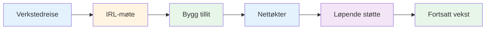
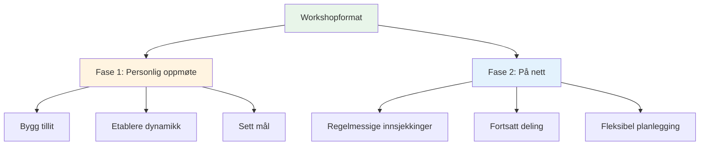
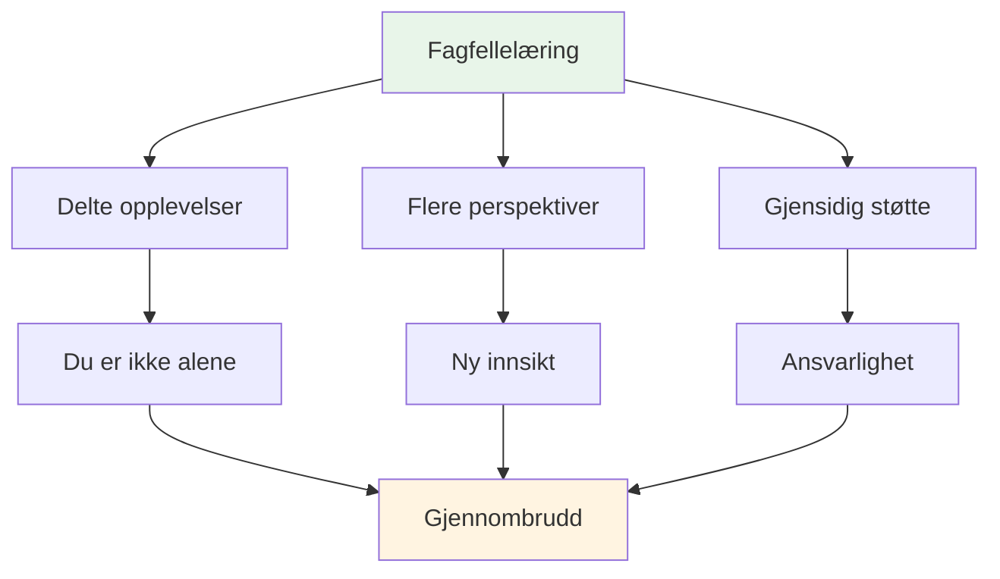

# Verksted

## Forum for elitespillere

Våre workshops er intime forum der elitespillere deler erfaringer og åpner opp for sine indre tanker om spillet, prestasjoner og mentale utfordringer.

::: tip Hva gjør verkstedene våre annerledes
**Små, kuraterte grupper av elitespillere i et trygt rom for ærlig diskusjon.** Dette er ikke et foredrag – det er en læringsopplevelse for likemenn der dere deler, lærer og vokser sammen.
:::

## Format

### Små grupper
::: info Gruppestørrelse
- **6–8 spillere** per workshop
- Nøye utvalgte grupper for optimal dynamikk
- Trygg rom for ærlig diskusjon
- Alle bidrar, alle lærer
:::

### Hybrid tilnærming

| Fase | Format | Hensikt | Fordeler |
|-------|--------|---------|----------|
| **Første møte** | Personlig (IRL) | Bygg fundament | Tillit, tilknytning, gruppedynamikk |
| **Pågående økter** | På nett | Oppretthold momentum | Regelmessig støtte, fleksibilitet, ansvarlighet |

::: details Fase 1: Møte ansikt til ansikt
**Hvorfor oppmøte først?**
- Bygg tillit og kontakt ansikt til ansikt
- Etablere gruppedynamikk og trygghet
- Sett intensjoner og mål sammen
- Skape grunnlaget for ærlig deling

**Hva skjer:**
- Introduksjoner og målsetting
- Innledende øvelser og diskusjoner
- Etablering av gruppenormer
- Bygge rapport
:::

::: details Fase 2: Nettmøter
**Hvorfor på nett for kontinuerlig bruk?**
- Regelmessige innsjekkinger uten reise
- Fortsatt deling og støtte
- Fleksibel timeplanlegging for travle spillere
- Oppretthold momentum mellom møter på stedet

**Hva skjer:**
- Fremdriftsoppdateringer og utfordringer
- Likemannsstøtte og problemløsning
- Ansvarlighetsinnsjekkinger
- Fortsatt læring og vekst
:::

## Hva du kan forvente

### Emner vi utforsker

| Område | Fokus | Resultater |
|------|-------|----------|
| **Mentalt spill** | Strømningstilstand, trykk, fokus | Konsekvent topp ytelse |
| **Personlige utfordringer** | Frykt, blokkeringer, frustrasjoner | Gjennombrudd og løsninger |
| **Felleslæring** | Delte opplevelser | Nye perspektiver og innsikter |
| **Praktiske verktøy** | Teknikker og øvelser | Umiddelbar søknad |
| **Fellesskap** | Løpende støtte | Langsiktig vekst |

::: tip Verkstedopplevelse
- 🧠 Dype diskusjoner om mentale aspekter ved spillet
- 💬 Deling av personlige erfaringer og utfordringer
- 🤝 Støtte og ansvarlighet fra likemenn
- 🛠️ Praktiske øvelser og teknikker
- 👥 Et fellesskap av spillere som er forpliktet til vekst
:::

## Hvem bør bli med?

::: info Ideelle deltakere
- **Elitespillere** som ønsker å ta neste steg
- Spillere som har **mestret teknikk**, men vil ha mer
- De som er interessert i det **mentale spillet**
- Spillere åpne for **ærlig selvrefleksjon**
- Forpliktet til **personlig vekst**
:::

::: warning Ikke en god match hvis
- Du er kun ute etter teknisk veiledning
- Du er ikke komfortabel med å dele i en gruppe
- Du er ikke villig til å være sårbar
- Du vil ha raske løsninger uten å gjøre jobben
:::

## Verdien av jevnaldrende læring

::: tip Hvorfor jevnaldrendegrupper fungerer
Elitespillere står overfor unike utfordringer som andre ikke forstår. På en workshop er du sammen med folk som **forstår** – presset, forventningene, de mentale kampene. Dette skaper et trygt rom for ekte vekst.
:::

## Klar til å bli med?

::: info Neste trinn
Workshoper annonseres i [Nyheter](/no/news/)-seksjonen vår. Følg med for kommende datoer og registreringsinformasjon.
:::

