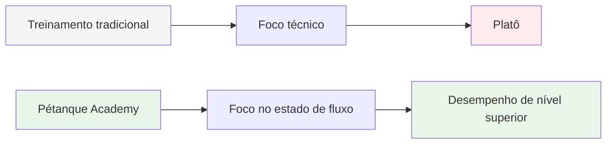
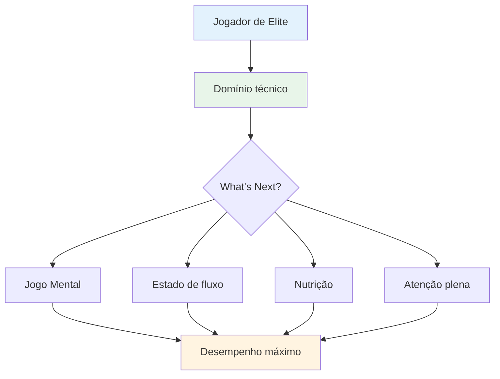

# Ambição

Nossa missão é ajudar jogadores de elite a darem o próximo passo em seu desenvolvimento.

::: tip Nossa visão
**Transformamos jogadores de elite, de tecnicamente proficientes a mentalmente imbatíveis.** Ajudamos você a acessar o estado de fluxo, onde as bolas perfeitas se tornam uma expressão natural da sua maestria.
:::

## Indo Além da Técnica

O treinamento tradicional se concentra muito em aspectos técnicos — a pegada, a postura, a liberação. Embora esses fundamentos sejam importantes, os jogadores de elite já os dominam.

::: info A Descoberta
**O próximo nível não se trata de aperfeiçoar a técnica, mas sim de entrar em estado de fluxo.**

Ajudamos os jogadores a fazer a transição de uma perspectiva de treinamento técnico para uma perspectiva de **fluxo (estar na zona)**, onde as bolas perfeitas se tornam uma expressão natural de seu domínio, em vez de um esforço consciente.
:::

## A Jornada

## O que oferecemos

| Oferta | Descrição | Impacto |
|----------|-------------|--------|
| **Oficinas** | Pequenos grupos de jogadores de elite (6-8) | Aprendizagem profunda entre pares e apoio |
| **Educação** | Aspectos mentais do desempenho máximo | Técnicas práticas que você pode usar imediatamente |
| **Comunidade** | Jogadores com ideias semelhantes que ultrapassam limites. | Responsabilidade e crescimento compartilhado |
| **Abordagem Holística** | Nutrição, mentalidade e treinamento mental | Otimização completa de desempenho |

::: tip Por que funciona
Jogadores de elite já possuem a base técnica. O que diferencia os bons dos excelentes é a capacidade de acessar o seu melhor desempenho sob pressão. É nisso que nos concentramos.
:::

## Nossa abordagem

### 1. Treinamento do Estado de Fluxo
Aprenda a entrar &quot;no estado de fluxo&quot; de forma consistente, não por acaso.

### 2. Força Mental
Desenvolva rotinas, pratique a atenção plena e aprenda a gerenciar a pressão.

### 3. Nutrição Inteligente
Alimente seu cérebro para ter foco estável e mãos firmes.

### 4. Aprendizagem entre pares
Compartilhe experiências com outros jogadores de elite em um ambiente seguro e acolhedor.

::: info Pronto para dar o próximo passo?
Explore a nossa secção [Educação](/pt/education/) ou saiba mais sobre os nossos [Workshops](/pt/workshop).
:::

