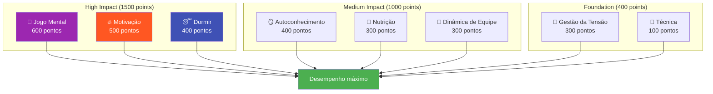

# Ambição

Nossa missão é ajudar jogadores de elite a darem o próximo passo em seu desenvolvimento.

::: tip Nossa visão
**Transforme jogadores de elite, de tecnicamente proficientes a mentalmente imparáveis.** Utilizamos uma abordagem baseada em dados para identificar suas áreas de melhoria de maior impacto.
:::

## O Modelo de Desempenho de 8 Fatores

Pesquisas e experiência mostram que o desempenho de elite na petanca depende de **8 fatores interligados**. A maioria dos jogadores investe demais na técnica, negligenciando os fatores que realmente diferenciam os bons dos excelentes.

### Por que a técnica tem o menor peso?

::: warning A verdade incômoda
**A técnica representa apenas 100 dos 2.900 pontos totais** em nosso modelo.

Isso não significa que a técnica não importe — significa que os jogadores de elite já desenvolveram uma técnica adequada. A pequena melhoria obtida ao aperfeiçoar o seu lançamento é ínfima em comparação com a otimização do seu sono, o controle da tensão ou o fortalecimento do seu jogo mental.
:::

## O princípio do ROI

Nem todas as melhorias são iguais. Usamos cálculos de **Retorno sobre o Investimento (ROI)** para identificar onde seu tempo de treinamento terá o maior impacto.

| Seu nível | Peso do fator | Potencial de retorno do investimento |
|------------|---------------|---------------|
| Baixa habilidade em área de alto peso | Alto (ex.: 600) | **Máximo** |
| Alta habilidade em áreas de alto peso | Alto (ex.: 600) | Baixo (retornos decrescentes) |
| Baixa habilidade em área de baixo peso | Baixo (ex.: 100) | Moderado |
| Alta habilidade em áreas de baixo peso | Baixo (ex.: 100) | **Mínimo** |

**Exemplo:** Melhorar seu sono de 30% para 60% (fator de peso alto, habilidade atual baixa) provavelmente terá um impacto maior do que melhorar a técnica de 75% para 85% (fator de peso baixo, habilidade já alta).

## Os 8 fatores explicados

| Fator | Peso | O que abrange |
|--------|--------|----------------|
| 🧠 **Jogo Mental** | 600 | Padrões de pensamento, foco, confiança, acesso ao estado de fluxo |
| 🔥 **Motivação** | 500 | Motivação, propósito, orientação para objetivos, persistência |
| 😴 **Sono e Recuperação** | 400 | Descanso de qualidade, protocolos pré-competitivos, gestão de energia. |
| 🪞 **Autoconhecimento** | 400 | Autopercepção precisa, reconhecimento de pontos cegos, uso de feedback |
| 🥗 **Nutrição** | 300 | Estabilidade do açúcar no sangue, hidratação, alimentação para competição |
| 🤝 **Dinâmica de Equipe** | 300 | Comunicação, confiança, clareza de papéis, contribuição para a equipe. |
| 💆 **Gestão da Tensão** | 300 | Relaxamento físico, controle da respiração, excitação ideal |
| 🎯 **Técnica** | 100 | Mecânica física, repertório de arremessos, consistência |

## Descubra o seu caminho

Criamos uma **ferramenta de avaliação gratuita** que analisa seus níveis atuais em todos os 8 fatores e calcula suas prioridades de melhoria personalizadas.

::: info Faça a avaliação
**[→ Inicie sua Avaliação de Desenvolvimento de Jogador](/pt/assessment/)**

Em 5 minutos, você receberá:
- Seu gráfico de radar considerando todos os 8 fatores.
- Recomendações classificadas por ROI sobre o que trabalhar.
- Links para conteúdo educacional específico sobre suas principais prioridades.
- Opção de receber feedback dos colegas de equipe
:::

## O que oferecemos

| Oferta | Descrição | Link |
|----------|-------------|------|
| **Ferramenta de Avaliação** | Identifique suas áreas de melhoria com maior retorno sobre o investimento. | [Fazer avaliação](/pt/assessment/) |
| **Módulos de Educação** | Conteúdo aprofundado sobre todos os 8 fatores. | [Navegar na área da Educação](/pt/education/) |
| **Oficinas** | Sessões de 3 a 4 horas para grupos de 6 a 8 jogadores. | [Guia do Workshop](/pt/guides/workshop/) |
| **Campos de Treinamento** | Cursos intensivos de fim de semana que combinam teoria e prática. | [Guia do Acampamento](/pt/guides/training-camp/) |

## Nossa abordagem

### 1. Avalie primeiro
Comece com uma autoavaliação honesta. Busque feedback de colegas para identificar pontos cegos.

### 2. Priorize pelo ROI (Retorno sobre o Investimento)
Concentre-se nos fatores de maior peso onde você tem espaço para crescer — não naquilo que lhe parece confortável.

### 3. Aprenda a Ciência
Entenda *por que* algo funciona, não apenas *o que* fazer.

### 4. Pratique deliberadamente
Aplique as técnicas nos treinos antes da competição. Construa hábitos, não apenas conhecimento.

### 5. Reavalie regularmente
Acompanhe seu progresso. Suas prioridades mudarão à medida que você melhorar.

::: tip Pronto para dar o próximo passo?
**[→ Comece com a Avaliação](/pt/assessment/)** — É grátis e leva 5 minutos.

Ou explore nossa seção [Educação](/pt/education/) para se aprofundar em qualquer um dos 8 fatores.
:::

