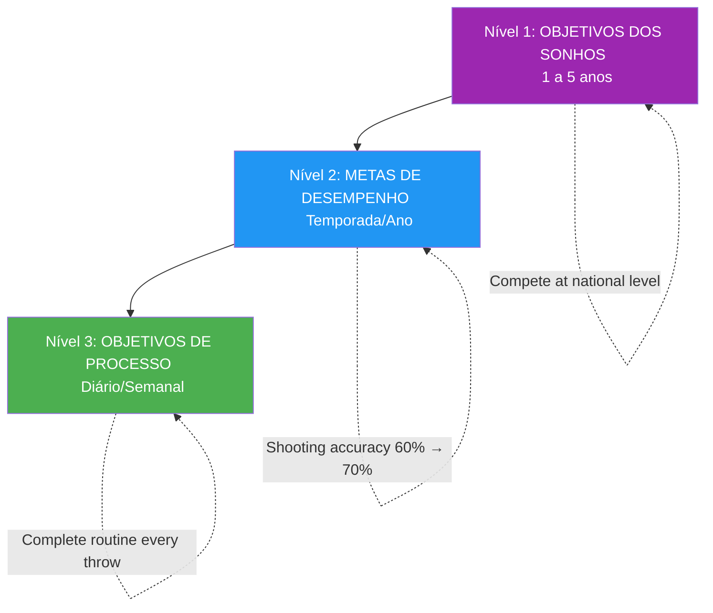

# Definição de metas para atletas de elite

> &quot;Os objetivos certos aceleram o desenvolvimento; os objetivos errados criam frustração e estagnação.&quot;

Definir metas parece simples: decida o que você quer e trabalhe para alcançar isso. Mas a definição de metas em nível de elite é mais complexa.

::: warning Erro comum
**A maioria dos jogadores só define metas de resultado** (&quot;Ganhar o campeonato&quot;). Você não pode controlar os resultados — apenas o processo que leva a eles.
:::

---

## Além dos objetivos básicos

| Problemas de Objetivos de Resultado | Por que isso é um problema? |
|----------------------|-------------------|
| Não é possível controlar totalmente os resultados. | Cria sensação de impotência |
| Cria pressão sem direção. | Ansiedade sem ação |
| Sucesso ou fracasso é binário | Sem vitórias parciais |
| Não orienta a prática diária. | O que você faz exatamente? |

O estabelecimento de metas de elite vai além disso.

---

## A Hierarquia de Objetivos

### Nível 1: Objetivos dos Sonhos (1-5 anos)
Suas maiores aspirações:
- &quot;Competir a nível nacional&quot;
- &quot;Seja reconhecido como um atirador de elite&quot;
- &quot;Ganhar um grande campeonato&quot;

::: info Direção, não ação
Essas dicas fornecem direção e motivação, mas não são aplicáveis no dia a dia.
:::

### Nível 2: Metas de desempenho (temporada/ano)
Melhorias mensuráveis no seu jogo:
- &quot;Aumentar a precisão de tiro de 60% para 70%&quot;
- &quot;Reduzir erros não forçados em 25%&quot;
- &quot;Desenvolver um plombée confiável&quot;

Essas coisas estão sob seu controle e são mensuráveis.

### Nível 3: Metas de Processo (Diárias/Semanais)
As ações que impulsionam a melhoria:
- &quot;Execute a rotina completa antes de cada arremesso&quot;
- &quot;Pratique a visualização por 10 minutos diariamente&quot;
- &quot;Treine a técnica de arremesso 3 vezes por semana&quot;

::: tip Controle total
**Os objetivos do processo são 100% controláveis.** Concentre-se aqui para obter o máximo impacto.
:::

## O Framework SMART+

Vá além das metas SMART básicas:

### Específico
Não se trata de &quot;melhorar minha pontaria&quot;, mas sim de &quot;desenvolver um demi-portée consistente que acerte o alvo a 30 cm do alvo a partir de 8 metros&quot;.

### Mensurável
Defina como você acompanhará o progresso:
- Percentagens de taxa de sucesso
- Métricas de consistência
- Marcadores de análise de vídeo

### Alcançável, mas desafiador.
A meta deve exigir crescimento, mas ser realista. Um jogador com 60% de aproveitamento que almeja 65% é possível; almejar 90% é fantasia.

### Relevante
Os objetivos devem estar conectados às suas aspirações maiores e abordar as fraquezas reais, não apenas aquilo que é fácil de melhorar.

### Com prazo determinado
Defina prazos claros:
- &quot;Até o final da temporada&quot;
- &quot;Dentro de 3 meses&quot;
- &quot;Pelo campeonato nacional&quot;

### + Significativo para mim
O objetivo deve ser importante para VOCÊ, não apenas para seu treinador ou colegas de equipe. A motivação interna sustenta o esforço quando o progresso é lento.

## Foco no processo versus foco no resultado

### O problema com as metas de resultado

&quot;Ganhar a partida&quot; cria problemas:
- Ansiedade em relação a coisas que você não pode controlar.
- Distração da execução
- Pensamento do tipo &quot;tudo ou nada&quot;.
- Pressão sem orientação

### O Poder das Metas de Processo

&quot;Executar minha rotina pré-filme perfeitamente&quot; oferece:
- Controle total
- Foco nítido
- Feedback imediato
- Constrói resultados naturalmente

### O equilíbrio

Use metas de resultado para motivação e direção. Use metas de processo para foco e execução diários.

## Definição de metas para diferentes fases

### Fora de temporada
Foco nos objetivos de desenvolvimento:
- Melhorias técnicas
- condicionamento físico
- Desenvolvimento de habilidades mentais
- Ampliando sua paleta de mantas

### Pré-temporada
Transição para a integração:
- Combinar habilidades em condições semelhantes às de uma partida.
- Testando melhorias em competições amistosas
- Aprimorando estratégias

### Temporada de Competição
Transição para desempenho e processos:
- Executar o que você desenvolveu.
- Objetivos do processo para cada partida
- Alterações técnicas mínimas

### Pós-Competição
Reflexão e planejamento:
- Analise o que funcionou.
- Identificar áreas de crescimento.
- Defina metas para o próximo ciclo.

## Erros comuns na definição de metas

### Muitos gols
Foco é poder. Dois ou três objetivos principais valem mais do que dez objetivos dispersos.

### Apenas metas de resultado
Sem objetivos de processo, você não tem um roteiro.

### Sem flexibilidade
Os objetivos devem se adaptar às novas informações. A adesão rígida a objetivos desatualizados desperdiça esforços.

### Metas baseadas em comparação
Dizer &quot;Seja melhor que [jogador]&quot; coloca seu sucesso nas mãos de outra pessoa.

### Negligenciar metas mentais
Os objetivos técnicos e físicos predominam, mas as habilidades mentais muitas vezes determinam o vencedor.

## Estratégias de Implementação

### Anote-os
Metas escritas têm uma probabilidade significativamente maior de serem alcançadas.

### Revise regularmente
A revisão semanal mantém os objetivos presentes e permite ajustes.

### Compartilhar Seletivamente
Compartilhe com aqueles que irão apoiar, e não sabotar.

### Visualize a Conquista
Imagine regularmente a conquista dos seus objetivos — a sensação, o momento.

### Acompanhe o progresso
O que é medido é gerenciado. Mantenha registros.

## Quando as metas não são atingidas

Metas não atingidas não são fracassos — são dados:

1. **Analise**: Por que isso não foi alcançado?
2. **Aprenda**: O que isso te ensina?
3. **Ajustar**: Modificar a meta ou a abordagem.
4. **Continuação:** A persistência vence a perfeição.

## O Jogo Mental dos Objetivos

Os objetivos afetam a psicologia:
- **Muito fácil**: Tédio, complacência
- **Muito difícil**: Ansiedade, desânimo
- **Na medida certa**: Engajamento, fluidez, crescimento

Encontre o ponto ideal em que as metas sejam desafiadoras sem serem avassaladoras.

---

| *Relacionado: [Introdução à definição de metas](/pt/education/motivation/) | [Metas SMART](/pt/education/motivation/smart-goals) | [Planejando seu desenvolvimento](/pt/education/motivation/planning)* |

