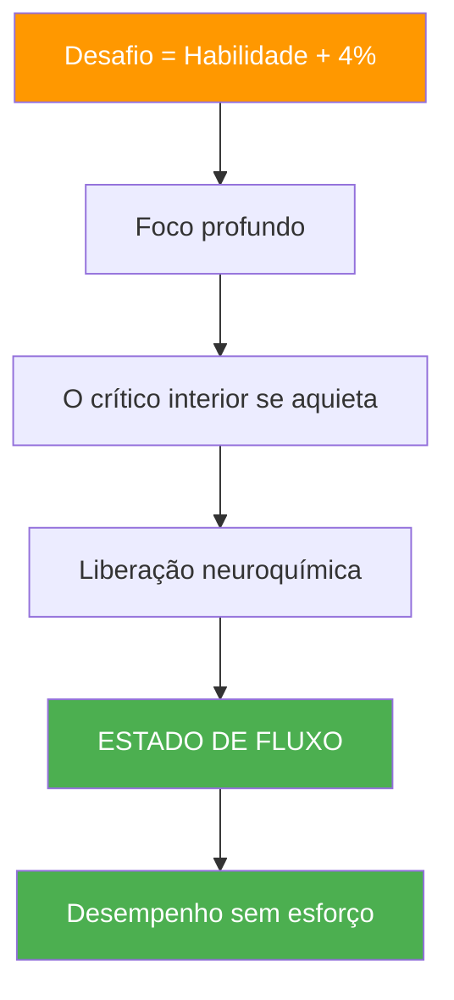

# A ciência por trás dos estados de fluxo

> &quot;Estado de fluxo — aquela zona mágica onde tudo se encaixa, o tempo desacelera e o desempenho parece não exigir esforço.&quot;

Não é misticismo; é neurologia. Compreender a ciência por trás do estado de fluxo pode ajudá-lo a acessá-lo com mais frequência.

::: tip Principais conclusões
O estado de fluxo não é algo que se possa forçar, mas você pode criar as condições que aumentam a probabilidade de ele surgir.
:::

---

## O que é o estado de fluxo?

O psicólogo Mihaly Csikszentmihalyi definiu o estado de fluxo como &quot;um estado de completa imersão em uma atividade&quot;. No jogo de petanca, você já o experimentou: lançamentos que parecem automáticos, decisões que surgem instantaneamente, a sensação de que você e o jogo são um só.

### Características do fluxo

| Característica | Como é a sensação? |
|----------------|-------------------|
| **Absorção completa** | O jogo é tudo o que existe. |
| **Perda de autoconsciência** | Sem autocrítica |
| **Tempo distorcido** | Horas parecem minutos |
| **Motivação intrínseca** | Jogar por puro prazer. |
| **Sensação de controle** | Confiança sem arrogância |
| **Retorno imediato** | Ajuste instantâneo |

## A Neurociência do Fluxo

### Alterações cerebrais durante o fluxo

Quando você entra em estado de fluxo, seu cérebro passa por mudanças mensuráveis:

**Hipofrontalidade Transitória**
O córtex pré-frontal — responsável pela autocrítica, dúvida e excesso de reflexão — torna-se menos ativo. É por isso que o estado de fluxo parece tão natural: seu crítico interno se cala.

**Coquetel Neuroquímico**
O estado de fluxo desencadeia uma poderosa combinação de neurotransmissores:
- **Dopamina**: Melhora o foco e o reconhecimento de padrões.
- **Noradrenalina**: Aumenta o estado de alerta e a atenção.
- **Endorfinas**: Criam sensações de bem-estar.
- **Anandamida**: Promove o pensamento lateral
- **Serotonina**: Produz a sensação de bem-estar após o fluxo sanguíneo.

**Alterações nas Ondas Cerebrais**
O estado de fluxo está correlacionado com mudanças das ondas beta (consciência normal em estado de vigília) para as ondas alfa e teta (alerta relaxado e criatividade).

## Os Gatilhos do Fluxo

Pesquisas identificaram condições que aumentam a probabilidade de estado de fluxo:

### 1. Equilíbrio entre desafio e habilidade

O estado de fluxo ocorre quando o desafio excede ligeiramente seu nível de habilidade atual — cerca de 4% além da sua zona de conforto. Facilidade excessiva leva ao tédio; dificuldade excessiva leva à ansiedade.

**Na pétanque:**
- Procure adversários um pouco melhores que você.
- Defina desafios pessoais dentro das partidas.
- Varie sua prática para manter o engajamento.

### 2. Objetivos claros

Você precisa saber o que está tentando alcançar. Intenções vagas não levam ao estado de fluxo.

**Na pétanque:**
- Defina sua intenção para cada arremesso.
- Tenha objetivos de jogo claros.
- Saiba qual é o seu papel na equipe.

### 3. Feedback imediato

Para estar em estado de fluxo, é preciso saber como você está se saindo em tempo real.

**Na pétanque:**
- O resultado de cada lançamento é imediatamente visível.
- Leia a resposta do terreno
- Preste atenção aos sinais do seu corpo.

### 4. Concentração Profunda

O estado de fluxo requer atenção concentrada, sem distrações.

**Na pétanque:**
- Desenvolva sua rotina pré-teste
- Pratique a atenção plena
- Elimine as distrações externas

### 5. Senso de Controle

A sensação de que suas ações importam e que você pode influenciar os resultados.

**Na pétanque:**
- Confie no seu treinamento
- Concentre-se no que você pode controlar.
- Aceite a incerteza nos resultados.

---

## Por que você não pode forçar o fluxo

::: warning O Paradoxo do Fluxo
**Tentar entrar em estado de fluxo impede que ele aconteça.** O estado de fluxo surge quando você para de tentar alcançá-lo e simplesmente se envolve completamente com a atividade.
:::

Isso ocorre porque:
- A tentativa ativa o córtex pré-frontal (o oposto do estado de fluxo).
- O automonitoramento interrompe a imersão.
- O foco nos objetivos substitui o foco no processo.

## Criando condições para o fluxo

Embora não seja possível forçar o fluxo, você pode criar condições que o tornem mais provável:

### Antes da competição
- Sono e nutrição adequados
- Aquecimento adequado
- Estado mental positivo
- intenções claras

### Durante a competição
- Mantenha o foco no presente.
- Use sua rotina pré-injeção
- Deixe de lado os resultados.
- Confie no seu corpo.

### Fatores Ambientais
- Minimize as distrações
- Estado físico confortável
- Nível de desafio apropriado
- Dinâmica de equipe colaborativa

---

## O Ciclo de Fluxo

O fluxo não é constante — ele segue um ciclo:

Compreender esse ciclo ajuda você a:
- Não force o fluxo durante a fase de luta.
- Saiba reconhecer a hora de deixar ir.
- Permitir a recuperação adequada entre os estados de fluxo

## Fluxo na Petanca em Equipe

O estado de fluxo pode ser contagioso. Quando um jogador entra em estado de fluxo, ele pode se espalhar para os companheiros de equipe através de:
- Energia e linguagem corporal positivas
- Redução da pressão sobre os outros
- Confiança coletiva elevada
- Ritmo de equipe sincronizado

## Capacidade de fluxo do edifício

Assim como qualquer habilidade, alcançar o estado de fluxo melhora com a prática:

### Práticas diárias
- Meditação mindfulness (desenvolve o controle da atenção)
- Visualização (ativa vias neurais)
- Treinamento físico (desenvolve a base de habilidades)

### Em treinamento
- Pratique no limite da sua capacidade.
- Mantenha o foco total mesmo durante os exercícios.
- Observe quando o fluxo ocorre e o que o precede.

### Desenvolvimento a longo prazo
- Aumente gradualmente os níveis de desafio.
- Desenvolva rotinas robustas antes da filmagem.
- Desenvolva resiliência mental para a fase de dificuldades.

---

| *Relacionado: [A Zona](/en/education/mental-game/the-zone/) | [Entrando na Zona](/en/education/mental-game/the-zone/entering-the-zone) | [Técnicas de Mindfulness](/en/education/mental-game/mindfulness/techniques)* |

