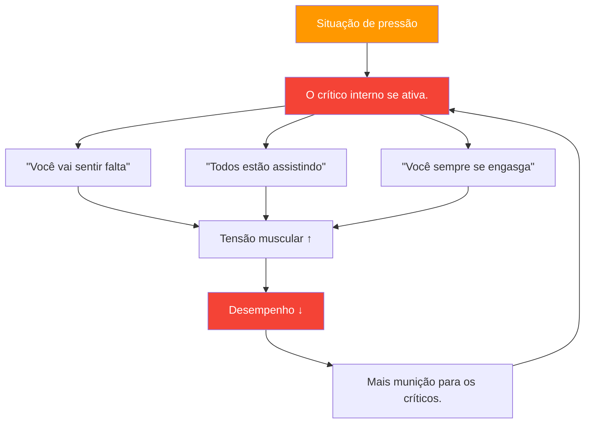

# Entendendo o Crítico Interior

> &quot;Todo jogador de petanca conhece aquela voz — aquela que sussurra &#39;você vai errar&#39; bem na hora em que você está prestes a arremessar.&quot;

Este é o seu crítico interno — e aprender a gerenciá-lo é essencial para um desempenho de elite.

::: warning O Paradoxo
**Seu crítico interno não está tentando te machucar** — é uma tentativa equivocada de proteção. Mas essa &quot;proteção&quot; se transforma em autossabotagem.
:::

---

## O que é o crítico interior?

O crítico interno é aquela voz interior que julga, critica e mina a sua confiança:

### Quando Aparece

| Momento | O crítico interior diz |
|--------|-------------------|
| **Antes da tomada crucial** | &quot;Todos estão assistindo. Não estrague tudo.&quot; |
| **Após um erro** | &quot;Você sempre se atrapalha sob pressão.&quot; |
| **Durante uma sequência de derrotas** | &quot;Você não é bom o suficiente para este nível.&quot; |

## Reconhecendo seus padrões

O primeiro passo é a consciência. Comece a perceber quando seu crítico interno aparece:

### Gatilhos comuns
- Situações de alta pressão (ponto de jogo, torneios importantes)
- Após cometer um erro
- Quando os adversários estão jogando bem
- Quando os colegas de equipe parecem frustrados
- Fadiga física ou desconforto

### Mensagens comuns
- &quot;Você não consegue lidar com pressão&quot;
- &quot;Você não é tão bom quanto eles&quot;
- &quot;Todos estão te julgando&quot;
- &quot;Você sempre falha quando importa&quot;

## O impacto no desempenho

Quando o crítico interno assume o controle, seu corpo reage:

1. **A tensão muscular aumenta** — Seu arremesso fica rígido
2. **A respiração torna-se superficial** — Menos oxigênio, menos concentração
3. **Visão reduzida** — Você perde a noção do terreno.
4. **A tomada de decisões fica prejudicada** — Você começa a duvidar de si mesmo.

Isso cria um ciclo vicioso: o crítico interno causa um desempenho ruim, o que dá ao crítico mais munição.

## Estratégias para lidar com o crítico interno

### 1. Dê um nome para domá-lo

Dê um nome ao seu crítico interno — algo um pouco ridículo. &quot;Ah, lá vai o Nils Negativo de novo.&quot; Isso cria uma distância entre você e a voz, tornando mais fácil ignorá-la.

### 2. Contestar as provas

Quando o crítico diz &quot;você sempre erra sob pressão&quot;, pergunte-se: isso é realmente verdade? Você consegue se lembrar de alguma vez em que teve um bom desempenho sob pressão? O crítico trabalha com absolutos que raramente refletem a realidade.

### 3. Reformule a mensagem

Transforme críticas em orientação:
- &quot;Você vai sentir falta&quot; → &quot;Concentre-se na sua rotina&quot;
- &quot;Todos estão observando&quot; → &quot;Este é o seu momento de brilhar&quot;
- &quot;Você sempre se atrapalha&quot; → &quot;Você já lidou com pressão antes&quot;

### 4. Use sua rotina pré-injeção

Uma rotina sólida de preparação para o arremesso dá à sua mente algo construtivo em que se concentrar, deixando menos espaço para o crítico.

### 5. Pratique a autocompaixão

Trate-se como trataria um colega de equipe. Você diria a um colega que está com dificuldades &quot;você é péssimo&quot;? Claro que não. Seja gentil consigo mesmo.

## Construindo uma Voz Interior de Apoio

O objetivo não é silenciar completamente a voz crítica interna — isso é praticamente impossível. Em vez disso, desenvolva uma voz de apoio mais forte:

### A Voz de Apoio Diz:
- &quot;Um arremesso de cada vez&quot;
- &quot;Confie no seu treinamento&quot;
- &quot;Você já fez isso antes&quot;
- &quot;Viva o presente&quot;
- &quot;Respire e recomece&quot;

### Prática diária

Dedique 5 minutos por dia a:
1. Relembre um momento em que você teve um bom desempenho.
2. Lembre-se de como se sentiu no seu corpo.
3. Ouça o que sua voz de apoio estava dizendo.
4. Ancore esse sentimento com um gesto físico (tocando na sua bola, ajustando sua postura).

## Em competição

Quando o crítico interno aparece durante uma partida:

1. **Reconheça isso:** &quot;Percebo que estou sendo autocrítico&quot;
2. **Respire fundo**: Respire lenta e profundamente para se acalmar.
3. **Use sua âncora**: O gesto físico da sua prática
4. **Retorne à rotina**: Concentre-se no seu processo pré-abertura.

## A jornada de longo prazo

Lidar com a autocrítica não é uma solução definitiva. É uma prática contínua que se torna mais fácil com o tempo. Jogadores de elite não eliminam a insegurança — eles aprendem a ter um bom desempenho apesar dela.

O crítico interno sempre fará parte de você. Mas com a prática, sua voz se silencia e sua voz de apoio se fortalece. Essa é a vantagem mental que separa os bons jogadores dos grandes.

---

| *Relacionado: [Lidando com a Pressão](/en/education/mental-game/mental-strength/handling-pressure) | [Rotina Pré-Arremesso](/en/education/mental-game/mental-strength/pre-shot-routine) | [Técnicas de Mindfulness](/en/education/mental-game/mindfulness/techniques)* |

