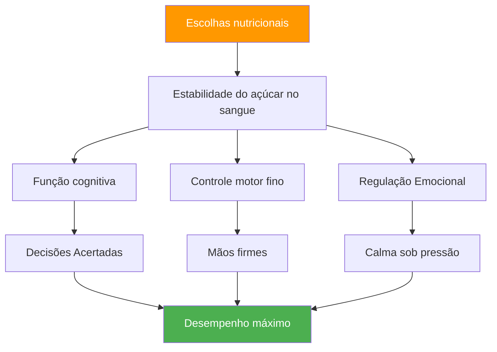

# Nutrição para Competição: Alimentando o Desempenho de Precisão

> &quot;Seu cérebro é sua ferramenta mais importante na petanca. Alimente-o com combustível estável, não com energia instável.&quot;

As competições de petanca podem durar de 6 a 10 horas. O que você consome afeta diretamente sua função cognitiva, coordenação motora fina e capacidade de manter o foco durante várias partidas.

::: tip A Regra de Ouro
**Níveis estáveis de açúcar no sangue = mãos firmes.** Cada escolha nutricional deve promover energia constante, e não picos e quedas bruscas.
:::

---

## Por que a nutrição é importante para a petanca?

Ao contrário dos esportes de alta intensidade, a petanca exige:

Escolhas nutricionais inadequadas criam problemas de desempenho que os jogadores atribuem à &quot;fraqueza mental&quot; ou ao &quot;azar&quot;.

---

## A conexão entre o açúcar no sangue e a sua relação com o açúcar no sangue.

Seu cérebro funciona com glicose. As flutuações de açúcar no sangue afetam diretamente:

| Estado de açúcar no sangue | Efeito Mental | Efeito físico |
|-------------------|---------------|-----------------|
| **Estável** | Raciocínio claro, boas decisões | Mãos firmes, consistentes |
| **Pico (muito alto)** | Energia inicial, depois queda | Nervoso, hiperativo |
| **Crash (muito baixo)** | Dificuldade de concentração, irritabilidade | Tremores, aperto fraco |
| **Montanha-russa** | Humor/foco imprevisíveis | Desempenho inconsistente |

**Objetivo:** Manter os níveis de açúcar no sangue estáveis durante toda a competição.

## Nutrição para o dia da competição

### Pré-competição (3-4 horas antes)

**Faça uma refeição substancial:**
- Carboidratos complexos (aveia, pão integral, arroz)
- Proteína (ovos, iogurte, carne magra)
- Gorduras saudáveis (abacate, nozes, azeite)
- Evite: açúcares simples, alimentos pesados/gordurosos

**Exemplos de refeições:**
- Mingau de aveia com nozes e banana
- Ovos em torrada integral com abacate
- Arroz com frango e legumes

### Pré-jogo (1 a 2 horas antes)

**Lanche leve e familiar:**
- Banana
- Um punhado pequeno de nozes
- Meio sanduíche
- Evite: Qualquer coisa nova ou experimental

### Durante a competição

**Entre partidas:**
- Pequenos lanches frequentes a cada 60-90 minutos.
- Nozes, sementes, frutas secas
- biscoitos de grãos integrais
- Frutas frescas (banana, maçã)

**Durante as partidas:**
- Goles de água entre as extremidades
- Carboidratos de rápida absorção, se necessário (frutas secas)
- Evite comer durante brincadeiras ativas.

### Recuperação (após a competição)

**Dentro de 30 a 60 minutos:**
- Proteína para recuperação muscular
- Carboidratos para repor
- Líquidos para reidratação

## Protocolo de Hidratação

### O básico
- Comece hidratado(a) (verifique a cor da urina da manhã).
- Beba aos poucos durante todo o processo, não espere até sentir sede.
- Meta: 150-250 ml por hora de competição
- Ajuste de acordo com o calor e a umidade.

### Sinais de alerta de desidratação
- Sede (você já está desidratado)
- Urina escura
- Dor de cabeça
- Concentração reduzida
- Fadiga

### A Armadilha da Hidratação Excessiva
Excesso de água, especialmente sem eletrólitos:
- Pausas frequentes para ir ao banheiro (interrompem o ritmo)
- Eletrólitos diluídos (podem causar tremores)
- Desconforto e distração

**Equilíbrio:** Ingestão constante, incluindo eletrólitos em condições de calor.

## Alimentos a evitar

### No dia da competição
- **Refeições pesadas** — Direcionam o fluxo sanguíneo para a digestão.
- **Alto nível de açúcar** — Causa quedas bruscas de energia
- **Álcool (na noite anterior)** — Interrompe o sono, desidrata
- **Excesso de cafeína** — Pode causar nervosismo
- **Novos alimentos** — Risco de problemas digestivos
- **Alimentos gordurosos/fritos** — Digestão lenta, letargia

### Alimentos que causam problemas
- **Bebidas gaseificadas** — Inchaço, desconforto
- **Alimentos ricos em fibras** — Podem causar desconforto
- **Laticínios (para algumas pessoas)** — Sensibilidade digestiva
- **Adoçantes artificiais** — Podem causar problemas estomacais

## Estratégia da Cafeína

A cafeína pode melhorar o foco e o tempo de reação, mas requer uma gestão cuidadosa:

### Uso eficaz
- Conheça sua tolerância.
- Cronometragem consistente (não altere para competição)
- Dose moderada (100-200mg)
- Com antecedência suficiente para evitar interferências com jogos noturnos.
- Combine com alimentos para reduzir a ansiedade.

### Uso ineficaz
- Mais do que o normal (causa ansiedade, tremores)
- No final do dia (interrompe o sono)
- Em jejum (nervosismo, queda de energia)
- Recorrer à cafeína para compensar a falta de sono.

## Como montar seu plano de nutrição para competição

### Etapa 1: Teste Prático
Experimente seu plano de nutrição para competição durante o treino:
- Mesmo horário
- Os mesmos alimentos
- Mesma hidratação
- Observe como você se sente e como se apresenta.

### Etapa 2: Preparar a logística
- Saiba quais opções de comida estão disponíveis no local.
- Traga seus próprios lanches comprovados.
- Tenha opções de backup
- Leve mais coisas do que você acha que precisa.

### Passo 3: Criar um cronograma
Anote o horário das suas refeições:
- Refeição pré-competição (horário, comida)
- Lanche pré-jogo (horário, comida)
- Durante a competição (cronograma, alimentação)
- Intervalos de lembrete de hidratação

### Passo 4: Rastrear e ajustar
Após as competições, observe:
- O que você comeu e quando?
- Como você se sentiu fisicamente?
- Qualidade de desempenho
- Algum problema (fome, queda de energia, estômago)?

## Considerações sobre calor e umidade

Requisitos para mudanças em clima quente:

- **Aumentar a ingestão de líquidos** — Pode ser necessário um aumento de 50 a 100% na quantidade de líquidos.
- **Reponha eletrólitos** — O suor causa perda de minerais.
- **Refeições mais leves** — Alimentos pesados são mais difíceis de digerir.
- **Pausas na sombra** — Não subestime o estresse térmico
- **Pré-resfriamento** — Chegue ao local do evento já resfriado e hidratado.

## Erros comuns

::: warning Evite estes
- **Pular o café da manhã** — Esgota o glicogênio matinal
- **Bebidas energéticas** — Excesso de cafeína e açúcar
- **Esperar até sentir fome** — Já afetando o desempenho
- **Álcool na noite anterior** — Desidratação e sono ruim
- **Experimentar novos alimentos** — Risco de problemas digestivos
:::

## Passos a seguir

1. **Planeje sua nutrição para a competição** com antecedência.
2. **Teste seu plano** em condições de prática.
3. **Prepare os lanches** na noite anterior.
4. **Siga seu cronograma**, independentemente da pressão da partida.
5. **Revisar e aprimorar** após cada competição.

---

## Conteúdo relacionado

- [Módulo de Nutrição](/pt/education/nutrition/) — Educação nutricional completa
- Nutrição para Competição — Protocolos detalhados
- [Durma para melhorar o desempenho](/pt/articles/sleep-performance) — Otimização da recuperação

