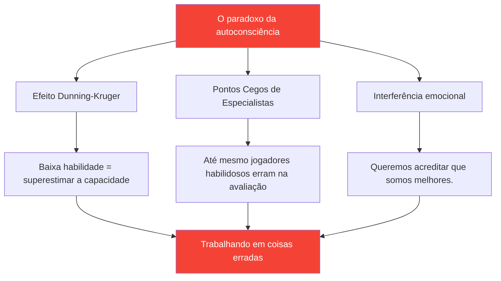

# Desenvolvendo a autoconsciência: a base para a melhoria.

> &quot;Não se pode melhorar aquilo que não se percebe com precisão.&quot;

A autoconsciência — conhecer seus pontos fortes e fracos reais — é a base para um desenvolvimento eficaz.

::: danger A verdade incômoda
**A maioria dos jogadores está trabalhando nas coisas erradas** porque não consegue se enxergar com clareza.
:::

---

## O paradoxo da autoconsciência

---

## Por que os jogadores de petanca têm dificuldades?

A petanca torna a autoavaliação particularmente difícil:

| Desafio | Por que é difícil? |
|-----------|--------------|
| **Variação de Resultados** | Boas decisões podem produzir resultados ruins (e vice-versa). |
| **Viés de comparação** | Lembramos das melhores atuações e tentamos justificar as piores. |
| **Proteção de Identidade** | Admitir fraqueza parece ameaçador. |

::: warning Memória não é dado
**Construímos narrativas que protegem nossa autoimagem.** O rastreamento objetivo é essencial.
:::

---

## Os componentes da autoconsciência

A verdadeira autoconsciência requer conhecimento em múltiplas áreas:

| Domínio | Questões-chave |
|--------|---------------|
| **Técnico** | Quais lançamentos são realmente confiáveis? Quais são inconsistentes? |
| **Mental** | Como reajo à pressão? O que desencadeia meu crítico interno? |
| **Físico** | Quando minha energia está no auge? Como a fadiga me afeta? |
| **Tático** | Será que eu ataco em excesso? Ou em falta? Como devo interpretar as situações? |
| **Emocional** | O que me frustra? Quando é que jogo de forma tensa? |
| **Interpessoal** | Como meus colegas de equipe percebem minha comunicação? |

## Feedback externo: O espelho que você precisa

Você não consegue enxergar seus próprios pontos cegos. Você precisa de perspectivas externas.

### Métodos de feedback estruturado

**Análise de Vídeo**
- Registre partidas e treinos.
- Assista com foco em áreas específicas.
- Preste atenção aos padrões que você não percebe no momento.

**Avaliação por Pares**
- Peça feedback honesto a colegas de equipe de confiança.
- Utilize a [Ferramenta de Avaliação](/en/assessment/) para validação por pares.
- Compare sua autoavaliação com a avaliação deles.

**Observação do treinador**
- Olhos frescos enxergam o que olhos experientes não veem.
- Solicite feedback específico, não impressões gerais.
- Acompanhe os temas de feedback ao longo do tempo.

### A lacuna de feedback

Quando sua autoavaliação difere significativamente do feedback externo, preste atenção:

| Tipo de lacuna | Significado | Ação |
|----------|---------|--------|
| Você avalia melhor | Possível ponto cego | Investigar com vídeo/dados |
| Você dá uma nota mais baixa | Possível problema de confiança | Foque nas evidências de competência. |
| Lacuna consistente | Erro de percepção sistemático | Recalibre seu modelo mental |

## Desenvolvendo hábitos de autoconhecimento

### Reflexão diária (5 minutos)

Após cada sessão, pergunte a si mesmo:

1. **O que correu bem?** (Seja específico)
2. **O que não correu bem?** (Seja sincero)
3. **O que eu faria de diferente?** (Seja construtivo)
4. **O que me surpreendeu?** (Seja curioso)

### Revisão semanal (15 minutos)

Procure por padrões:

- Quais situações me desafiam constantemente?
- Em que áreas estou a melhorar?
- Que tipo de feedback recebi?
- O que estou evitando olhar?

### Avaliação Mensal

Utilize a ferramenta [Avaliação do Jogador](/en/assessment/):

- Avalie-se em todos os 8 fatores.
- Solicitar validação por pares
- Comparar com o mês anterior
- Identificar as maiores lacunas

## A Vantagem dos Dados

A percepção subjetiva não é confiável. Os dados fornecem objetividade.

### O que acompanhar

**Dados de desempenho**
- Taxas de sucesso por tipo de arremesso
- Desempenho sob pressão versus desempenho sem pressão
- Primeiro set vs. sets posteriores
- Com diferentes parceiros

**Dados do Processo**
- Qualidade do sono antes das partidas
- conformidade com a rotina pré-jogo
- Estado mental durante momentos-chave
- Tempo de recuperação após erros

### Como usar os dados

1. **Identificar padrões** — O que se correlaciona com um bom/mau desempenho?
2. **Questionar pressupostos** — Os dados correspondem às suas crenças?
3. **Treinamento de orientação** — Concentre-se nas fraquezas reais, não nas imaginárias.
4. **Acompanhe o progresso** — A melhoria muitas vezes é invisível sem mensuração.

## Bloqueios comuns de autoconsciência

::: warning Fique atento a estes
- **Atitude defensiva** ao receber feedback
- **Justificando** desempenhos ruins
- **Buscando confirmação** em vez da verdade
- **Evitar a medição** de áreas frágeis
- **Atribuir culpa a fatores externos** de forma consistente
:::

## A Conexão da Mentalidade de Crescimento

A autoconsciência exige aceitar que:

- A capacidade atual não está definida.
- A fraqueza reside na informação, não na identidade.
- Feedback é uma dádiva, não um ataque.
- A melhoria exige uma avaliação honesta.

## Passos a seguir

1. **Hoje:** Conclua a [Autoavaliação](/en/assessment/)
2. **Esta semana:** Solicite feedback de dois colegas de equipe de confiança.
3. **Em andamento:** Estabelecer o hábito da reflexão diária
4. **Mensalmente:** Acompanhe o progresso com avaliações repetidas.

---

## Conteúdo relacionado

- [Módulo de Autoconhecimento](/en/education/self-awareness/) — Educação completa
- [Avaliação do Jogador](/en/assessment/) — Avalie seus 8 fatores
- [O Crítico Interior](/en/articles/inner-critic) — Gerenciando o autojulgamento

