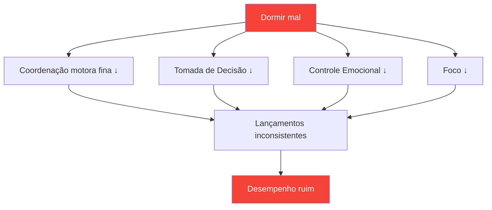

# Sono: o fator de desempenho mais subestimado

> &quot;O jogador que dormiu melhor costuma vencer.&quot;

A maioria dos jogadores se concentra na técnica e no treinamento mental. Poucos otimizam o sono. Isso é um erro — o sono pode ser o investimento com o maior retorno disponível para a maioria dos jogadores competitivos.

::: tip Melhoria de alto retorno sobre o investimento
**A otimização do sono não exige nenhum talento e proporciona resultados enormes.** É o mais próximo que existe de um potencializador de desempenho legal.
:::

---

## A pesquisa

A ciência do sono revela efeitos surpreendentes no desempenho em esportes de precisão:

### Tempo de reação
- **24 horas sem dormir** = tempo de reação equivalente a 0,1% de álcool no sangue
- **6 horas por noite durante 2 semanas** = equivalente a ficar acordado por 48 horas
- Atletas de elite dormem em média **mais de 8,5 horas**, enquanto a população em geral dorme 7 horas.

### Tomando uma decisão
- A privação de sono afeta primeiro o córtex pré-frontal.
- As decisões táticas se deterioram antes mesmo que a fadiga óbvia apareça.
- Você não percebe sua deficiência (a metacognição também falha).

### Controle do motor
- As habilidades motoras finas (preensão, liberação) requerem memória consolidada.
- A consolidação da memória ocorre durante o sono profundo.
- Aprender habilidades sem dormir o suficiente = prática desperdiçada

## A Conexão de Precisão

A petanca exige exatamente aquilo que a privação de sono destrói:

| Habilidade necessária | Efeito da privação de sono |
|----------------|--------------------------|
| Controle motor fino | A pressão de preensão torna-se inconsistente. |
| Processamento visual | Dificuldade em avaliar distâncias |
| Tomando uma decisão | Os erros táticos aumentam |
| Regulação emocional | A frustração após erros aumenta. |
| Atenção sustentada | A concentração se dispersa em partidas mais longas. |

## Sinais de que você está dormindo pouco

Você se adaptou à privação crônica de sono se:

- Você precisa de um despertador para acordar.
- Você sente sonolência no início da tarde.
- Você adormece em 5 minutos após se deitar.
- Você &quot;coloca o papo em dia&quot; nos fins de semana.
- Café é essencial, não opcional.

**Um choque de realidade:** Se você precisa de cafeína para funcionar normalmente, você está com privação de sono.

## Protocolo da Semana da Competição

### 7 dias antes
- Comece a dormir 30 minutos a mais por noite.
- Estabilizar o horário de despertar (sempre no mesmo horário)

### 3 dias antes
- Sem álcool (interfere na estrutura do sono)
- Não se deve fazer refeições pesadas após as 19h.
- Reduza o tempo de uso de telas após o pôr do sol.

### Na noite anterior
- Horário normal de dormir (não vá para a cama cedo — você só vai ficar acordado).
- Ambiente familiar, se possível
- rotina de relaxamento

### Manhã de competição
- Acorde no horário normal.
- Exposição à luz imediatamente
- rotina normal de café da manhã

## Otimizando a qualidade do sono

Não é apenas a duração que importa — a qualidade é o que mais importa.

### Ambiente de sono
- **Temperatura:** 18-20°C (65-68°F) é a ideal
- **Escuridão:** Escuridão total ou máscara de dormir
- **Som:** Constante (ruído branco) ou silencioso
- **Roupa de cama:** Confortável, não muito quente

### Rotina pré-sono
- Evite telas por mais de 60 minutos antes de dormir.
- Luzes baixas à noite
- Atividades de relaxamento consistentes
- Um banho frio pode ajudar a adormecer.

### Tempo
- Horário de despertar consistente (mais importante que o horário de dormir)
- Evite dormir mais de 30 minutos a mais nos fins de semana.
- Sonecas: antes das 15h, com duração inferior a 20 minutos.

## A estratégia da soneca

Cochilos estratégicos para dias de competição:

### A soneca revigorante (10-20 min)
- Reduz a fadiga sem causar sonolência.
- Ideal para sessões entre a manhã e a tarde.
- Programe um alarme — não durma demais.

### O Ciclo Completo (90 min)
- Ciclo completo do sono
- Somente se você tiver mais de 2 horas antes da competição.
- Risco de sonolência se interrompido

### Nunca tire uma soneca se:
- Você tem insônia de início do sono.
- A competição começa em 90 minutos.
- Já passa das 15h e você precisa dormir naquela noite.

## Considerações sobre viagens

Para competições fora de casa:

### Antes de viajar
- Leve itens de sono que você já conhece (travesseiro, máscara de dormir).
- Pesquise quartos de hotel (solicite um quarto silencioso)
- Ajuste o itinerário caso esteja atravessando fusos horários.

### No destino
- Mantenha o horário de sono de casa, se possível.
- A exposição à luz controla o ritmo circadiano.
- Evite refeições pesadas perto da hora de dormir.

### Cruzamento de fuso horário
- 1 dia por hora para se ajustar completamente
- A exposição à luz da manhã acelera o ajuste para leste.
- A exposição à luz do entardecer acelera o ajuste para oeste.

## Monitorando seu sono

O que é medido é gerenciado:

### Rastreamento simples
- Hora de acordar e hora de dormir
- Qualidade subjetiva (1-10)
- Notas de correlação de desempenho

### Rastreamento Avançado
- Monitor de sono ou dispositivo vestível
- Tendências da VFC (variabilidade da frequência cardíaca)
- Dados sobre os estágios do sono

### O que procurar
- Correlação entre sono e desempenho
- Padrões (recuperação de tempo no fim de semana, insônia pré-competição)
- Tendências ao longo do tempo

## Erros comuns

::: warning Evite estes
- **Álcool como auxiliar do sono** — Facilita o início do sono, mas prejudica a qualidade.
- **Colocando o sono em dia nos fins de semana** — Não dá para &quot;pagar&quot; a dívida de sono
- **Telas na cama** — Treina o cérebro para associar cama a sono.
- **Horário inconsistente** — O ritmo circadiano precisa de consistência.
- **Ignorando o sono para treinar** — Trocar qualidade por quantidade
:::

## Passos a seguir

1. **Esta semana:** Monitore seu sono real (duração + qualidade)
2. **Na próxima semana:** Estabeleça um horário de despertar consistente.
3. **Semanas seguintes:** Otimizar o ambiente e a rotina
4. **Pré-competição:** Implementar o protocolo da semana de competição

---

## Conteúdo relacionado

- [Módulo de Sono e Recuperação](/pt/education/sleep/) — Educação completa sobre o sono
- [Hábitos de Sono](/pt/education/sleep/habits) — Construindo rotinas sustentáveis
- [Sono de Competição](/pt/education/sleep/competition) — Protocolos específicos para cada evento

