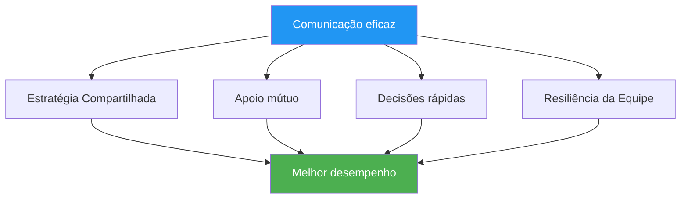

# Comunicação sob pressão

> &quot;As palavras certas no momento certo constroem confiança. As palavras erradas podem desestabilizar até mesmo equipes talentosas.&quot;

::: tip A Verdade da Comunicação
**Sob pressão, menos é mais.** Uma comunicação clara e concisa sempre supera discussões longas.
:::

---

## Por que a comunicação é importante

As equipas de petanca enfrentam desafios únicos:
- As decisões precisam ser tomadas rapidamente.
- A pressão afeta a forma como falamos e ouvimos.
- Sinais não verbais são visíveis para os oponentes.
- O desempenho individual afeta a dinâmica da equipe.

---

## Os Princípios da Comunicação

### 1. Clareza acima de quantidade

| ❌ Não diga | ✅ Diga em vez disso |
|-------------|---------------|
| &quot;Acho que talvez devêssemos tentar apontar para cá, mas não tenho certeza...&quot; | &quot;Vou apontar para o lado esquerdo. O terreno é melhor lá.&quot; |

### 2. Enquadramento Positivo

| ❌ Negativo | ✅ Positivo |
|------------|------------|
| &quot;Não perca esta oportunidade&quot; | &quot;Você consegue — confie no seu arremesso&quot; |
| &quot;Aquilo foi terrível&quot; | &quot;Deixa pra lá, próxima.&quot; |

### 3. Foco no presente

::: warning Passado versus Presente
**Em vez de:** &quot;Por que você jogou isso ali?&quot;
**Diga:** &quot;Certo, qual é a nossa melhor opção agora?&quot;
:::

### 4. Linguagem de Propriedade

Use frases com &quot;eu&quot; para suas próprias ações e frases com &quot;nós&quot; para situações em equipe:

- &quot;Eu vou tomar essa decisão.&quot;
- &quot;Precisamos proteger o ponto&quot;
- &quot;Acho que deveríamos...&quot;

## O que comunicar

### Antes de cada fim

- **Discussão estratégica**: Breve alinhamento de abordagem.
- **Definição clara de funções**: Quem faz o quê?
- **Observações do terreno**: Condições relevantes

### Durante o jogo

- **Decisões**: Declaração clara da ação pretendida
- **Apoio**: Encorajamento antes dos arremessos
- **Informação**: Observações relevantes sobre o terreno ou os oponentes.

### Após os lançamentos

- **Agradecimento**: Breve reconhecimento (bom ou ruim)
- **Ajuste**: Quaisquer mudanças estratégicas necessárias
- **Recomeçar**: Ajude o colega a se concentrar novamente.

## O que NÃO comunicar

### Evite em momentos de pressão.

- Instruções técnicas (&quot;Mantenha o cotovelo junto ao corpo&quot;)
- Críticas a lançamentos anteriores
- Expressões de frustração
- Dúvidas sobre a capacidade do companheiro de equipe
- Análise excessiva

### Evite em geral

- Linguagem de culpa
- Sarcasmo ou agressão passiva
- Comparações com outros jogadores
- Previsões de falha

## Comunicação não verbal

Sua linguagem corporal fala por si só:

### Sinais Positivos
- Contato visual com os colegas de equipe
- Postura aberta e relaxada
- Acenar com a cabeça e demonstrar concordância.
- Movimentos calmos e constantes

### Sinais negativos (Evitar)
- Revirar os olhos ou suspirar
- Afastando-se dos companheiros de equipe
- Braços cruzados ou postura fechada
- Frustração visível

### Colegas de equipe de leitura

Aprenda a reconhecer quando seus colegas de equipe precisam de:
- **Espaço**: Eles estão processando, não interrompa.
- **Apoio**: Eles estão com dificuldades, ofereça encorajamento.
- **Informação**: Eles estão incertos, forneça esclarecimentos.
- **Energia**: São planas e trazem entusiasmo.

## Funções de comunicação

### O ponteiro
- Comunique sua leitura do terreno.
- Indique claramente a colocação pretendida.
- Peça a opinião de outras pessoas quando estiver em dúvida.

### O Atirador
- Confirme a seleção do alvo.
- Comunique o nível de confiança.
- Solicitar informações sobre ângulos

### O Meio/Capitão
- Facilitar discussões em equipe
- Tomar as decisões finais quando necessário.
- Gerenciar a energia e o foco da equipe

## Situações de pressão

### Quando atrás

- Mantenha o foco na solução.
- Mantenha a energia positiva.
- Evite culpar os outros ou se frustrar.
- Comemore as pequenas vitórias

### Quando à frente

- Mantenha o foco, evite a complacência.
- Mantenha a comunicação consistente.
- Não mexa no que está funcionando.

### Ponto de jogo (deles)

- Reconheça brevemente a pressão.
- Concentre-se no processo.
- Apoiem-se mutuamente de forma visível.

### Ponto de jogo (nosso)

- Mantenha a calma e o foco.
- Evite comemorações prematuras.
- Execute normalmente

## Desenvolvendo Habilidades de Comunicação

### Na prática

- Pratique a comunicação durante o treinamento.
- Dar e receber feedback sobre a comunicação.
- Experimente diferentes abordagens.

### Acordos de Equipe

Estabelecer normas de equipe:
- Como lidamos com divergências
- Como é o suporte?
- Quando falar e quando ficar em silêncio

### Análise pós-jogo

Discutir a comunicação:
- O que funcionou bem?
- O que poderia ser melhorado?
- Há algum mal-entendido a esclarecer?

## Quando a comunicação falha

### No momento

1. Respire fundo.
2. Recomece com uma frase simples: &quot;Vamos nos concentrar neste arremesso&quot;.
3. Retorno ao básico: claro, positivo, presente

### Após a partida

- Aborde os problemas com calma.
- Foque nos comportamentos, não nas personalidades.
- Concordar com as melhorias
- Avancemos juntos

## O apoio silencioso

Às vezes, a melhor comunicação é a presença:
- Ao lado de um companheiro de equipe que está com dificuldades.
- Uma mão no ombro
- Um aceno de confiança
- Simplesmente estar lá

As palavras nem sempre são necessárias. A conexão, sim.

---

| *Relacionado: [Dinâmica de Equipe](/en/education/team-dynamics/) | [Comunicação](/en/education/team-dynamics/communication) | [Lidando com a Pressão](/en/education/mental-game/mental-strength/handling-pressure)* |

