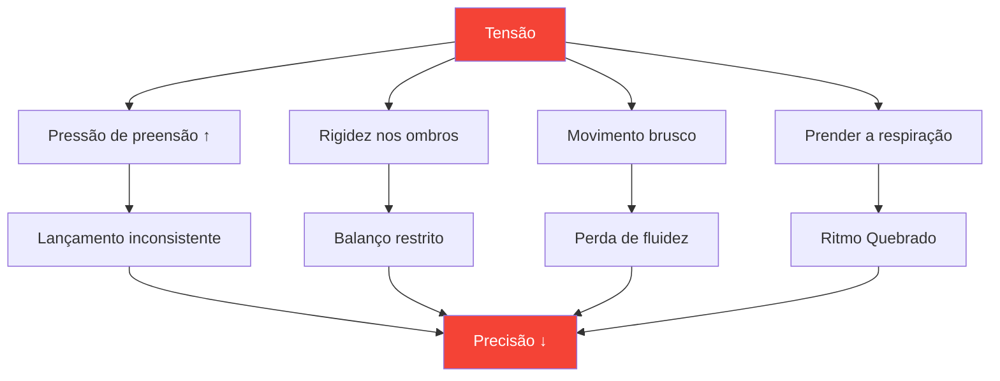

# Tensão e Precisão: A Conexão Oculta

> &quot;Não se pode ser tenso e preciso ao mesmo tempo. É fisicamente impossível.&quot;

Você já sentiu isso: aquele arremesso crucial em que seu corpo se tensiona, sua pegada se intensifica e a bola vai exatamente para onde você não queria. A tensão é a assassina silenciosa da precisão.

::: danger O Inimigo Oculto
**A maior parte da tensão é invisível para o jogador que a sente.** Você só percebe que está tenso quando já é tarde demais.
:::

---

## A biomecânica da tensão

---

## Onde a tensão se esconde

A maioria dos jogadores está ciente da tensão muscular generalizada (ombros rígidos antes de um arremesso importante). Poucos percebem a tensão sutil que prejudica o desempenho de forma consistente:

| Localização | Efeito no arremesso | Como perceber |
|----------|-----------------|---------------|
| **Pegada** | Cronograma de lançamento inconsistente | Marcas de bola na palma da mão |
| **Antebraço** | Redução da fluidez do pulso | Sensação de queimação |
| **Ombro** | Arco de balanço restrito | O arremesso parece &quot;curto&quot;. |
| **Pescoço** | Posição da cabeça alterada | Rigidez após as partidas |
| **Mandíbula** | Cascata de tensão em todo o corpo | Dentes cerrados |
| **Respiração** | Ritmo interrompido | Prender a respiração |

---

## A Espiral de Pressão-Tensão

Sob pressão, inicia-se um ciclo destrutivo:

::: tip Quebre o ciclo
**Interrompa na Etapa 2** — antes que a tensão afete o desempenho. É por isso que rotinas pré-arremesso com verificações de tensão são essenciais.
:::

## Detectando seus padrões de tensão

### O Método de Escaneamento Corporal

Antes de praticar, feche os olhos e faça um escaneamento:

1. Comece pelos pés — você sente algum aperto nos dedos dos pés?
2. Suba pelas pernas — Algum joelho travado?
3. Observe os quadris e o abdômen — Alguma contração muscular?
4. Verifique os ombros — Há alguma elevação?
5. Examine os braços e as mãos — Há algum sinal de aperto prematuro?
6. Observe o pescoço e o rosto — algum sinal de contração muscular?

Avalie a tensão de 0 a 10 em cada ponto. **Sua linha de base deve ser 2 ou menos.**

### O Método do Vídeo

Grave você mesmo arremessando:
- Prática de baixo risco
- Prática de risco moderado
- Competição de alto risco

Compare sua linguagem corporal. Onde você fica tenso à medida que a pressão aumenta?

### O Método do Parceiro

Peça a um colega de equipe para observar:
- Sua cara antes de lances importantes.
- Sua postura muda sob pressão.
- Seus padrões respiratórios
- Seu comportamento de preensão

Observadores externos veem o que nós não conseguimos sentir.

## Técnicas de Liberação

### Liberações rápidas (para uso durante a competição)

**O Teste Final**
- Aperto de mãos e braços breve e vigoroso.
- Libera padrões de retenção
- Leva de 2 a 3 segundos

**A Gota na Expiração**
- Respire fundo.
- Ao expirar, abaixe os ombros conscientemente.
- Alivie a tensão da mandíbula simultaneamente

**A Reinicialização da Pegada**
- Abra completamente a mão
- Abra bem os dedos
- Aperte novamente com a força mínima necessária.

### Liberações profundas (Uso em treinos/pré-competição)

**Relaxamento Muscular Progressivo**
- Contraia cada grupo muscular deliberadamente (5 segundos)
- Solte completamente (15 segundos)
- Observe a diferença
- Trabalhe com o corpo todo.

**Conexão Respiração-Corpo**
- Respiração lenta (4 tempos para inspirar, 6 tempos para expirar)
- A cada expiração, relaxe uma área do corpo.
- Continue até atingir o relaxamento total do corpo.

## A integração pré-filmagem

Incorpore a consciência da tensão na sua rotina pré-teste:

### Antes de entrar no círculo
- Escaneamento corporal rápido (2 segundos)
- Uma expiração libertadora
- Confirme a pegada relaxada

### No círculo
- Último suspiro para acalmar
- Foco suave no alvo
- Inicie o arremesso a partir de um estado relaxado.

### Após o arremesso
- Observe onde a tensão se acumulou.
- Sacuda se necessário.
- Reiniciar para o próximo lançamento

## Treinamento da Consciência da Tensão

### Exercício 1: A pegada mínima

Determine a pressão mínima de preensão que permite manter o controle:
- Comece com uma pegada firme — lance 5 bolas
- Reduza a força da pegada em 20% — arremesse 5 bolas.
- Continue reduzindo até perder o controle.
- Dê um passo para trás — essa é a sua pegada ideal.

A maioria dos jogadores aperta os braços com 40 a 60% mais força do que o necessário.

### Exercício 2: Simulação de Pressão

Pratique sob pressão artificial enquanto monitora a tensão:
- Estabelecer consequências para os lançamentos de treino.
- Observe onde a tensão aparece.
- Pratique o relaxamento mantendo o foco.
- Aumente gradualmente a tolerância à pressão.

### Exercício 3: O ponteiro relaxado

Avalie-se em duas dimensões:
- Resultado técnico (onde a bola caiu?)
- Nível de tensão (quão relaxado você estava?)

**Objetivo:** Maximizar ambos simultaneamente. Muitos jogadores precisam aceitar resultados ligeiramente piores inicialmente, enquanto aprendem a arremessar relaxados.

## Protocolo do dia da competição

### Pré-jogo
- Relaxamento progressivo de 10 minutos
- Escaneamento corporal para identificar padrões de retenção
- rotina de descompressão

### Entre extremidades
- Breve teste
- Uma respiração que se liberta
- Verificação de tensão antes de lançamentos críticos

### Durante o arremesso
- Confie na sua rotina pré-injeção
- A técnica de liberação é pré-programada.
- Não controle conscientemente durante a execução.

## Erros comuns

::: warning Evite estes
- **Relaxamento excessivo** — Alguma ativação é necessária
- **Controle consciente durante o arremesso** — Interrompe o fluxo
- **Relaxar apenas em arremessos longos** — Deve ser consistente
- **Ignorar a respiração** — A respiração e a tensão estão ligadas.
- **Apressar a rotina** — Liberar a tensão leva tempo
:::

## O benefício a longo prazo

Jogadores que dominam o gerenciamento da tensão:
- Ter um desempenho mais consistente sob pressão.
- Experimente menos fadiga física.
- Recupere-se mais rapidamente dos erros.
- Aproveite mais a competição

---

## Conteúdo relacionado

- [Módulo de Gestão da Tensão](/en/education/tension/) — Educação completa
- [Preparação Física](/en/education/tension/physical) — Prontidão física
- [Gestão da Pressão](/en/articles/pressure-management) — Aspectos Mentais

