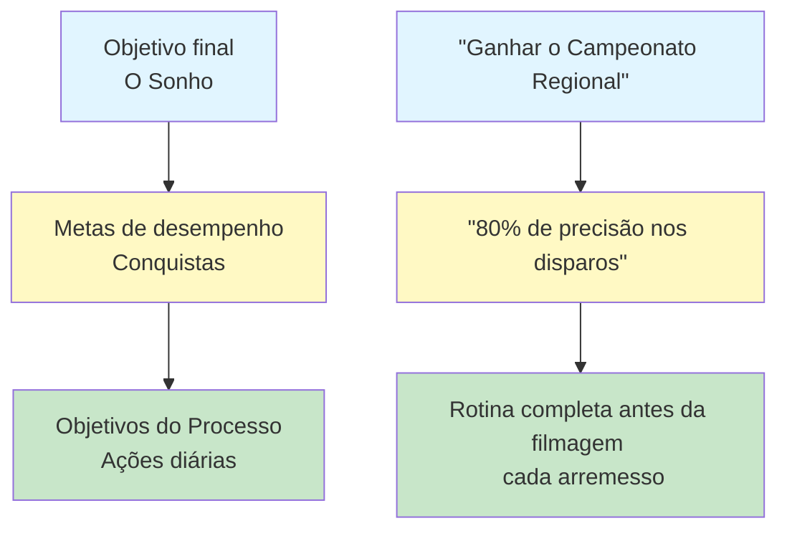

# Definição de metas para jogadores de petanca
<AdBanner />

Metas claras são a sua bússola. Elas dão direção ao seu treinamento, motivação quando as coisas ficam difíceis e uma maneira de medir o progresso. Sem metas, você está apenas jogando bolinhas. Com metas, você está construindo algo.

::: tip O princípio fundamental
**Um objetivo sem um plano é apenas um desejo.** Defina metas claras, divida-as em etapas menores, concentre-se no que você controla e acompanhe seu progresso.
:::

## Por que as metas são importantes

Os objetivos servem a múltiplos propósitos:
- **Instruções:** Saiba em que trabalhar
- **Motivação:** Ter algo pelo qual lutar
- **Medição:** Acompanhe seu progresso
- **Foco:** Priorize seu tempo limitado

Para o jogador autônomo, os objetivos são especialmente importantes. Sem um treinador para pressioná-lo, seus objetivos se tornam seu guia.

## Os três tipos de objetivos

Nem todos os objetivos são iguais. Compreender os diferentes tipos ajuda você a definir objetivos melhores.

### 1. Objetivos de Resultado
**O quê:** O resultado final que você deseja
**Exemplo:** &quot;Ganhar o campeonato regional&quot;
**Nível de controle:** Baixo - depende dos oponentes, das condições e da sorte.

### 2. Metas de desempenho
**O quê:** Padrões de desempenho específicos
**Exemplo:** &quot;Alcançar 80% de precisão nos exercícios de arremesso&quot;
**Nível de controle:** Médio - depende principalmente de você

### 3. Objetivos do Processo
**O quê:** Ações e comportamentos que você controla
**Exemplo:** &quot;Completar minha rotina pré-arremesso em todos os lançamentos&quot;
**Nível de controle:** Alto - totalmente a seu critério

### A Hierarquia de Objetivos

::: warning Principais conclusões
**Concentre a maior parte da sua atenção nas metas de processo.** Elas são o que você controla e levam aos resultados que você deseja.

- **Objetivos de resultado:** Baixo controle, alta motivação
- **Objetivos de desempenho:** Controle moderado, progresso mensurável
- **Objetivos do processo:** Alto controle, foco diário ← **Foco aqui**
:::

## O Quadro SMART

::: info Lista de verificação para metas SMART
Todo objetivo deve ser:
- ✅ **E**specífico - Claro e bem definido
- ✅ **M**ensurável - Você pode acompanhar o progresso
- ✅ **Alcançável** - Desafiador, mas possível
- ✅ **R**elevante - Alinhado com sua visão geral
- ✅ **Com prazo definido - Possui uma data limite
:::

<AdInArticle />

### S - Específico
❌ &quot;Aprimore suas habilidades de tiro&quot;
✅ &quot;Melhorar minha precisão de acerto direto a 8 metros&quot;

### M - Mensurável
❌ &quot;Atire com mais precisão&quot;
✅ &quot;Acerte pelo menos 24/30 no exercício de arremesso em escada&quot;

### A - Atingível
❌ &quot;Nunca erre um tiro&quot; (impossível)
✅ &quot;Aumentar a precisão em 10% ao longo de 8 semanas&quot; (desafiador, mas realista)

### R - Relevante
❌ &quot;Correr uma maratona&quot; (sem relação direta)
✅ &quot;Melhore o equilíbrio e a estabilidade para arremessos mais precisos&quot; (auxilia no seu jogo)

### T - Temporal
❌ &quot;Um dia eu vou melhorar&quot;
✅ &quot;Até 15 de março, eu terei alcançado...&quot;

## Exemplos de gols para petanca

| Tipo | Gol ruim | Meta SMART |
|------|-----------|------------|
| Resultado | &quot;Ganhe mais&quot; | &quot;Chegar às semifinais do Torneio de Primavera&quot; |
| Desempenho | &quot;Aponte melhor&quot; | &quot;Atingir 70% dos pontos a uma distância de 50 cm e 8 m&quot; |
| Processo | &quot;Pratique mais&quot; | &quot;Realize 3 sessões de treinamento focadas por semana&quot; |

## Desmembrando Grandes Objetivos

Grandes objetivos podem parecer assustadores. Divida-os em partes menores:

### Exemplo: &quot;Ganhar o Campeonato do Clube (daqui a 12 meses)&quot;

**Objetivo anual:** Vencer o campeonato do clube

**Metas trimestrais:**
- Q1: Melhorar a precisão dos disparos para 75%
- Q2: Desenvolver uma rotina pré-teste consistente
- Q3: Domine as situações de pressão
- 4º trimestre: Desempenho máximo e preparação para a competição

**Metas mensais (1º trimestre):**
- Mês 1: Estabelecer a linha de base, identificar as fragilidades.
- Mês 2: Foco na técnica de tiro
- Mês 3: Adicione pressão ao treino de arremesso

**Metas semanais (Mês 2):**
- Semana 1: 3 sessões de filmagem, análise de vídeo
- Semana 2: Trabalhar na questão técnica identificada
- Semana 3: Aumente a distância gradualmente
- Semana 4: Avalie o progresso, ajuste o plano.

## Conectando metas ao seu &quot;porquê&quot;

Os objetivos funcionam melhor quando estão conectados a uma motivação mais profunda.

Pergunte a si mesmo:
- Por que eu quero alcançar isso?
- O que isso significará para mim?
- Como me sentirei quando tiver sucesso?
- O que me motiva a melhorar?

Anote suas respostas. Volte a elas quando a motivação diminuir.

## Nesta seção

- **[Metas SMART em Detalhe](/en/education/goals/smart-goals)** - Uma análise aprofundada da criação de metas eficazes
- **[Criando seu Plano de Treinamento](/en/education/goals/planning)** - Transforme metas em ação

## Resumo: Regras para definição de metas

::: tip Regra nº 1: A Regra de Controle
**Concentre-se nos objetivos de processo (aquilo que você controla) em vez dos objetivos de resultado.**
Os objetivos de processo levam a objetivos de desempenho, que por sua vez levam a objetivos de resultado.
:::

::: tip Regra nº 2: A Regra SMART
**Os objetivos devem ser Específicos, Mensuráveis, Atingíveis, Relevantes e Temporais.**
Metas vagas produzem resultados vagos. Metas SMART produzem progresso.
:::

::: tip Regra nº 3: A Regra de Quebra
**Grandes metas precisam de marcos trimestrais, mensais e semanais.**
Divida grandes objetivos em pequenas etapas práticas que você possa concluir esta semana.
:::

::: tip Regra nº 4: A Regra da Conexão
**Conecte seus objetivos ao seu &quot;porquê&quot; mais profundo.**
Quando a motivação diminui, o seu &quot;porquê&quot; é o que te mantém firme.
:::

## Ponto-chave

> Um objetivo sem um plano é apenas um desejo.

Defina metas claras. Divida-as em etapas menores. Concentre-se no que você controla. Acompanhe seu progresso.

<AdBanner />
