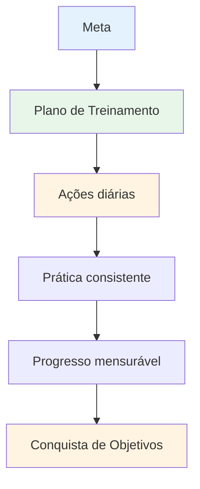

# Criando seu plano de treinamento

Metas sem um plano são apenas desejos. Este guia ajuda você a transformar suas metas em um plano de treinamento estruturado que realmente funciona.

::: tip A Grande Ideia
**Objetivos sem um plano são apenas desejos.** Um plano de treinamento estruturado transforma seus objetivos em ações diárias que se acumulam e resultam em progresso real.
:::

## As 8 fases do desenvolvimento autodirigido

### Fase 1: Defina sua bússola (Objetivos)
Você já aprendeu sobre metas SMART. Agora, organize-as em uma hierarquia:

1. **Objetivo a longo prazo** (1 a 2 anos): Seu sonho
2. **Meta anual**: Meta para este ano
3. **Metas trimestrais**: marcos trimestrais
4. **Metas mensais**: Áreas de foco específicas
5. **Objetivos semanais**: Metas de treinamento

### Fase 2: Avalie seus recursos

Antes de planejar, avalie honestamente o que você tem:

| Recurso | Perguntas a fazer |
|----------|-----------------|
| **Tempo** | Quantas horas por semana você consegue treinar de forma realista? |
| **Localização** | Você tem acesso a uma pista adequada? Qual é a qualidade da superfície? |
| **Equipamento** | Você tem bolas de bocha adequadas? Ferramentas de medição? Capacidade de filmagem? |
| **Conhecimento** | Quais são seus pontos fortes e fracos em termos técnicos? |
| **Condição física** | Há alguma limitação? Alguma área que precise de melhorias? |

Seja honesto. Um plano realista é melhor do que uma fantasia ambiciosa.

### Fase 3: Escolha seus exercícios

Selecione exercícios que contribuam diretamente para seus objetivos:

**Para melhorar a pontuação:**
- Apontamento preciso para zonas marcadas
- exercícios de variação de distância
- Prática de superfície diferente

**Para melhorar a sua pontaria:**
- Escada de tiro (distâncias progressivas)
- Tiro ao obstáculo (arco alto forçado)
- prática de alvo móvel

**Para o desenvolvimento mental:**
- prática de rotina pré-arremesso
- Sessões de visualização
- Simulação de pressão

**Equilibre seu programa:**
- Trabalho técnico (apontar, disparar)
- Treinamento mental (atenção plena, visualização)
- Condicionamento físico (equilíbrio, flexibilidade)
- Jogo de partidas (aplicação de habilidades)

### Fase 4: Crie seu cronograma

Elabore um cronograma semanal realista:

| Dia | Manhã | Tarde | Noite | Foco |
|-----|---------|-----------|---------|-------|
| seg | - | Técnico: Apontar | Mobilidade leve | Precisão |
| ter | - | Técnico: Tiro ao alvo | - | Potência/precisão |
| qua | - | Treinamento mental | - | Atenção plena |
| qui | - | Misto: Cenários de jogo | Mobilidade leve | Aplicativo |
| sex | - | Técnico: Fraqueza | - | Melhoria |
| Sentado | Jogo ou competição | - | - | Desempenho |
| Sol | Descansar | Revisão semanal | Planejamento | Recuperação |

**Princípios fundamentais:**
- Priorize o treinamento mental (ele costuma ser negligenciado).
- Incluir dias de descanso
- Equilibrar diferentes habilidades
- Deixe a flexibilidade para a vida

### Fase 5: Preparar-se para os obstáculos

As coisas vão dar errado. Esteja preparado para isso.

| Risco | Probabilidade | Impacto | Plano de contingência |
|------|------------|--------|-------------|
| Falta de tempo | Alto | Médio | Tenha uma &quot;sessão mínima&quot; preparada (20 minutos). |
| Mau tempo | Médio | Médio | Visualização em ambientes internos, estudo em vídeo |
| Baixa motivação | Alto | Médio | Retorne ao &quot;porquê&quot;, estabeleça metas menores e faça uma pausa. |
| Lesão leve | Médio | Alto | Foque no treinamento mental e em habilidades não afetadas. |
| Sem parceiro de treino | Médio | Baixo | Exercícios individuais, autoanálise em vídeo |

### Fase 6: Acompanhe seu progresso

O que é medido é gerenciado.

**Mantenha um diário de treinamento:**
- Data e duração
- Exercícios concluídos
- Pontuações/resultados
- Como você se sentiu (energia, foco, estado de fluxo)
- Notas técnicas
- Clima/condições

**Questões de revisão semanais:**
- Concluí as sessões que havia planejado?
- Que notas eu obtive?
- O que foi agradável? O que foi difícil?
- Alguém já passou por uma experiência de estado de fluxo?
- O que devo ajustar?

### Fase 7: Mantenha-se motivado

A motivação oscila. Crie sistemas para mantê-la:

**Motivação interna:**
- Conecte-se ao seu &quot;porquê&quot;
- Comemore as pequenas vitórias
- Observe a melhora ao longo do tempo.
- Encontre alegria no processo.

**Suporte externo:**
- Parceiros de treino (mesmo que ocasionalmente)
- Compartilhe seus objetivos com alguém.
- Participe de comunidades online
- Acompanhe as sequências e a consistência.

**Quando a motivação diminui:**
- Faça uma sessão mínima (qualquer coisa é melhor do que nada).
- Mude seu ambiente
- Analise seu progresso
- Lembre-se dos sucessos passados
- Faça uma pausa planejada, se necessário.

### Fase 8: Revisão e Adaptação

Seu plano deve evoluir:

**Semanalmente:** Revisão rápida, ajustes menores
**Mensalmente:** Avaliar o progresso em relação às metas mensais e ajustar o foco.
**Trimestral:** Revisão geral, definição das metas para o próximo trimestre.
**Anualmente:** Avaliação completa, novo plano anual

**Questões para revisão:**
- Estou progredindo em direção aos meus objetivos?
- Meu treinamento é eficaz?
- Preciso de exercícios diferentes?
- Meus objetivos ainda são relevantes?
- O que eu aprendi?

## Exemplo de Plano de 8 Semanas

**Objetivo:** Melhorar a precisão dos arremessos em 15%

| Semana | Foco | Sessões principais |
|------|-------|--------------|
| 1 | Linha de base | Teste o nível atual, análise de vídeo |
| 2 | Técnica | Identificar e trabalhar nas questões principais |
| 3 | Repetição | Prática de tiro em alto volume |
| 4 | Teste | Avaliação intermediária, ajuste |
| 5 | Variação | Distâncias e ângulos diferentes |
| 6 | Pressão | Adicionar consequências aos exercícios |
| 7 | Integração | Cenários semelhantes a jogos |
| 8 | Teste final | Melhoria da mensuração |

## Ponto-chave

> Planeje seu trabalho e depois execute o plano. Mas esteja preparado para se adaptar.

O melhor plano é aquele que você realmente segue. Comece com algo simples, mantenha a consistência e ajuste conforme for aprendendo.

