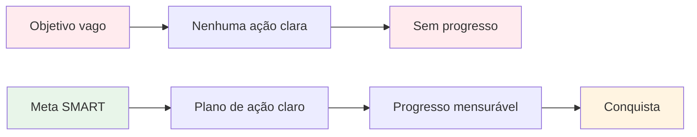

# Metas SMART para Petanca
<AdBanner />

A metodologia SMART transforma desejos vagos em objetivos concretos. Vamos analisar cada elemento em detalhes, com exemplos específicos para a petanca.

::: tip A Grande Ideia
**Objetivos vagos levam a resultados vagos.** Metas SMART criam clareza, ação e progresso mensurável. Transforme &quot;Eu quero melhorar&quot; em metas específicas que você realmente pode alcançar.
:::

## S - Específico

Um objetivo específico responde a estas perguntas:
- **O que** exatamente eu quero alcançar?
- **Onde** isso acontecerá?
- **Quais** aspectos estão envolvidos?

### Tornar as metas específicas.

| Vago | Específico |
|-------|----------|
| &quot;Aprimorar minha mira&quot; | &quot;Aprimorar minha precisão de apontamento em superfícies de cascalho a distâncias de 7 a 9 metros&quot; |
| &quot;Torne-se mentalmente mais forte&quot; | &quot;Desenvolva uma rotina pré-arremesso consistente que eu utilize em todos os arremessos.&quot; |
| &quot;Ganhe mais jogos&quot; | &quot;Ganhar pelo menos 60% das minhas partidas competitivas nesta temporada&quot; |

### Lista de verificação de especificidade
- [ ] Alguém consegue entender exatamente o que estou tentando fazer?
- [ ] Defini as condições (distância, superfície, situação)?
- [ ] Existe apenas uma interpretação para esse objetivo?

## M - Mensurável

O que não se mede, não se gerencia. Metas mensuráveis permitem acompanhar o progresso e saber quando se alcançou o sucesso.

### Formas de medir objetivos na petanca

**Medidas quantitativas:**
- Pontos obtidos em exercícios (ex.: 24/30)
- Percentagem de precisão (ex.: taxa de acerto de 75%)
- Distância do alvo (ex.: em média 30 cm do macaco)
- Consistência (ex.: 3 sessões bem-sucedidas consecutivas)

**Utilizando exercícios de treinamento como medidas:**

| Furar | O que mede | Exemplo de alvo |
|-------|-----------------|----------------|
| Escada de tiro | Precisão de tiro sob pressão | Alcance 10m em 30 bolas |
| Precisão de apontamento | Precisão de apontamento para a zona | 24/30 pontos |
| Variação de distância | Controle de profundidade | 80% dentro de 50 cm |

### Acompanhando suas medidas
Mantenha um registro simples:
- Data
- Exercício/treinamento
- Pontuação/resultado
- Condições (superfície, clima)
- Notas

## A - Atingível (mas desafiador)

Os objetivos devem te desafiar sem serem impossíveis.

### Encontrando o nível certo

**Muito fácil:** &quot;Pratique uma vez este mês&quot;
- Sem crescimento, sem motivação.

<AdInArticle />

**Muito difícil:** &quot;Nunca erre um arremesso&quot;
- Impossível leva à frustração.

**Ideal:** &quot;Aumente a precisão dos seus tiros em 15% em 8 semanas&quot;
- Desafiador, mas realista com esforço.

### Questões para testar a capacidade de realização
- Outros indivíduos do meu nível já conseguiram isso?
- Tenho o tempo e os recursos necessários?
- Isso está (em grande parte) sob meu controle?
- Estou disposto a fazer o que for preciso?

### Metas ambiciosas
Ter objetivos ambiciosos a longo prazo é normal. Apenas certifique-se de que seus objetivos a curto prazo sejam passos alcançáveis em direção a eles.

## R - Relevante

Seus objetivos devem estar alinhados com sua visão de longo prazo.

### Questões de Relevância
- Este objetivo contribui para o meu desenvolvimento geral?
- Essa é a prioridade certa neste momento?
- Isso se encaixa no meu tempo e recursos disponíveis?
- Estou realmente motivado por esse objetivo?

### Exemplo: Verificando a Relevância

**Situação:** Você deseja competir em nível nacional.

**Objetivos relevantes:**
- Melhorar a precisão dos disparos (impacta diretamente os resultados)
- Desenvolva rotinas mentais (ajuda em situações de pressão)
- Aumentar a frequência de treino (desenvolve a habilidade mais rapidamente)

**Objetivos menos relevantes:**
- Aprenda jogadas de efeito (diversão, mas não prioridade competitiva)
- Compre bolas novas e caras (o equipamento não é o seu fator limitante).

## T - Temporal

Os prazos criam urgência e possibilitam o planejamento.

### Definir prazos

| Tipo de objetivo | Prazo típico |
|-----------|------------------|
| Longo prazo | 1 a 3 anos |
| Anual | 12 meses |
| Trimestral | 3 meses |
| Mensal | 4 semanas |
| Semanalmente | 7 dias |
| Sessão | Prática única |

### Exemplo de linha do tempo

**Longo prazo (2 anos):** Qualificar-se para a seleção da equipe nacional

**Anual:** Ficar entre os 10 primeiros colocados no ranking regional

**Trimestral (1º trimestre):**
- Estabeleça uma rotina de treinamento consistente.
- Melhorar a precisão dos disparos para 70%.

**Mensal (janeiro):**
- Semana 1: Avaliar o nível atual, definir parâmetros de referência.
- Semanas 2 e 3: Foco na técnica de arremesso
- Semana 4: Testar e medir o progresso

**Semanalmente:**
- Segunda-feira: Sessão de filmagem técnica
- Quarta-feira: Apontar e situações de jogo
- Sexta-feira: Treinamento mental e visualização
- Fim de semana: Competição ou treino para jogo

## Juntando tudo

### Planilha para definição de metas

**Meu objetivo (primeira versão):**
_________________________________

**Específico - O quê exatamente?**
_________________________________

**Mensurável - Como saberei?**
_________________________________

**Viável - É realista?**
_________________________________

**Relevante - Por que isso importa?**
_________________________________

**Com prazo definido - Até quando?**
_________________________________

**Minha meta SMART (versão final):**
_________________________________

### Exemplo concluído

**Primeira versão:** &quot;Aprimorar a pontaria&quot;

**Versão SMART:** &quot;Até 30 de abril, alcançarei uma pontuação de 24/30 ou superior no exercício de Escada de Tiro (6-10m com obstáculos) em três sessões de treinamento consecutivas, conforme registrado em meu diário de treinamento.&quot;

## Ponto-chave

> Metas SMART transformam sonhos em planos e planos em resultados.

Dedique tempo para elaborar seus objetivos com cuidado. Um objetivo bem definido é metade do caminho percorrido.

<AdBanner />
