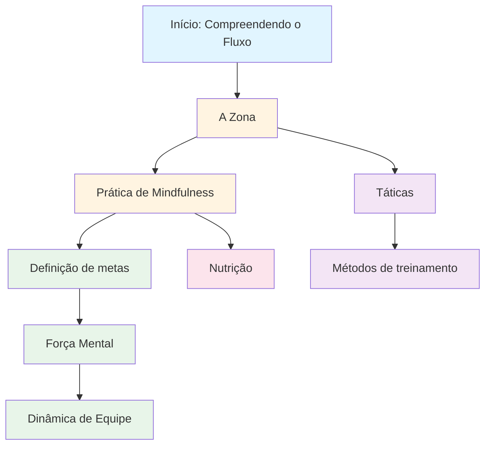

# Educação

Bem-vindo ao programa educacional da Academia de Pétanque. Aqui, jogadores de elite aprendem a dominar o jogo mental.

::: tip Princípio Fundamental
No nível de elite, o **treinamento mental torna-se mais importante do que o treinamento técnico**. Essa proporção se inverte conforme o atleta se desenvolve: iniciantes precisam de 90% de trabalho técnico, enquanto especialistas precisam de 80% de trabalho mental.
:::

## Por que o treinamento mental é importante

No nível de elite, a habilidade técnica é apenas o ponto de partida. Pesquisas mostram que a atitude mental pode ser tão importante quanto a habilidade física em esportes de precisão como a petanca. A diferença entre bons jogadores e grandes jogadores reside, muitas vezes, na mente.

> &quot;O esporte é 100% mental. A mente é a força motriz por trás de todas as habilidades físicas.&quot;

## Sua jornada de aprendizado

Eis o caminho recomendado em nosso programa educacional:

**Sequência recomendada:**
1. **Fundamentos:** Comece com o Método Zone e Mindfulness.
2. **Estrutura:** Adicionar definição de metas e métodos de treinamento
3. **Competição:** Desenvolva força mental e táticas
4. **Jogo em Equipe:** Domine a Dinâmica de Equipe
5. **Otimização:** Ajuste fino com a Nutrição

## Nossos Caminhos de Aprendizagem

### 🎯 [A Zona (Estado de Fluxo)](/pt/education/the-zone/)
Aprenda o que é realmente &quot;o estado de fluxo&quot; e como acessá-lo. Compreenda a ciência por trás dos estados de fluxo e descubra técnicas práticas para ter o melhor desempenho quando mais importa.

### 🧘 [Atenção Plena](/pt/education/mindfulness/)
Domine a arte de estar presente. Aprenda técnicas comprovadas cientificamente para acalmar a mente, melhorar o foco e se recuperar rapidamente de erros.

### 📊 [Definição de Metas](/pt/education/goals/)
Crie um roteiro para o seu desenvolvimento. Aprenda a metodologia SMART adaptada para a petanca e elabore um plano de treinamento que realmente funcione.

### 💪 [Força Mental](/pt/education/mental-strength/)
Desenvolva a resistência mental necessária para a competição. Aprenda a lidar com a pressão, superar a ansiedade e desenvolver rotinas que desencadeiem o máximo desempenho.

### 🤝 [Dinâmica de Equipe](/pt/education/team-player/)
Torne-se o colega de equipe com quem todos querem jogar. Aprenda sobre comunicação, confiança e como contribuir para uma cultura de equipe vencedora.

### ♟️ [Táticas](/pt/education/tactics/)
Pense estrategicamente sobre cada situação. Aprenda a tomar decisões com base em probabilidades e saiba quando assumir riscos.

### 🏋️ [Métodos de Treinamento](/pt/education/training/)
Treine de forma inteligente, não apenas com mais intensidade. Aprenda a estruturar seu treino para obter o máximo de resultados.

### 🥗 [Nutrição](/pt/education/nutrition/)
Abasteça seu cérebro para um desempenho preciso. Aprenda a manter energia e foco estáveis durante toda a competição.

## A Jornada da Técnica ao Fluidez

À medida que você se desenvolve como jogador, a proporção do seu treinamento se inverte - o treinamento mental torna-se mais importante, e não menos:

| Nível | Proporção (Técnica:Mental) | Objetivo principal |
|-------|---------------------|-------------------|
| **Novato** | 90 : 10 | Construa a máquina |
| **Intermediário** | 70 : 30 | Estabilizar a habilidade |
| **Avançado** | 50 : 50 | Confie na máquina |
| **Especialista** | 20 : 80 | Liberdade de execução |

Não é possível treinar um iniciante como um especialista (eles não possuem as conexões neurais necessárias), e não é possível treinar um especialista como um iniciante (o alto volume de informações técnicas leva ao excesso de reflexão).

## Guia de referência rápida: Princípios-chave de cada seção

| Seção | Princípio Fundamental | Ponto-chave |
|---------|---------------|--------------|
| **A Zona** | Alternar do modo analítico para o modo automático | *&quot;Não existem técnicas que sempre produzam uma bola perfeita. Mas existe um estado mental em que bolas perfeitas se tornam naturais.&quot;* |
| **Atenção plena** | Escolha onde concentrar sua atenção. | *&quot;A atenção plena não se trata de esvaziar a mente. Trata-se de escolher onde concentrar sua atenção.&quot;* |
| **Definição de Metas** | Concentre-se no que você controla. | *&quot;Um objetivo sem um plano é apenas um desejo.&quot;* |
| **Força Mental** | Ter um bom desempenho apesar do nervosismo | *&quot;A força mental não se trata de eliminar o nervosismo ou nunca cometer erros. Trata-se de ter um bom desempenho apesar deles.&quot;* |
| **Dinâmica de Equipe** | Confiança e comunicação são essenciais para vencer jogos. | *&quot;As melhores equipes nem sempre são as mais habilidosas, mas sim aquelas que jogam melhor juntas.&quot;* |
| **Táticas** | Tomar decisões é mais importante que a técnica. | *&quot;No nível de elite, a diferença raramente está na técnica, mas sim na tomada de decisões.&quot;* |
| **Treinamento** | Qualidade acima de quantidade | *&quot;Treine de forma inteligente, não apenas com mais intensidade.&quot;* |
| **Nutrição** | Energia estável = desempenho estável | *&quot;Seu cérebro é um instrumento de precisão. Alimente-o adequadamente.&quot;* |

## Todas as regras e principais conclusões

::: details Clique para expandir: Lista completa de princípios
Este é o seu guia de referência rápida. Adicione esta seção aos seus favoritos e consulte-a regularmente.

### As Regras da Zona
1. **A Regra da Troca:** Analise antes do círculo, execute dentro do círculo, observe depois.
2. **A Regra da Inversão:** À medida que a habilidade aumenta, o treinamento mental torna-se mais importante do que o treinamento técnico.
3. **A Regra da Confiança:** Sua mente consciente planeja, seu subconsciente executa.

### Regras da Atenção Plena
1. **A Regra da Consciência:** Observe sem julgar
2. **A Regra SOAS:** Pare, Observe, Aceite, Deixe ir
3. **A Regra do Presente:** Você só pode controlar este momento, este arremesso.

### Regras para definição de metas
1. **A Regra do Controle:** Concentre-se nas metas de processo (aquilo que você controla) em vez das metas de resultado.
2. **A Regra SMART:** Os objetivos devem ser Específicos, Mensuráveis, Atingíveis, Relevantes e Temporais.
3. **A Regra da Divisão:** Grandes objetivos precisam de marcos trimestrais, mensais e semanais.

### Regras de Força Mental
1. **A Regra da Rotina:** Rotinas consistentes antes do disparo levam ao desempenho máximo.
2. **A Regra da Reinicialização:** Desenvolva uma rotina de reinicialização de 10 segundos após cometer erros.
3. **O Ciclo da Confiança:** Melhor preparação → Mais confiança → Melhor desempenho

### Regras Táticas
1. **A Regra da Probabilidade:** Escolha lançamentos em que a probabilidade de sucesso justifique o risco.
2. **Regra do Controle do Valete:** A equipe que controla a posição do valete tem vantagem.
3. **A Regra da Distância:** Curta distância favorece o tiro, longa distância favorece apontar
4. **A Regra do Estilo:** Force o jogo a se adequar ao estilo mais forte da sua equipe.
5. **Regra de Gestão da Bocha:** Às vezes, ceder 1 ponto é melhor do que arriscar 3.

### Regras de dinâmica de equipe
1. **A Regra da Comunicação:** Uma comunicação clara e positiva constrói confiança.
2. **A Regra do Suporte:** A forma como você reage aos erros dos seus companheiros de equipe importa mais do que a sua habilidade.
3. **A Regra do Papel:** Conheça o seu papel e execute-o plenamente.

### Regras de Treinamento
1. **A Regra da Especificidade:** Treine aquilo que você deseja aprimorar.
2. **A Regra da Variação:** Treino aleatório é melhor que treino bloqueado para transferência de competição.
3. **A Regra da Recuperação:** O repouso é quando ocorre a adaptação.

### Regras de Nutrição
1. **A Regra da Estabilidade:** Evite picos e quedas bruscas de açúcar no sangue.
2. **A Regra da Hidratação:** Mesmo uma desidratação de 2% prejudica o desempenho.
3. **Regra do Tempo:** Alimente-se de 2 a 3 horas antes da competição.
:::

## Comece sua jornada

::: tip Ponto de partida recomendado
Comece com [The Zone](/pt/education/the-zone/) para entender a base do desempenho de elite, depois explore [Mindfulness](/pt/education/mindfulness/) para técnicas práticas que você pode usar imediatamente.
:::

