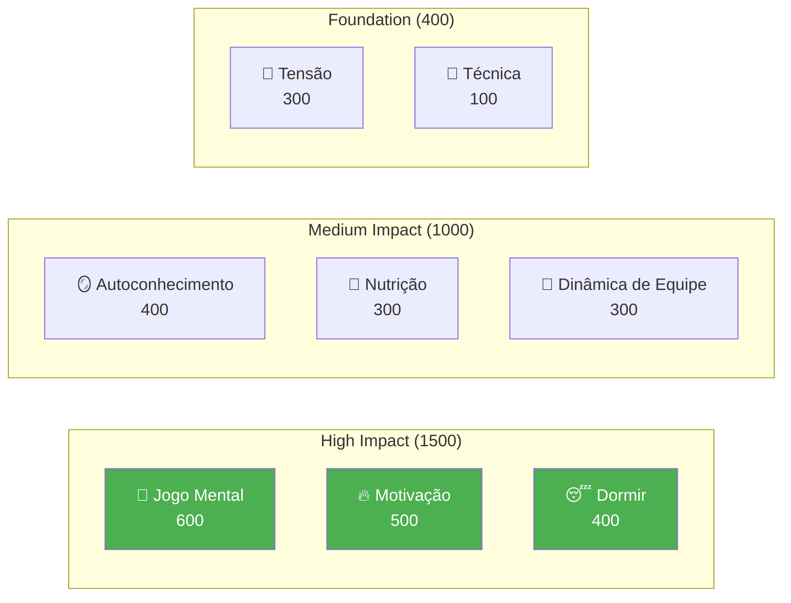

# Desenvolvimento de Jogadores de Elite

Bem-vindo ao programa educacional da Academia de Pétanque — o sistema completo de desenvolvimento do jogador baseado em 8 fatores de desempenho.

::: tip Princípio Fundamental
No nível de elite, o **treinamento mental torna-se mais importante do que o treinamento técnico**. Observe que a técnica tem o menor peso — não porque seja irrelevante, mas porque, no nível de elite, todos possuem boa técnica. O diferencial está no aspecto mental.
:::

---

## O Modelo de Desempenho de 8 Fatores

Nosso currículo é estruturado em torno de 8 fatores-chave, ponderados pelo seu impacto no desempenho de elite:

| Fator | Peso | Descrição |
|--------|--------|-------------|
| 🧠 [**Jogo Mental**](/en/education/mental-game/) | **600** | Padrões de pensamento, foco, estados de fluxo, diálogo interno |
| 🔥 [**Motivação**](/en/education/motivation/) | **500** | Motivação, propósito, orientação para objetivos, persistência |
| 😴 [**Sono e Recuperação**](/en/education/sleep/) | **400** | Qualidade do sono, recuperação, descanso pré-competição |
| 🪞 [**Autoconhecimento**](/en/education/self-awareness/) | **400** | Autopercepção precisa, reconhecimento de pontos cegos |
| 🥗 [**Nutrição**](/en/education/nutrition/) | **300** | Estabilidade do açúcar no sangue, hidratação, combustível para competição |
| 🤝 [**Dinâmica de Equipe**](/en/education/team-dynamics/) | **300** | Comunicação, confiança, clareza de papéis |
| 💆 [**Gestão da Tensão**](/en/education/tension/) | **300** | Tensão física, relaxamento, controle da respiração |
| 🎯 [**Técnica**](/pt/educação/técnica/) | **100** | Mecânica física, repertório de arremessos |

**Total: 2.900 pontos**

---

## Por que esses pesos?

Os pesos refletem o **impacto no nível de elite**:

> &quot;No campeonato regional, a técnica separa os 50% melhores. No campeonato nacional, todos na sala têm técnica de elite. O que os diferencia é todo o resto.&quot;

---

## Explore cada fator

### 🧠 Jogo Mental (600 pontos)

**O fator de maior impacto para o desempenho de elite.**

Sua capacidade de gerenciar pensamentos, manter o foco e acessar estados de fluxo.

- [A Zona](/en/education/mental-game/the-zone/) — Compreendendo e acessando estados de fluxo
- [Força Mental](/en/education/mental-game/mental-strength/) — Lidar com a pressão, rotinas pré-arremesso
- [Mindfulness](/en/education/mental-game/mindfulness/) — Foco no momento presente, recuperação de erros

### 🔥 Motivação (500 pontos)

**O que te motiva a melhorar dia após dia, ano após ano?**

- [Definição de Metas](/en/education/motivation/) — Metas SMART, foco no processo versus foco no resultado
- [Psicologia da Motivação](/en/education/motivation/motivation) — Motivação intrínseca versus extrínseca, Teoria da Autodeterminação
- [Manter a Motivação](/en/education/motivation/maintaining) — Prevenção da síndrome de burnout, superação de platôs

### 😴 Sono e Recuperação (400 pontos)

**Frequentemente negligenciado, mas de enorme impacto.**

A qualidade do sono afeta diretamente o tempo de reação, a tomada de decisões e a regulação emocional.

- [Ciência do Sono para Atletas](/en/education/sleep/) — Por que o sono é importante para esportes de precisão
- [Criando Hábitos de Sono](/en/education/sleep/habits) — Higiene do sono prática
- [Sono e Competição](/en/education/sleep/competition) — Protocolos pré-evento, gestão de viagens

### 🪞 Autoconhecimento (400 pontos)

**Você não pode melhorar o que não consegue ver.**

Uma autopercepção precisa possibilita melhorias direcionadas.

- [A Vantagem da Autoconsciência](/en/education/self-awareness/) — Por que o autoconhecimento é importante
- [Obtendo Feedback](/en/education/self-awareness/feedback) — Perspectivas externas
- [Análise de Vídeo](/en/education/self-awareness/video) — Usando vídeos para autodescoberta

### 🥗 Nutrição (300 pontos)

**Energia estável = desempenho estável.**

Seu cérebro é um instrumento de precisão — alimente-o adequadamente.

- [Aprimorando o Desempenho](/en/education/nutrition/) — Açúcar no sangue, hidratação, nutrição para competição

### 🤝 Dinâmica de Equipe (300 pontos)

**As melhores equipes nem sempre são as mais habilidosas.**

A comunicação e a confiança muitas vezes superam o talento individual.

- [Como ser um ótimo colega de equipe](/en/education/team-dynamics/) — Cultura e apoio à equipe
- Comunicação em equipe — Comunicação clara e positiva

### 💆 Gestão da Tensão (300 pontos)

**A tensão é inimiga da precisão.**

Não é possível ser tenso e preciso ao mesmo tempo.

- [Entendendo a Tensão](/en/education/tension/) — Tensão física versus tensão mental
- [Técnicas de Liberação](/en/education/tension/techniques) — Liberação Miofascial Progressiva (PMR), respiração, reinicializações rápidas
- [Gestão da Competição](/en/education/tension/competition) — Protocolos pré-jogo e durante o jogo

### 🎯 Técnica (100 pontos)

**A base — necessária, mas não suficiente.**

No nível de elite, a técnica é um pré-requisito. Os diferenciais estão acima.

- [Visão geral da técnica](/en/education/technique/) — Mecânica física
- [Métodos de treinamento](/en/education/technique/training/) — Prática deliberada
- [Táticas](/en/education/technique/tactics/) — Tomada de decisão estratégica

---

## A Jornada de Desenvolvimento

À medida que você se desenvolve como jogador, sua proporção de treinamento se inverte:

| Nível | Proporção (Técnica:Mental) | Foco |
|-------|---------------------|-------|
| **Novato** | 90 : 10 | Construa a máquina |
| **Intermediário** | 70 : 30 | Estabilizar a habilidade |
| **Avançado** | 50 : 50 | Confie na máquina |
| **Especialista** | 20 : 80 | Liberdade de execução |

Não é possível treinar um iniciante como um especialista (eles não possuem as conexões neurais necessárias), e não é possível treinar um especialista como um iniciante (o alto volume de informações técnicas leva ao excesso de reflexão).

---

## Guia de referência rápida: Princípios básicos

::: details Clique para expandir: Lista completa de princípios

### Regras do Jogo Mental
1. **A Regra da Troca:** Analise antes do círculo, execute dentro do círculo, observe depois.
2. **A Regra da Confiança:** Sua mente consciente planeja, seu subconsciente executa.
3. **A Regra do Presente:** Você só pode controlar este momento, este arremesso.

### Regras de Motivação
1. **A Regra do Controle:** Concentre-se nas metas de processo em vez das metas de resultado.
2. **A Regra SMART:** Os objetivos devem ser Específicos, Mensuráveis, Atingíveis, Relevantes e Temporais.
3. **A Regra Intrínseca:** A motivação interna supera as recompensas externas.

### Regras do sono
1. **A Regra da Consistência:** Acordar sempre no mesmo horário, inclusive nos fins de semana.
2. **A Regra do Buffer:** Relaxe pelo menos 60 minutos antes de dormir.
3. **Regra da Competição:** Durma mais na semana anterior, não apenas na noite anterior.

### Regras de autoconhecimento
1. **A Regra do Feedback:** Busque ativamente perspectivas externas
2. **A Regra do Vídeo:** O que você sente ≠ o que é real — grave e revise.
3. **A Regra do Ponto Cego:** A baixa autoconsciência afeta todas as outras avaliações.

### Regras de Nutrição
1. **A Regra da Estabilidade:** Evite picos e quedas bruscas de açúcar no sangue.
2. **A Regra da Hidratação:** Mesmo uma desidratação de 2% prejudica o desempenho.
3. **Regra do Tempo:** Alimente-se de 2 a 3 horas antes da competição.

### Regras de dinâmica de equipe
1. **A Regra da Comunicação:** Uma comunicação clara e positiva constrói confiança.
2. **A Regra do Apoio:** A forma como você reage aos erros importa mais do que a habilidade.
3. **A Regra do Papel:** Conheça o seu papel e execute-o plenamente.

### Regras de tensão
1. **A Regra da Liberação:** Você não pode ser tenso e preciso ao mesmo tempo.
2. **A Regra de Yerkes-Dodson:** Encontre sua zona de excitação ideal.
3. **Regra de Reinicialização:** Reinicie por 10 segundos antes de cada arremesso.

### Regras de técnica
1. **A Regra da Especificidade:** Treine aquilo que você deseja aprimorar.
2. **A Regra da Variação:** Prática aleatória é melhor que prática em bloco
3. **A Regra da Recuperação:** O repouso é quando ocorre a adaptação.
:::

---

## Comece sua jornada

::: tip Ponto de partida recomendado
Comece com o [Jogo Mental](/en/education/mental-game/) para entender a base do desempenho de elite. Em seguida, explore o [Sono](/en/education/sleep/) — geralmente é a melhoria com maior retorno sobre o investimento para jogadores em desenvolvimento.
:::

