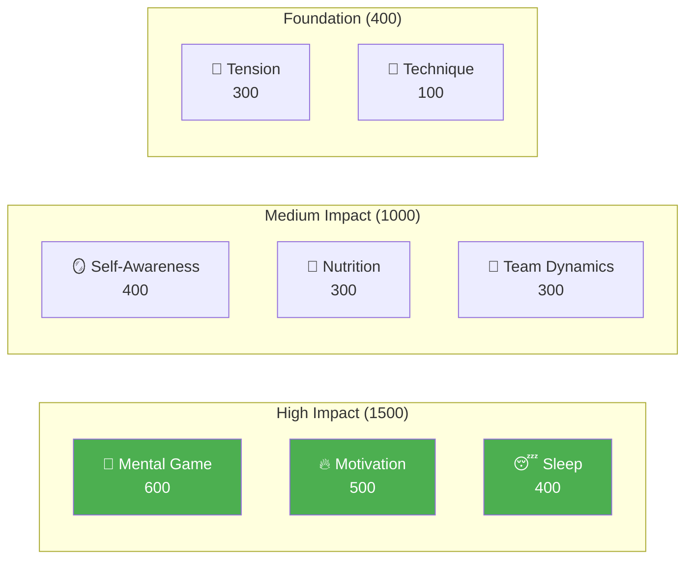

# Elite Player Development

Welcome to the Pétanque Academy Education program — the complete player development system based on 8 performance factors.

::: tip Core Principle
At the elite level, **mental training becomes more important than technical training**. Notice that Technique has the lowest weight — not because it doesn't matter, but because at the elite level, everyone has good technique. The differentiators are mental.
:::

---

## The 8-Factor Performance Model

Our curriculum is structured around 8 key factors, weighted by their impact on elite performance:

| Factor | Weight | Description |
|--------|--------|-------------|
| 🧠 [**Mental Game**](/pt/education/mental-game/) | **600** | Thought patterns, focus, flow states, self-talk |
| 🔥 [**Motivation**](/pt/education/motivation/) | **500** | Drive, purpose, goal orientation, persistence |
| 😴 [**Sleep & Recovery**](/pt/education/sleep/) | **400** | Sleep quality, recovery, pre-competition rest |
| 🪞 [**Self-Awareness**](/pt/education/self-awareness/) | **400** | Accurate self-perception, blind spot recognition |
| 🥗 [**Nutrition**](/pt/education/nutrition/) | **300** | Blood sugar stability, hydration, competition fuel |
| 🤝 [**Team Dynamics**](/pt/education/team-dynamics/) | **300** | Communication, trust, role clarity |
| 💆 [**Tension Management**](/pt/education/tension/) | **300** | Physical tension, relaxation, breath control |
| 🎯 [**Technique**](/pt/education/technique/) | **100** | Physical mechanics, throw repertoire |

**Total: 2,900 points**

---

## Why These Weights?

The weights reflect **impact at the elite level**:

> "At the regional championship, technique separates the top 50%. At the national championship, everyone in the room has elite technique. What separates them is everything else."

---

## Explore Each Factor

### 🧠 Mental Game (600 points)

**The most impactful factor for elite performance.**

Your ability to manage thoughts, maintain focus, and access flow states.

- [The Zone](/pt/education/mental-game/the-zone/) — Understanding and accessing flow states
- [Mental Strength](/pt/education/mental-game/mental-strength/) — Handling pressure, pre-shot routines
- [Mindfulness](/pt/education/mental-game/mindfulness/) — Present-moment focus, recovery from mistakes

### 🔥 Motivation (500 points)

**What drives you to improve day after day, year after year.**

- [Goal Setting](/pt/education/motivation/) — SMART goals, process vs outcome focus
- [Psychology of Motivation](/pt/education/motivation/motivation) — Intrinsic vs extrinsic, Self-Determination Theory
- [Maintaining Motivation](/pt/education/motivation/maintaining) — Burnout prevention, plateau navigation

### 😴 Sleep & Recovery (400 points)

**Often overlooked, massively impactful.**

Sleep quality directly affects reaction time, decision-making, and emotional regulation.

- [Sleep Science for Athletes](/pt/education/sleep/) — Why sleep matters for precision sports
- [Building Sleep Habits](/pt/education/sleep/habits) — Practical sleep hygiene
- [Sleep & Competition](/pt/education/sleep/competition) — Pre-event protocols, travel management

### 🪞 Self-Awareness (400 points)

**You can't improve what you can't see.**

Accurate self-perception enables targeted improvement.

- [The Self-Awareness Advantage](/pt/education/self-awareness/) — Why self-knowledge matters
- [Getting Feedback](/pt/education/self-awareness/feedback) — External perspectives
- [Video Analysis](/pt/education/self-awareness/video) — Using video for self-discovery

### 🥗 Nutrition (300 points)

**Stable energy = stable performance.**

Your brain is a precision instrument — fuel it accordingly.

- [Fueling Performance](/pt/education/nutrition/) — Blood sugar, hydration, competition nutrition

### 🤝 Team Dynamics (300 points)

**The best teams aren't always the most skilled.**

Communication and trust often outweigh individual talent.

- [Being a Great Teammate](/pt/education/team-dynamics/) — Team culture and support
- [Team Communication](/pt/education/team-dynamics/communication) — Clear, positive communication

### 💆 Tension Management (300 points)

**Tension is precision's enemy.**

You cannot be both tense and accurate.

- [Understanding Tension](/pt/education/tension/) — Physical vs mental tension
- [Release Techniques](/pt/education/tension/techniques) — PMR, breathing, quick resets
- [Competition Management](/pt/education/tension/competition) — Pre-match, during-match protocols

### 🎯 Technique (100 points)

**The foundation — necessary but not sufficient.**

At elite level, technique is a given. The differentiators are above.

- [Technique Overview](/pt/education/technique/) — Physical mechanics
- [Training Methods](/pt/education/technique/training/) — Deliberate practice
- [Tactics](/pt/education/technique/tactics/) — Strategic decision-making

---

## The Development Journey

As you develop as a player, your training ratio inverts:

| Level | Ratio (Tech:Mental) | Focus |
|-------|---------------------|-------|
| **Beginner** | 90 : 10 | Build the machine |
| **Intermediate** | 70 : 30 | Stabilize the skill |
| **Advanced** | 50 : 50 | Trust the machine |
| **Expert** | 20 : 80 | Freedom of performance |

You cannot train a Beginner like an Expert (they lack the neural pathways), and you cannot train an Expert like a Beginner (high technical volume causes over-thinking).

---

## Quick Reference: Core Principles

::: details Click to expand: Complete list of principles

### Mental Game Rules
1. **The Switch Rule:** Analyze before the circle, execute in the circle, observe after
2. **The Trust Rule:** Your conscious mind plans, your subconscious executes
3. **The Present Rule:** You can only control this moment, this throw

### Motivation Rules
1. **The Control Rule:** Focus on process goals over outcome goals
2. **The SMART Rule:** Goals must be Specific, Measurable, Achievable, Relevant, Time-bound
3. **The Intrinsic Rule:** Internal motivation outlasts external rewards

### Sleep Rules
1. **The Consistency Rule:** Same wake time every day, even weekends
2. **The Buffer Rule:** Wind down routine 60+ minutes before bed
3. **The Competition Rule:** Extra sleep the week before, not just the night before

### Self-Awareness Rules
1. **The Feedback Rule:** Actively seek external perspectives
2. **The Video Rule:** What you feel ≠ what's real — record and review
3. **The Blind Spot Rule:** Low self-awareness affects all other assessments

### Nutrition Rules
1. **The Stability Rule:** Avoid blood sugar spikes and crashes
2. **The Hydration Rule:** Even 2% dehydration impairs performance
3. **The Timing Rule:** Eat 2-3 hours before competition

### Team Dynamics Rules
1. **The Communication Rule:** Clear, positive communication builds trust
2. **The Support Rule:** How you respond to mistakes matters more than skill
3. **The Role Rule:** Know your role and execute it fully

### Tension Rules
1. **The Release Rule:** You cannot be both tense and precise
2. **The Yerkes-Dodson Rule:** Find your optimal arousal zone
3. **The Reset Rule:** 10-second reset before every throw

### Technique Rules
1. **The Specificity Rule:** Train what you want to improve
2. **The Variation Rule:** Random practice beats blocked practice
3. **The Recovery Rule:** Rest is when adaptation happens
:::

---

## Start Your Journey

::: tip Recommended Starting Point
Begin with [Mental Game](/pt/education/mental-game/) to understand the foundation of elite performance. Then explore [Sleep](/pt/education/sleep/) — it's often the highest-ROI improvement for developing players.
:::

