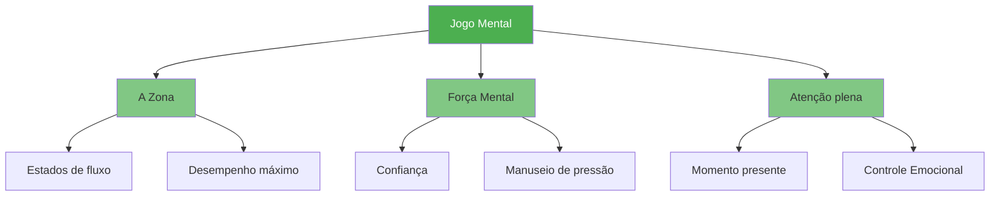

# Jogo Mental

::: tip O fator mais importante
**Peso: 600 pontos** — O aspecto mental é o que mais impacta seu desempenho. Domine sua mente e todo o resto virá naturalmente.
:::

O aspecto mental do jogo engloba tudo o que acontece entre suas orelhas: seus pensamentos, foco, confiança e diálogo interno. Jogadores de elite não apenas possuem uma técnica superior, como também um controle mais apurado sobre seu estado mental.

## Os Três Pilares

### 🎯 [A Zona](/pt/education/mental-game/the-zone/)
Acesse o estado de fluxo, onde o desempenho parece natural e sem esforço. Aprenda o que desencadeia o fluxo e como atingi-lo consistentemente.

- [Introdução ao Jogo da Zona](/pt/education/mental-game/the-zone/)
- [Treinamento Técnico vs. Treinamento de Fluxo](/pt/education/mental-game/the-zone/technical-vs-flow)
- [Entrando na Zona](/pt/education/mental-game/the-zone/entering-the-zone)

### 💪 [Força Mental](/pt/education/mental-game/mental-strength/)
Desenvolva a resiliência psicológica necessária para ter um bom desempenho sob pressão. Cultive a autoconfiança, aprenda a lidar com contratempos e mantenha a compostura.

- [Desenvolvendo Força Mental](/pt/education/mental-game/mental-strength/)
- [Lidando com a Pressão](/pt/education/mental-game/mental-strength/handling-pressure)
- [Rotina Pré-Arremesso](/pt/education/mental-game/mental-strength/pre-shot-routine)

### 🧘 [Mindfulness](/pt/education/mental-game/mindfulness/)
Desenvolva a consciência do momento presente para manter o foco e se recuperar rapidamente de erros.

- [Introdução à Atenção Plena](/pt/education/mental-game/mindfulness/)
- [Técnicas de Mindfulness](/pt/education/mental-game/mindfulness/techniques)
- [Prática Diária](/pt/education/mental-game/mindfulness/daily-practice)

## Por que o jogo mental é tão importante

| Aspecto | Treinamento técnico | Treinamento Mental |
|--------|-------------------|-----------------|
| **Na prática** | Você pode fazer a jogada | Você pode fazer a jogada |
| **Em competição** | A técnica pode falhar sob pressão. | As habilidades mentais mantêm o desempenho. |
| **A diferença** | É necessário ter habilidade física. | A habilidade mental é o multiplicador. |

::: warning O erro comum
A maioria dos jogadores dedica 90% do seu tempo à técnica e 10% às habilidades mentais. Jogadores de elite frequentemente invertem essa proporção assim que dominam os fundamentos.
:::

## Por onde começar?

**Novo no treinamento mental?** Comece com [The Zone](/pt/education/mental-game/the-zone/) para entender o que é a sensação de desempenho máximo.

**Está com dificuldades sob pressão?** Acesse [Força Mental](/pt/education/mental-game/mental-strength/) para técnicas práticas.

**Sua mente divaga durante as partidas?** [Atenção plena](/pt/education/mental-game/mindfulness/) ajudará você a se manter presente.

## Recursos relacionados

- Autoconhecimento — Conheça a si mesmo para melhorar mais rapidamente
- [Gestão da Tensão](/pt/education/tension/) — O relaxamento físico possibilita clareza mental
- [Ferramenta de Avaliação](/pt/education/) — Avalie seu desempenho mental e receba recomendações personalizadas

