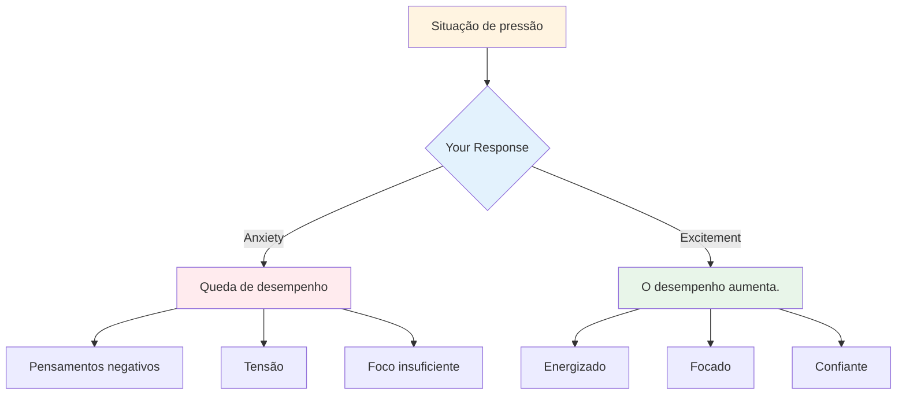

# Lidar com a pressão

A pressão faz parte da competição. O objetivo não é eliminá-la – isso é impossível. O objetivo é ter um bom desempenho apesar dela, e até mesmo usá-la a seu favor.

::: tip A Grande Ideia
**A pressão não desaparece com a experiência – você apenas aprende a lidar melhor com ela.** Os melhores jogadores não são calmos; eles são habilidosos em usar sua excitação de forma produtiva.
:::

## Entendendo a pressão

### O que cria pressão?
- Alto risco (jogo importante, lance decisivo)
- Ser observado (pelo público, pelos colegas de equipe)
- Expectativas (suas e dos outros)
- Incerteza (placar apertado, adversários desconhecidos)
- Tempo (estando, esperando demais)

### O que a pressão faz ao seu corpo
Quando você sente pressão, seu corpo reage:
- A frequência cardíaca aumenta.
- A respiração torna-se superficial.
- Músculos tensos
- As mãos podem tremer.
- O foco se estreita (às vezes demais).

Seu corpo está se preparando para a ação. Não é nada ruim – é energia que você pode usar.

## Reestruturando a pressão

### Pressão como excitação

As sensações físicas de ansiedade e excitação são quase idênticas. A diferença está em como você as interpreta.

**Interpretação da ansiedade:** &quot;Estou nervoso(a), algo ruim pode acontecer&quot;
**Interpretação da empolgação:** &quot;Estou energizado(a), isso é importante para mim&quot;

**Experimente isto:** Quando sentir pressão, diga para si mesmo: &quot;Estou animado&quot; em vez de &quot;Estou nervoso&quot;.

### Pressão como privilégio

Apenas os momentos importantes criam pressão. Se você está sentindo pressão, está numa situação que importa.

> &quot;Pressão é um privilégio – só chega para quem a merece.&quot; – Billie Jean King

## Técnicas para momentos de alta pressão

### 1. Controle da Respiração

A respiração é a maneira mais rápida de mudar seu estado.

**A técnica 4-7-8:**
1. Inspire contando até 4.
2. Mantenha a posição por 7 tempos.
3. Expire contando até 8.
4. Repita 2 a 3 vezes.

**Reinicialização rápida (no círculo):**
- Uma respiração lenta e profunda.
- Sinta seus pés no chão
- Relaxe os ombros ao expirar.

### 2. Aterramento físico

Conecte-se com as sensações físicas para sair da sua cabeça:
- Sinta o peso da bola.
- Repare nos seus pés no chão.
- Aperte e solte a mão que não está arremessando.
- Gire os ombros para trás.

### 3. Redução do foco

Em momentos de pressão, concentre-se apenas no que importa:
- Não é a pontuação
- Não o público
- Não o que poderia acontecer
- Só este arremesso, este alvo, este momento.

**Palavras-chave:** &quot;Aqui. Agora. Isto.&quot;

### 4. Foco no Processo

Mudança de foco do resultado para o processo:

**Foco no resultado (gera pressão):**
- &quot;Preciso fazer isso&quot;
- &quot;Se eu errar, nós perdemos&quot;
- &quot;Todos estão assistindo&quot;

**Foco no processo (reduz a pressão):**
- &quot;Siga minha rotina&quot;
- &quot;Veja o alvo&quot;
- &quot;Confie no meu treinamento&quot;

### 5. O aperto com a mão esquerda

Para jogadores destros, aperte a mão esquerda por 10 a 15 segundos:
- Ativa o hemisfério direito do cérebro
- Acalma o excesso de pensamento analítico.
- Ajuda a acessar a execução automática.

Use isso quando perceber que está pensando demais.

## Preparando-se para a pressão

### Simular pressão na prática

Você não consegue lidar com a pressão da competição se nunca a experimentou nos treinos.

**Formas de criar pressão nos treinos:**
- Estabelecer consequências (flexões para quem errar, comprar café para o parceiro)
- Criar cenários &quot;obrigatórios&quot;
- Pratique com uma plateia.
- Pressão do tempo (cronômetro)
- Fadiga (pratique quando estiver cansado)

### Visualização

Ensaiar mentalmente situações de alta pressão:
1. Feche os olhos
2. Imagine um cenário de pressão em detalhes.
3. Sinta as sensações de pressão
4. Você se vê lidando bem com isso.
5. Execute com sucesso em sua mente

Faça isso regularmente, não apenas antes das competições.

### Crie um histórico de pressão

Anote as vezes em que você lidou bem com a pressão:
- Qual era a situação?
- Como você se sentiu?
- O que você fez?
- Qual foi o resultado?

Relembre isso antes das competições para se manter informado: &quot;Eu já fiz isso antes.&quot;

## Durante a competição

### Antes do lançamento de pressão
1. Dê um passo para trás, respire fundo.
2. Relembre sua rotina.
3. Foque no processo, não no resultado.
4. Use sua palavra-gatilho ou deixa.

### No círculo
1. Execute sua rotina exatamente como praticou.
2. Foque no exterior (alvo, não no corpo)
3. Confie no seu treinamento
4. Liberte sem hesitação

### Após o arremesso
- Aceite o resultado sem julgamento.
- Se estiver tudo bem: breve agradecimento e prossiga.
- Se falhar: método SOAS, reinicie para o próximo lançamento.

## Erros comuns relacionados à pressão

| Erro | Melhor abordagem |
|---------|----------------|
| Apressando-se | Vá com calma, use a rotina completa. |
| Pensar demasiado | Foco externo, treinamento de confiança |
| Mudança de técnica | Apegue-se ao que você conhece. |
| Focando no resultado | Foque no processo |
| Lutar contra os nervos | Aceite e utilize a energia |

## Ponto-chave

> A pressão não desaparece com a experiência. Você apenas aprende a lidar melhor com ela.

Os melhores jogadores não são calmos – eles são habilidosos em usar sua excitação de forma produtiva.

