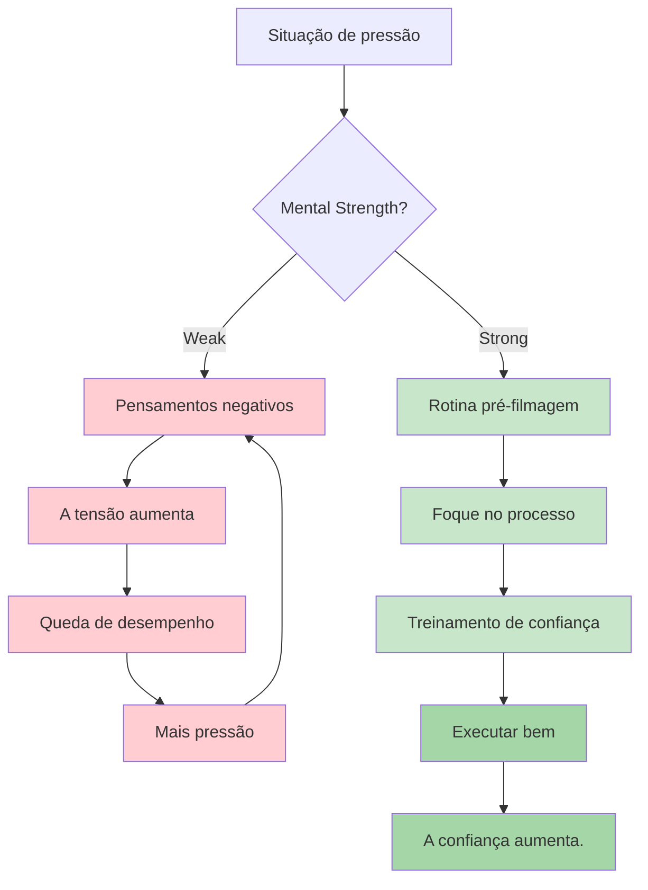
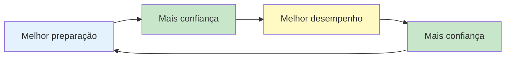

# Força Mental

A força mental é o que diferencia os jogadores que têm um bom desempenho nos treinos daqueles que têm um bom desempenho quando a coisa fica séria. É a capacidade de lidar com a pressão, se recuperar de contratempos e manter o foco durante longas competições.

::: tip O princípio fundamental
**A força mental não se trata de eliminar o nervosismo ou nunca cometer erros. Trata-se de ter um bom desempenho apesar deles.** Você não pode controlar o que acontece. Você pode controlar como reage.
:::

## O que é força mental?

A força mental inclui:
- **Confiança:** Acreditar na sua capacidade
- **Foco:** Manter a atenção no que importa.
- **Resiliência:** Recuperar-se de erros
- **Equismo:** Manter a calma sob pressão
- **Motivação:** Manter o esforço ao longo do tempo

Essas não são características fixas – são habilidades que você pode desenvolver.

## As exigências mentais da petanca

A petanca tem desafios mentais únicos:

| Desafio | Por que é difícil? |
|-----------|--------------|
| Tempo entre lançamentos | Oportunidade para pensamentos negativos |
| Resultados visíveis | Todos veem seus erros. |
| Formato de equipe | Pressão para não decepcionar os parceiros |
| Competições longas | Fadiga mental ao longo de muitas horas |
| Jogos equilibrados | Alto risco em lances únicos |
| Oscilações de momento | Montanha-russa emocional |

## Construindo Força Mental

### 1. Desenvolver autoconfiança

A confiança vem de:
- **Preparação:** Saber que você fez o trabalho
- **Sucessos passados:** Recordar momentos em que você teve um bom desempenho.
- **Diálogo interno positivo:** Como você fala consigo mesmo
- **Linguagem corporal:** Postura ereta, movimentos firmes e objetivos

**Atividades que aumentam a autoconfiança:**
- Mantenha um diário de sucessos
- Visualize desempenhos bem-sucedidos
- Prepare-se minuciosamente para as competições.
- Use uma linguagem corporal confiante (ela afeta sua mente).

### 2. Domine seu diálogo interno

A voz na sua cabeça importa muito.

**Diálogo interno destrutivo:**
- &quot;Sempre sinto falta disso&quot;
- &quot;Vou engasgar&quot;
- &quot;Meus companheiros de equipe estão contando comigo&quot; (pressão)
- &quot;Aquilo foi terrível&quot;

**Diálogo interno construtivo:**
- &quot;Já fiz esse arremesso antes&quot;
- &quot;Confie no meu treinamento&quot;
- &quot;Um arremesso de cada vez&quot;
- &quot;Próximo arremesso, novo começo&quot;

**Mudando seu diálogo interno:**
1. Preste atenção no que você diz para si mesmo(a).
2. Contestar declarações negativas
3. Substitua por alternativas realistas e úteis.
4. Pratique até que se torne automático.

### 3. Desenvolver resiliência

Resiliência é a capacidade de se recuperar de contratempos.

**A mentalidade resiliente:**
- Erros são informação, não fracassos.
- Um arremesso ruim não define você.
- Os contratempos são temporários.
- Você sempre pode reagir bem ao que acontece.

**Construindo resiliência:**
- Pratique a recuperação de erros durante o treinamento.
- Utilize o método SOAS (Parar, Observar, Aceitar, Deslizar)
- Foque na resposta, não no evento.
- Desenvolva uma memória curta para arremessos ruins.

### 4. Gerencie sua energia

A força mental requer gestão de energia:

**Energia física:**
- Durma bem antes das competições.
- Alimente-se adequadamente (níveis estáveis de açúcar no sangue).
- Mantenha-se hidratado
- Alterne entre os jogos (não fique sentado por muito tempo).

**Energia mental:**
- Faça pausas sempre que possível.
- Não fique analisando demais entre os lançamentos.
- Reserve o foco intenso para quando você realmente precisar dele.
- Tenha rotinas de recuperação

## O Ciclo Confiança-Competência

::: info O Ciclo Positivo

**Construa-o através de:**
1. Prática de qualidade (desenvolve competência)
2. Acompanhar o progresso (aumenta a confiança)
3. Desempenhos bem-sucedidos (reforçam ambos)
:::

## Nesta seção

- **[Lidando com a Pressão](/pt/education/mental-game/mental-strength/handling-pressure)** - Técnicas para situações de alto risco
- **[Rotina Pré-Arremesso](/pt/education/mental-game/mental-strength/pre-shot-routine)** - Construindo seu gatilho de desempenho

## Resumo: Regras de Força Mental

::: tip Regra nº 1: A Regra da Rotina
**Rotinas consistentes antes do disparo levam ao desempenho máximo.**
A mesma rotina sempre = gatilho confiável para o estado de fluxo
:::

::: tip Regra nº 2: A Regra de Reinicialização
**Desenvolva uma rotina de recuperação de 10 segundos após cometer erros.**
Reinicialização física (respiração profunda, rotação dos ombros) + reinicialização mental (método SOAS)
:::

::: tip Regra nº 3: A Regra do Loop de Confiança
**Melhor preparação → Mais confiança → Melhor desempenho.**
O ciclo funciona nos dois sentidos. Construa-o através de prática de qualidade e acompanhamento do progresso.
:::

::: tip Regra nº 4: A Regra do Diálogo Interno
**Fale consigo mesmo como falaria com um colega de equipe.**
Apoio, construtivo, focado no que fazer (e não no que deu errado)
:::

::: tip Regra nº 5: A Regra de Gestão de Energia
**Reserve o foco intenso para quando precisar dele.**
Não fique analisando demais entre os lançamentos. Conserve sua energia mental para a execução.
:::

## Ponto-chave

> A força mental não se trata de eliminar o nervosismo ou nunca cometer erros. Trata-se de ter um bom desempenho apesar deles.

Você não pode controlar o que acontece. Você pode controlar como reage.

