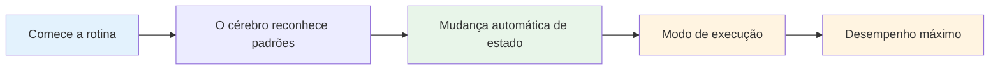

# Como montar sua rotina pré-injeção

Sua rotina pré-arremesso é uma das ferramentas mais poderosas do seu jogo mental. É uma sequência consistente de ações que prepara você para cada arremesso e ativa seu melhor estado de desempenho.

::: tip A Grande Ideia
**Sua rotina é a porta de entrada para o estado de fluxo.** Uma rotina consistente antes da sessão de fotos sinaliza para o seu cérebro: &quot;É hora de executar.&quot; Com a repetição, ela se torna um gatilho automático para o máximo desempenho.
:::

## Por que as rotinas funcionam

### A consistência gera confiança.
Ao fazer sempre a mesma coisa, você elimina as variáveis. Seu corpo sabe o que esperar. Isso cria uma sensação de controle e familiaridade, mesmo em situações desconhecidas.

### Rotinas desencadeiam estados
Com a repetição, sua rotina se torna associada ao seu desempenho. Iniciar a rotina automaticamente desencadeia a mudança mental para o modo de execução.

### Rotinas bloqueiam distrações
Uma rotina dá à sua mente algo em que se concentrar. Não há espaço para se preocupar com a pontuação, o público ou o que pode acontecer.

### Rotinas Controlam a Excitação
Uma rotina bem planejada ajuda a regular seu nível de energia – acalmando você se estiver muito agitado e concentrando você se estiver sem energia.

## Elementos de uma rotina eficaz

### Fase 1: Avaliação (Fora do Círculo)

Antes de agir, reúna informações:
- Analise o terreno (inclinações, obstáculos, superfície)
- Avalie a situação (pontuação, posições das bolas)
- Escolha seu alvo e local de pouso
- Decida o tipo de arremesso (apontar, chutar, lançar, rolar)

**É aqui que a reflexão acontece.** Reserve um tempo para isso.

### Fase 2: Transição (Entrando no Círculo)

A transição do pensar para o agir:
- Ação física (entrar no círculo de forma consistente)
- Sinal mental (uma palavra ou frase que indica o &quot;modo de execução&quot;)
- Respiração (uma respiração consciente para se centrar)

**Este é o interruptor.** A análise termina aqui.

### Fase 3: Preparação (No Círculo)

Prepare seu corpo:
- Postura consistente (sempre a mesma)
- Teste de aderência (sinta a bola)
- Alinhamento com o objetivo
- Gatilho físico (um pequeno movimento seu)

### Fase 4: Visualização (Breve)

Veja o arremesso antes de fazê-lo:
- Imagine a trajetória da bola (2-3 segundos no máximo)
- Sinta o arremesso bem-sucedido
- Conecte-se visualmente com seu público-alvo.

### Fase 5: Execução

Faça o arremesso:
- Foco externo (apenas alvo)
- Confie no seu corpo.
- Liberte sem hesitação
- Siga em frente naturalmente

## Construindo sua rotina pessoal

### Passo 1: Observe o que você já faz

Você provavelmente já tem alguma rotina. Observação:
- O que você faz antes de bons arremessos?
- O que lhe parece natural?
- O que te ajuda a se concentrar?

### Passo 2: Elabore sua rotina

Crie uma sequência que inclua:
- [ ] Fase de avaliação
- [ ] Momento de transição claro
- [ ] Configuração física consistente
- [ ] Breve visualização
- [ ] Gatilho de execução

### Passo 3: Anote

Seja específico. Exemplo:

1. **Avalie:** Leia o terreno, escolha o local de pouso
2. **Transição:** Entre no círculo com o pé esquerdo primeiro e diga &quot;confiança&quot;.
3. **Configuração:** Pés afastados na largura dos ombros, verifique a pegada, alinhe os ombros.
4. **Visualize:** Veja o caminho, sinta a libertação
5. **Executar:** Olhos no alvo, arremessar

### Passo 4: Pratique religiosamente

Use sua rotina em TODOS os arremessos durante o treino:
- Lançamentos fáceis
- Lançamentos difíceis
- Quando você está cansado
- Quando você está fresco

A rotina precisa se tornar automática.

### Etapa 5: Aprimorar ao longo do tempo

Sua rotina vai evoluir. Observe o que funciona e ajuste. Mas não a altere durante a competição — apenas entre os eventos.

## Horário de rotina

Sua rotina deve levar uma quantidade consistente de tempo:
- Muito rápido: Você está com pressa, sem a devida preparação.
- Muito lento: você está pensando demais e perdendo o ritmo.
- Na medida certa: tempo suficiente para se preparar, mas não tanto a ponto de você pensar demais.

**Horário típico:**
- Avaliação: 5 a 10 segundos
- Transição + Preparação: 3-5 segundos
- Visualização + Execução: 3-5 segundos
- **Total: 10-20 segundos**

## Erros comuns na rotina

| Erro | Problema | Solução |
|---------|---------|----------|
| Pular corda na prática | A rotina não é automática. | Use-o em todos os arremessos. |
| Muito complicado | Difícil de lembrar sob pressão. | Simplifique ao essencial |
| Pensar durante a execução | Interrompe o desempenho automático | Ponto de transição claro |
| Horários inconsistentes | Cria incerteza | Pratique em ritmo constante |
| Mudança no meio da competição | Introduz dúvidas | Apegue-se ao que você conhece. |

## Solução de problemas de rotina

**Se você estiver com pressa:**
- Adicione uma pausa na transição.
- Diminua a velocidade dos seus movimentos de preparação.
- Faça uma pausa antes da visualização.

**Se você está pensando demais:**
- Encurte a rotina
- Use uma deixa de transição mais forte.
- Foque mais no exterior

**Se você for inconsistente:**
- Grave um vídeo de si mesmo para verificar.
- Pratique a rotina sem arremessar
- Obtenha feedback de um parceiro

## Rotinas de exemplo

### Rotina simples
1. Selecione o alvo
2. Entre, respire.
3. Segure firme, alinhe
4. Veja, jogue fora

### Rotina detalhada
1. Leia o terreno, escolha o local de pouso
2. Dê o primeiro passo com o pé esquerdo.
3. Diga &quot;suave&quot; mentalmente
4. Uma respiração, ombros relaxam
5. Pés posicionados, verificação de aderência
6. Alinhe os ombros ao alvo.
7. Veja o caminho (2 segundos)
8. Olhos fixos no alvo
9. Lançar

## Ponto-chave

> Sua rotina é sua âncora. No caos, ela é sua constante.

Construa com cuidado. Pratique sempre. Confie plenamente.

