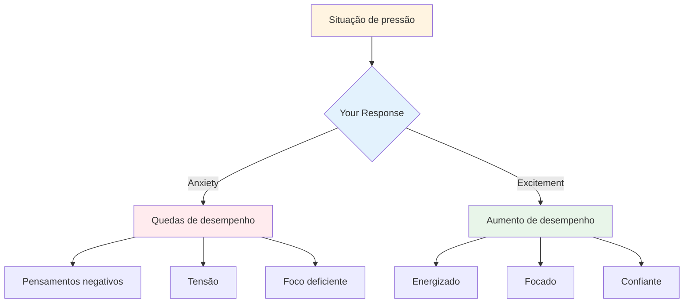

# Lidando com pressão

A pressão faz parte da competição. O objetivo não é eliminá-lo – isso é impossível. O objetivo é ter um bom desempenho apesar disso e até mesmo usar isso a seu favor.

::: dica A Grande Ideia
**A pressão não desaparece com a experiência - você apenas melhora seu desempenho com ela.** Os melhores jogadores não ficam calmos; eles são hábeis em usar sua excitação de forma produtiva.
:::

## Compreendendo a pressão

### O que cria pressão?
- Apostas altas (jogo importante, lançamento decisivo)
- Sendo observado (público, companheiros de equipe)
- Expectativas (suas e dos outros)
- Incerteza (placar próximo, oponentes desconhecidos)
- Tempo (acabando, esperando muito)

### O que a pressão faz ao seu corpo
Quando você sente pressão, seu corpo responde:
- A frequência cardíaca aumenta
- A respiração se torna superficial
- Músculos tensos
- As mãos podem tremer
- O foco diminui (às vezes demais)

Este é o seu corpo se preparando para a ação. Não é ruim – é energia que você pode usar.

## Pressão de Reenquadramento

### Pressão como excitação

As sensações físicas de ansiedade e excitação são quase idênticas. A diferença é como você os interpreta.

**Interpretação da ansiedade:** "Estou nervoso, algo ruim pode acontecer"
**Interpretação de excitação:** "Estou energizado, isso é importante para mim"

**Tente isto:** Quando sentir pressão, diga para si mesmo: "Estou animado" em vez de "Estou nervoso".

### Pressão como privilégio

Apenas momentos importantes criam pressão. Se você está sentindo isso, você está em uma situação que importa.

> “A pressão é um privilégio – só vem para quem a merece.” -Billie Jean King

## Técnicas para momentos de alta pressão

### 1. Controle da respiração

Sua respiração é a maneira mais rápida de mudar seu estado.

**A técnica 4-7-8:**
1. Inspire por 4 contagens
2. Segure por 7 contagens
3. Expire contando 8
4. Repita 2-3 vezes

**Reinicialização rápida (no círculo):**
- Uma respiração lenta e profunda
- Sinta seus pés no chão
- Abaixe os ombros ao expirar

### 2. Aterramento Físico

Conecte-se com sensações físicas para sair da sua cabeça:
- Sinta o peso da bocha
- Observe seus pés no chão
- Aperte e solte a mão que não joga
- Role os ombros para trás

### 3. Estreitamento do foco

Em momentos de pressão, foque apenas no que importa:
- Não é a pontuação
- Não o público
- Não é o que pode acontecer
- Apenas este lançamento, este alvo, este momento

** Palavras-chave: ** "Aqui. Agora. Isto."

### 4. Foco no Processo

Mudança do resultado para o processo:

**Foco no resultado (cria pressão):**
- "Eu preciso fazer isso"
- "Se eu errar, perdemos"
- "Todo mundo está assistindo"

**Foco no processo (reduz a pressão):**
- "Siga minha rotina"
- "Veja o alvo"
- "Confie no meu treinamento"

### 5. O aperto da mão esquerda

Para jogadores destros, apertar a mão esquerda por 10 a 15 segundos:
- Ativa o hemisfério direito do cérebro
- Acalma o pensamento analítico excessivo
- Ajuda a acessar a execução automática

Use isso quando perceber que está pensando demais.

## Preparando-se para pressão

### Simule pressão na prática

Você não consegue lidar com a pressão da competição se nunca a experimentar no treinamento.

**Maneiras de criar pressão na prática:**
- Definir consequências (flexões para erros, comprar café para o parceiro)
- Crie cenários "obrigatórios"
- Pratique com um público
- Pressão de tempo (relógio de tiro)
- Fadiga (pratique quando estiver cansado)

### Visualização

Ensaie mentalmente situações de alta pressão:
1. Feche os olhos
2. Imagine detalhadamente um cenário de pressão
3. Sinta as sensações de pressão
4. Veja-se lidando bem com isso
5. Execute com sucesso em sua mente

Faça isso regularmente, não apenas antes das competições.

### Construa um histórico de pressão

Acompanhe os momentos em que você lidou bem com a pressão:
- Qual era a situação?
- Como você se sentiu?
- O que você fez?
- Qual foi o resultado?

Revise isso antes das competições para se lembrar: “Já fiz isso antes”.

## Durante a competição

### Antes do lançamento de pressão
1. Dê um passo para trás, respire
2. Lembre-se da sua rotina
3. Concentre-se no processo, não no resultado
4. Use sua palavra-gatilho ou sugestão

### No Círculo
1. Complete sua rotina exatamente como praticada
2. Concentre-se externamente (alvo, não corpo)
3. Confie no seu treinamento
4. Solte sem hesitação

### Depois do lançamento
- Aceite o resultado sem julgamento
- Se for bom: breve reconhecimento, siga em frente
- Se ruim: método SOAS, redefina para o próximo lançamento

## Erros comuns de pressão

|  | Erro | Melhor abordagem |  |
|--------|----------------|
|  | Correndo | Desacelere, use a rotina completa |  |
|  | Pensar demasiado | Foco externo, treinamento de confiança |  |
|  | Mudando técnica | Fique com o que você sabe |  |
|  | Foco no resultado | Foco no processo |  |
|  | Lutando contra os nervos | Aceite e use a energia |  |

## Principal vantagem

> A pressão não desaparece com a experiência. Você simplesmente melhora seu desempenho com isso.

Os melhores jogadores não são calmos – eles são hábeis em usar sua excitação de forma produtiva.

