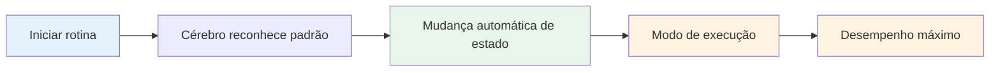

# Construindo sua rotina pré-filmagem

Sua rotina de pré-lançamento é uma das ferramentas mais poderosas do seu jogo mental. É uma sequência consistente de ações que prepara você para cada lançamento e desencadeia seu melhor estado de desempenho.

::: dica A Grande Ideia
**Sua rotina é sua porta de entrada para a zona.** Uma rotina consistente de pré-disparo sinaliza ao seu cérebro: "É hora de executar." Com a repetição, torna-se um gatilho automático para o desempenho máximo.
:::

## Por que as rotinas funcionam

### Consistência cria confiança
Quando você faz sempre a mesma coisa, você remove variáveis. Seu corpo sabe o que está por vir. Isso cria uma sensação de controle e familiaridade, mesmo em situações desconhecidas.

### Estados de gatilho de rotinas
Com a repetição, sua rotina fica ligada ao seu estado de desempenho. Iniciar a rotina inicia automaticamente a mudança mental para o modo de execução.

### Rotinas bloqueiam distrações
Uma rotina dá à sua mente algo em que se concentrar. Não há espaço para preocupação com o placar, o público ou o que pode acontecer.

### Rotinas gerenciam a excitação
Uma rotina bem elaborada ajuda a regular seu nível de energia - acalmando você se estiver muito empolgado, concentrando-se se estiver desanimado.

## Elementos de uma rotina eficaz

### Fase 1: Avaliação (Fora do Círculo)

Antes de intervir, reúna informações:
- Leia o terreno (inclinações, obstáculos, superfície)
- Avalie a situação (pontuação, posições de bocha)
- Escolha seu alvo e local de pouso
- Decida o tipo de lançamento (apontar, atirar, lob, rolar)

**É aqui que o pensamento acontece.** Não tenha pressa aqui.

### Fase 2: Transição (Entrando no Círculo)

A mudança do pensar para o fazer:
- Ação física (entrar no círculo de maneira consistente)
- Dica mental (uma palavra ou frase que sinaliza "modo de execução")
- Respiração (uma respiração consciente para se centrar)

**Esta é a mudança.** A análise termina aqui.

### Fase 3: Configuração (No Círculo)

Prepare seu corpo:
- Postura consistente (sempre a mesma)
- Verificação de aderência (sentir a bocha)
- Alinhamento ao alvo
- Gatilho físico (um pequeno movimento que é seu)

### Fase 4: Visualização (breve)

Veja o lançamento antes de fazê-lo:
- Imagine o caminho da bola (2-3 segundos no máximo)
- Sinta o lançamento bem sucedido
- Conecte-se visualmente com seu alvo

### Fase 5: Execução

Faça o lançamento:
- Foco externo (somente alvo)
- Confie no seu corpo
- Solte sem hesitação
- Siga naturalmente

## Construindo sua rotina pessoal

### Etapa 1: observe o que você já faz

Você provavelmente já tem alguma rotina. Perceber:
- O que você faz antes de bons lances?
- O que parece natural para você?
- O que ajuda você a se concentrar?

### Etapa 2: crie sua rotina

Crie uma sequência que inclua:
- [ ] Fase de avaliação
- [ ] Momento de transição claro
- [ ] Configuração física consistente
- [ ] Breve visualização
- [ ] Gatilho de execução

### Etapa 3: anote

Seja específico. Exemplo:

1. **Avalie:** Leia o terreno, escolha o local de pouso
2. **Transição:** Entre em círculo com o pé esquerdo primeiro e diga "confiança"
3. **Configuração:** Pés na largura dos ombros, verificação de aderência, alinhamento dos ombros
4. **Visualize:** Veja o caminho, sinta a liberação
5. **Executar:** Olhos no alvo, arremessar

### Passo 4: Pratique Religiosamente

Use sua rotina em CADA lance na prática:
- Lançamentos fáceis
- Lançamentos difíceis
- Quando você está cansado
- Quando você está fresco

A rotina deve se tornar automática.

### Etapa 5: refinar ao longo do tempo

Sua rotina irá evoluir. Observe o que funciona e ajuste. Mas não mude isso durante a competição – apenas entre os eventos.

## Tempo de rotina

Sua rotina deve levar um tempo consistente:
- Muito rápido: você está com pressa, não está devidamente preparado
- Muito lento: você está pensando demais, perdendo o fluxo
- Na medida certa: tempo suficiente para se preparar, não tanto a ponto de você pensar muito

**Tempo típico:**
- Avaliação: 5-10 segundos
- Transição + Configuração: 3-5 segundos
- Visualização + Execução: 3-5 segundos
- **Total: 10-20 segundos**

## Erros comuns de rotina

|  | Erro | Problema | Solução |  |
|--------|---------|----------|
|  | Ignorando na prática | A rotina não é automática | Use-o em cada lance |  |
|  | Muito complicado | Difícil de lembrar sob pressão | Simplifique ao essencial |  |
|  | Pensando durante a execução | Interrompe o desempenho automático | Ponto de transição claro |  |
|  | Tempo inconsistente | Cria incerteza | Pratique com ritmo consistente |  |
|  | Mudança no meio da competição | Apresenta dúvida | Fique com o que você sabe |  |

## Solução de problemas de rotina

**Se você estiver com pressa:**
- Adicione uma respiração na transição
- Retarde seus movimentos de configuração
- Pausa antes da visualização

**Se você está pensando demais:**
- Encurte a rotina
- Use uma sugestão de transição mais forte
- Concentre-se mais externamente

**Se você for inconsistente:**
- Faça um vídeo para verificar
- Pratique a rotina sem jogar
- Obtenha feedback de um parceiro

## Rotinas de amostra

### Rotina Simples
1. Escolha o alvo
2. Entre, respire
3. Segure, alinhe
4. Veja, jogue

### Rotina detalhada
1. Leia o terreno, escolha o local de pouso
2. Pise primeiro com o pé esquerdo
3. Diga “suave” internamente
4. Uma respiração, ombros caem
5. Pés colocados, verificação de aderência
6. Alinhe os ombros ao alvo
7. Veja o caminho (2 segundos)
8. Olhos fixos no alvo
9. Jogue

## Principal vantagem

> Sua rotina é sua âncora. No caos, é a sua constante.

Construa-o com cuidado. Pratique sempre. Confie completamente.

