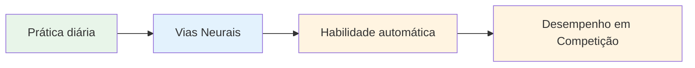
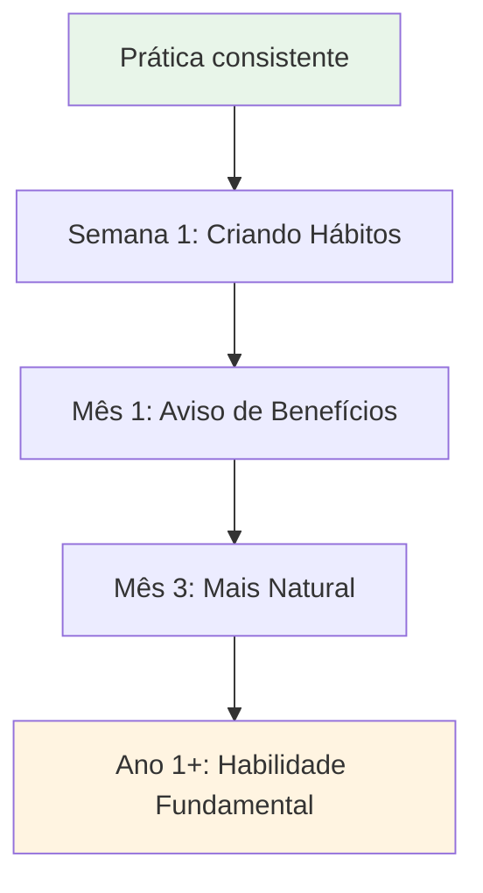

# Construindo uma Prática Diária de Mindfulness

Os benefícios da atenção plena vêm da prática consistente. Veja como incorporá-la à sua vida.

::: tip A Grande Ideia
**A consistência supera a intensidade.** Cinco minutos por dia são melhores do que uma hora por semana. Comece devagar, seja consistente e os benefícios se acumularão com o tempo.
:::

## Por que a prática diária é importante

::: info A atenção plena é como um exercício físico.
- ❌ Você não consegue ficar em forma com apenas uma sessão de academia.
- ✅ A prática regular gera mudanças duradouras
- ✅ Os efeitos se acumulam ao longo do tempo
- ✅ Com consistência, fica mais fácil.
:::

::: tip Comprovado por pesquisas
Pesquisas mostram que mesmo **3 minutos diários** geram benefícios mensuráveis. Mas é preciso fazer isso regularmente.
:::

## Criando sua rotina

### Passo 1: Escolha o seu horário

Escolha um horário fixo que funcione para a sua vida:

| Tempo | Vantagens | Considerações |
|------|------------|----------------|
| **Manhã** | Define o tom do dia, com menos interrupções. | Preciso acordar mais cedo |
| **Meio-dia** | Interrompe a rotina, redefine o foco. | Pode haver esquecimento, conflitos de agenda. |
| **Noite** | Relaxe e reflita sobre o dia. | Pode estar cansado, menos alerta. |
| **Antes do treino** | Conexão direta à petanca | Depende da programação de treinos. |

**Melhor abordagem:** Associe isso a um hábito já existente (após o café, antes do almoço, etc.)

### Passo 2: Comece pequeno

Não tente fazer em 30 minutos no primeiro dia.

**Progressão recomendada:**
- Semanas 1-2: 3-5 minutos
- Semanas 3-4: 5-10 minutos
- Mês 2: 10-15 minutos
- A partir do 3º mês: 15 a 20 minutos

É melhor fazer 5 minutos todos os dias do que 30 minutos uma vez por semana.

### Passo 3: Crie seu espaço

Você não precisa de uma sala de meditação, mas ter um local fixo ajuda:
- Em algum lugar tranquilo (ou use fones de ouvido)
- Assentos confortáveis
- Distrações mínimas
- Se possível, sempre no mesmo local.

### Etapa 4: Remover Barreiras

Facilite a prática:
- Coloque seu celular no silencioso.
- Avise a familiares/colegas de casa para não interromperem.
- Deixe tudo pronto (almofada, cronômetro)
- Não espere pelas condições &quot;perfeitas&quot;.

## Exemplos de horários diários

### Prática mínima (5 minutos)
- Manhã: 3 minutos de respiração consciente
- Ao longo do dia: 3 momentos de atenção plena com o sino
- À noite: 2 minutos de consciência corporal antes de dormir.

### Prática padrão (15 minutos)
- Manhã: 10 minutos de meditação sentada.
- Meio-dia: 2 minutos de respiração consciente
- Noite: 3 minutos de escaneamento corporal

### Prática intensiva (30 minutos)
- Manhã: 15 minutos de meditação sentada.
- Meio-dia: 5 minutos de meditação caminhando
- À noite: 10 minutos de escaneamento corporal.
- Além disso: Alimentação consciente em uma refeição

## Integração com o Treinamento de Petanca

### Antes do treino
- 5 minutos de meditação sentada
- Defina uma intenção para a sessão.
- Faça um escaneamento corporal para detectar qualquer tensão.

### Durante o treino
- Use a rotina pré-captura como prática de atenção plena.
- Aplique SOAS após erros
- Mantenha-se presente entre os lançamentos.

### Após o treino
- 3 minutos de reflexão (sem julgamento)
- Observe quaisquer momentos de fluxo
- Respiração consciente para a transição para o relaxamento.

## Acompanhando sua prática

Manter o controle ajuda a manter a consistência:

### Registro simples
| Data | Duração | Tipo | Notas |
|------|----------|------|-------|
| seg | 10 minutos | Sentado | Mente muito ocupada |
| ter | 10 minutos | Sentado | Mais calmo hoje |
| qua | 5 minutos | Escaneamento corporal | Senti tensão nos ombros. |

### O que acompanhar
- Você praticou? (Sim/Não)
- Quanto tempo?
- Que tipo?
- Breve nota sobre a experiência (opcional)

### Aplicativos que ajudam
- Espaço mental
- Calma
- Cronômetro Insight
- rastreadores de hábitos simples

## Superando Obstáculos Comuns

### &quot;Não tenho tempo&quot;
- Você tem 3 minutos.
- É uma questão de prioridade, não de tempo.
- Experimente criar links para atividades existentes.

### &quot;Eu continuo esquecendo&quot;
- Defina um alarme diário
- Ligar ao hábito existente
- Coloque um lembrete visual em algum lugar onde você possa vê-lo.

### &quot;Não estou fazendo isso direito&quot;
- Não existe um jeito &quot;certo&quot; de fazer as coisas.
- Se você estiver prestando atenção, você está conseguindo.
- Ter a mente divagando é normal e esperado.

### &quot;Não vejo resultados&quot;
- Os benefícios são sutis no início.
- Mantenha um diário para observar as mudanças ao longo do tempo.
- Confie na pesquisa - ela funciona.

### &quot;É chato&quot;
- O tédio é apenas mais uma experiência a ser observada.
- Experimente técnicas diferentes.
- Lembre-se do porquê de estar fazendo isso.

## Sinais de progresso

Você pode não notar mudanças drásticas, mas fique atento a:
- Perceber quando a mente divaga (mais rápido)
- Recuperar-se da frustração mais rapidamente
- Perceber a tensão antes que ela aumente.
- Sentir-se mais presente durante os jogos
- Dormir melhor
- Menos reativo a passes ruins

## O Jogo de Longo Prazo

A atenção plena é uma prática para a vida toda. Atletas de elite costumam dizer que é a habilidade mais valiosa que desenvolveram.

**Mês 1:** Criando o hábito
**Meses 2-3:** Começando a notar os benefícios
**Meses 4 a 6:** Tornando-se mais natural
**A partir do 1º ano:** Parte fundamental de quem você é

## Ponto-chave

> A consistência supera a intensidade. Cinco minutos por dia são melhores do que uma hora uma vez por semana.

Comece hoje. Comece pequeno. Continue.

