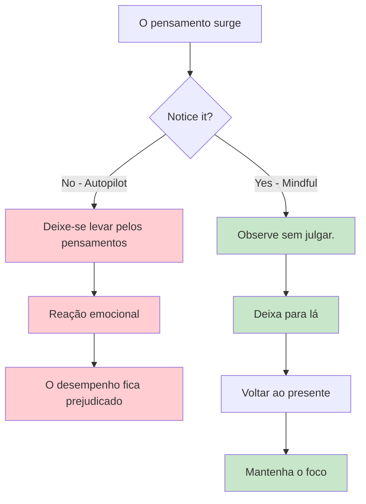
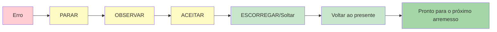

# Atenção plena para jogadores de petanca
<AdBanner />

A atenção plena é uma das ferramentas mais poderosas disponíveis para atletas. Não é algo místico ou complicado – é simplesmente a prática de prestar atenção ao momento presente sem julgamento.

::: tip O princípio fundamental
**A atenção plena não se trata de esvaziar a mente. Trata-se de escolher onde concentrar sua atenção.** Você não pode impedir que os pensamentos surjam, mas pode escolher não segui-los.
:::

## O que é Mindfulness?

Mindfulness significa estar totalmente presente e consciente de:
- Onde você está
- O que você está fazendo
- Como você está se sentindo?

...sem se sentir sobrecarregado pelo que está acontecendo ao seu redor ou reagir de forma impulsiva a isso.

Para os jogadores de petanca, isso se traduz em:
- Estar totalmente presente em cada arremesso.
- Perceber os pensamentos sem se deixar levar por eles.
- Recuperar-se rapidamente de erros
- Manter a calma sob pressão

## A ciência por trás disso

Mindfulness não é apenas filosofia – é respaldado por pesquisas sólidas:

### Efeitos no seu cérebro
- **Reduz a atividade na amígdala** (o sistema de alarme do seu cérebro)
- **Fortalece o córtex pré-frontal** (tomada de decisões e foco) - isso ajuda você a pensar com clareza durante o planejamento.
- **Aprimora sua capacidade de aquietar a mente** quando necessário - essencial para acessar o estado de fluxo durante a execução.
- **Melhora as conexões** entre as regiões do cérebro
- **Proporciona mudanças estruturais duradouras** com a prática regular.

### Efeitos no desempenho
| Beneficiar | Como isso ajuda no seu jogo |
|---------|----------------------|
| Redução do estresse | Cortisol mais baixo, mãos mais firmes |
| Melhor foco | Menos distrações, decisões mais claras. |
| Controle emocional | Não deixe que lançamentos ruins se agravem. |
| Recuperação mais rápida | Recuperar-se rapidamente dos erros |
| Melhora do sono | Melhor descanso, melhor desempenho. |

## Por que os jogadores de petanca precisam de atenção plena?

A petanca tem desafios mentais únicos:

1. **Tempo entre os lançamentos** - Muitas oportunidades para pensamentos negativos.
2. **Erros visíveis** - Todos percebem quando você erra.
3. **Pressão da equipe** - Seu arremesso afeta seus parceiros
4. **Competições longas** - Fadiga mental ao longo de muitas horas
5. **Jogos equilibrados** - Alta pressão nos momentos decisivos

A atenção plena ajuda você a lidar com tudo isso.

## A habilidade essencial: Consciência sem julgamento

A palavra-chave é &quot;sem julgamento&quot;.

<AdInArticle />

::: danger Pensamento crítico (Acrescenta peso emocional)
❌ &quot;Que arremesso terrível&quot;
❌ &quot;Sempre sinto falta disso&quot;
❌ &quot;Meus colegas de equipe devem estar frustrados&quot;

**Resultado:** Espiral de emoções negativas, tensão, pior desempenho
:::

::: tip Consciência sem julgamento (apenas observa)
✅ &quot;O arremesso foi para a esquerda do alvo&quot;
✅ &quot;Percebo que estou me sentindo tenso&quot;
✅ &quot;Minha mente está divagando ao som da partitura&quot;

**Resultado:** Observação clara, recuperação, manutenção do foco
:::

**Qual a diferença?** O julgamento adiciona peso emocional e desencadeia reações. A consciência apenas observa e permite que você responda com habilidade.

## Começando

Você não precisa de horas de meditação. Comece com estas práticas simples:

### 1. Respiração Consciente (2 minutos)
- Sente-se confortavelmente.
- Concentre-se na sua respiração.
- Quando sua mente divagar (e ela vai divagar), gentilmente retorne à respiração.
- Sem julgamentos por se perder - apenas retorne.

### 2. Escaneamento Corporal (5 minutos)
- Preste atenção às sensações nos seus pés.
- Mova lentamente a atenção para cima, percorrendo todo o seu corpo.
- Apenas observe - não tente mudar nada.
- Perceba as áreas de tensão sem lutar contra elas.

### 3. Momentos de Atenção Plena
- Escolha uma atividade do dia a dia (tomar café, caminhar).
- Faça isso com total atenção.
- Preste atenção a todas as sensações envolvidas.
- Quando sua mente divagar, retorne à atividade.

## Atenção plena na competição

### Antes do jogo
- Reserve de 2 a 3 minutos para respirar conscientemente.
- Defina uma intenção de como você quer jogar (não o resultado, mas o processo).
- Observe qualquer sinal de nervosismo sem tentar eliminá-lo.

### Durante o jogo
- Use sua rotina pré-ensaio como uma âncora de atenção plena.
- Entre os lançamentos, volte a atenção para o presente.
- Observe os pensamentos sobre a pontuação/resultado e, em seguida, deixe-os ir.

### Após erros

::: warning O Método SOAS (Sua Ferramenta de Reinicialização)
**Pare** - Faça uma pausa antes de reagir.
**Observe** - O que aconteceu? O que estou sentindo?
**A**ccept - Aconteceu. Está feito.
**S**lip (Solte) - Liberte-se, retorne ao agora

**Tempo necessário:** 10 segundos
**Use-o:** Após cada erro, rebatida ruim ou momento frustrante.
:::

## Nesta seção

- **[Técnicas](/en/education/mindfulness/techniques)** - Exercícios práticos que você pode usar
- **[Prática Diária](/en/education/mindfulness/daily-practice)** - Incorporando a atenção plena à sua vida

## Resumo: Regras da Atenção Plena

::: tip Regra nº 1: A Regra da Consciência
**Observe sem julgar.**
Observe os pensamentos e sentimentos sem rotulá-los como bons ou ruins.
:::

::: tip Regra nº 2: A Regra SOAS
**Pare, observe, aceite, deslize (solte).**
Sua pausa de 10 segundos após erros. Use-a sempre.
:::

::: tip Regra nº 3: A Regra Atual
**Você só pode controlar este momento, este arremesso.**
Os lançamentos passados já se foram. Os lançamentos futuros ainda não existem. Esteja aqui agora.
:::

::: tip Regra nº 4: A Regra da Prática
**Comece devagar: 2 a 5 minutos por dia.**
A consistência supera a duração. A prática diária aprimora a habilidade.
:::

## Ponto-chave

> Mindfulness não significa esvaziar a mente. Significa escolher onde concentrar sua atenção.

Você não pode impedir que os pensamentos surjam. Mas pode escolher não segui-los até o fundo do poço.

<AdBanner />
