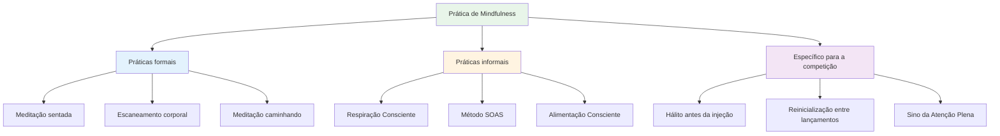

# Técnicas de atenção plena
<AdBanner />

Aqui estão algumas técnicas práticas que você pode usar para desenvolver a atenção plena. Comece com uma ou duas e vá adicionando outras aos poucos.

::: tip A Grande Ideia
**A atenção plena é uma habilidade, não um talento.** Assim como apontar ou atirar, ela melhora com a prática. Comece devagar, seja consistente e os benefícios se acumularão com o tempo.
:::

## Práticas formais

Estas são sessões dedicadas à atenção plena - tempo reservado especificamente para a prática.

### Meditação sentada

Os fundamentos da prática da atenção plena.

**Como fazer:**
1. Sente-se confortavelmente (na cadeira ou no chão).
2. Feche os olhos ou suavize o olhar.
3. Concentre-se na sua respiração – na sensação do ar entrando e saindo.
4. Quando os pensamentos surgirem, observe-os sem julgá-los.
5. Retorne suavemente a atenção à respiração.
6. Comece com 5 minutos e vá aumentando até 15-20 minutos.

**Pontas:**
- Os pensamentos virão - isso é normal.
- Cada vez que você percebe que se desviou do caminho e retorna, você está aprimorando essa habilidade.
- Não se julgue por vagar sem rumo.
- A consistência importa mais do que a duração.

### Escaneamento corporal

Desenvolve a consciência das sensações físicas.

**Como fazer:**
1. Deite-se ou sente-se confortavelmente.
2. Comece pelos pés - observe quaisquer sensações.
3. Vá subindo lentamente: tornozelos, panturrilhas, joelhos...
4. Observe sem tentar mudar nada.
5. Se você sentir tensão, respire nessa área.
6. Continue até o topo da sua cabeça.
7. Leva de 10 a 20 minutos

**Para petanca:** Ajuda a perceber a tensão antes que ela afete o seu lançamento.

### Meditação caminhando

Atenção plena em movimento - ótima preparação para a pista.

**Como fazer:**
1. Caminhe devagar e com atenção.
2. Sinta cada parte do passo: levantar, mover, colocar
3. Preste atenção às sensações nos seus pés e pernas.
4. Quando sua mente divagar, retorne às sensações físicas.
5. 5 a 10 minutos são suficientes.

## Práticas informais

<AdInArticle />

Essas práticas integram a atenção plena às atividades diárias.

### Respiração Consciente

A técnica mais simples - disponível a qualquer momento.

**A prática:**
- Respire lenta e profundamente três vezes.
- Concentre-se completamente na sensação.
- Use-o como um botão de reinicialização ao longo do dia.

**Quando usar:**
- Antes de entrar no círculo
- Quando você perceber que o estresse está aumentando
- Entre jogos
- Qualquer momento de transição

### O Método SOAS

Sua ferramenta para lidar com momentos difíceis.

| Etapa | Ação | Exemplo |
|------|--------|---------|
| **Parar | Faça uma pausa, não reaja. | Não desista depois de errar um arremesso. |
| **Observar | Observe o que está acontecendo | &quot;Sinto-me frustrado. Minha mandíbula está tensa.&quot; |
| **Aceitar | Reconhecer sem lutar | &quot;É assim que me sinto neste momento.&quot; |
| **Escorregar | Deixe para lá, siga em frente. | Libere a tensão, retorne ao presente. |

**Pratique isso no dia a dia** para que se torne automático durante as competições.

### Alimentação Consciente

Uma prática surpreendentemente eficaz.

**Como fazer:**
- Faça uma refeição sem distrações (sem telefone, TV).
- Observe as cores, os cheiros e as texturas.
- Mastigue devagar, saboreie completamente.
- Observe quando estiver satisfeito.

**Por que isso é importante:** Desenvolve a habilidade geral de prestar atenção.

### Consciência Sensorial

Interagir plenamente com o ambiente ao seu redor.

**A técnica 5-4-3-2-1:**
- Observe 5 coisas que você pode ver
- Preste atenção em 4 coisas que você pode ouvir.
- Observe 3 coisas que você pode sentir.
- Observe duas coisas que você pode cheirar.
- Observe uma coisa que você pode saborear.

**Use isto:** Quando sua mente estiver a mil antes de um jogo importante.

## Técnicas específicas para competição

### A respiração antes da injeção

Incorpore a respiração à sua rotina:

1. Antes de entrar no círculo, respire conscientemente uma vez.
2. Sinta seus pés no chão
3. Deixe seus ombros relaxarem ao expirar.
4. Então comece sua rotina.

### Reinicialização entre lançamentos

O que fazer enquanto espera:

- Observe para onde sua atenção se dirige.
- Se for para falar de pontuação/resultado, reconheça e retorne ao presente.
- Concentre-se em algo neutro (sua respiração, a sensação de uma bola de bilhar).
- Mantenha-se fisicamente relaxado

### O &quot;Sino da Atenção Plena&quot;

Use gatilhos para lembrá-lo de estar presente:

- Toda vez que você pega uma bola
- Quando você ouvir o macaco sendo lançado
- Ao entrar no círculo
- Quando um jogo termina

Cada gatilho = uma respiração consciente.

## Construindo sua prática

### Semanas 1-2: Fundamentos
- 5 minutos de meditação sentada diariamente
- Três respirações conscientes antes de cada refeição.
- Pratique o SOAS uma vez quando algo pequeno der errado.

### Semanas 3-4: Expansão
- Aumente a meditação para 10 minutos.
- Adicione o escaneamento corporal duas vezes por semana.
- Utilize os sinais de atenção plena (sinos) na prática.

### Semana 5+: Integração
- Prática diária de 15 a 20 minutos
- Integração completa na rotina pré-injeção
- A SOAS torna-se uma resposta automática aos erros.

## Desafios comuns

| Desafio | Solução |
|-----------|----------|
| &quot;Não consigo parar de pensar&quot; | Não é para fazer isso. Apenas observe e retorne. |
| &quot;Não tenho tempo&quot; | Comece com 3 minutos. Todos têm 3 minutos. |
| &quot;Eu adormeço&quot; | Experimente sentar em vez de deitar, ou pratique mais cedo durante o dia. |
| &quot;Parece inútil&quot; | Os benefícios vêm com a consistência. Confie no processo. |
| &quot;Eu me esqueço de praticar&quot; | Defina um lembrete diário. Associe-o a um hábito já existente. |

## Ponto-chave

> A atenção plena é uma habilidade. Como qualquer habilidade, ela melhora com a prática.

Comece devagar. Seja consistente. Os benefícios se acumulam com o tempo.

<AdBanner />
