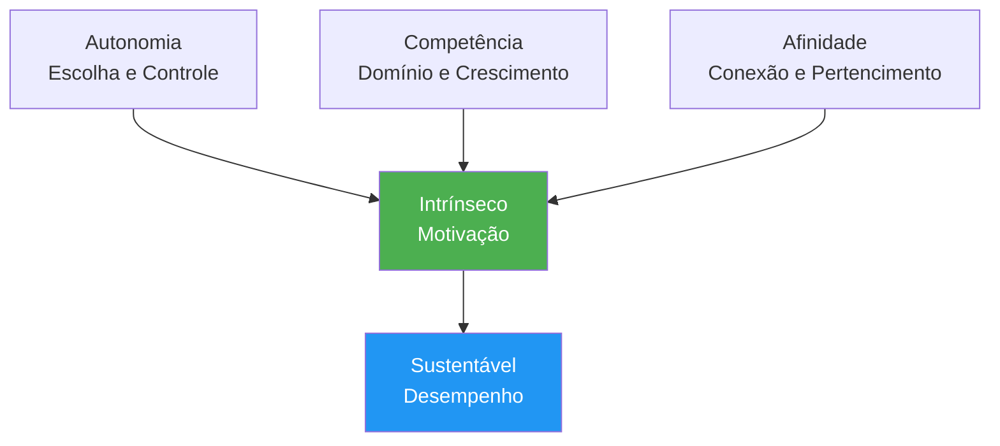

# Psicologia da Motivação

Entender POR QUE você está motivado — e não apenas que você está — ajuda a construir uma motivação sustentável que não depende de resultados.

---

## Motivação intrínseca versus motivação extrínseca

### Motivação extrínseca

Motivação impulsionada por recompensas ou pressões externas:

| Fonte | Exemplo |
|--------|---------|
| **Troféus/medalhas** | &quot;Quero ganhar o campeonato&quot; |
| **Classificações** | &quot;Quero estar entre os 10 melhores da minha região&quot; |
| **Reconhecimento** | &quot;Quero que os outros me vejam como um bom jogador&quot; |
| **Evite críticas** | &quot;Não quero decepcionar minha equipe&quot; |
| **Financeiro** | &quot;Quero ganhar o prêmio em dinheiro&quot; |

**Características:**
- Pode fornecer uma forte motivação inicial.
- Geralmente diminui com o tempo.
- Depende de fatores fora do seu controle.
- Pode prejudicar o prazer.

### Motivação Intrínseca

Motivação proveniente da própria atividade:

| Fonte | Exemplo |
|--------|---------|
| **Domínio** | &quot;Adoro a sensação de estar melhorando&quot; |
| **Fluxo** | &quot;O tempo desaparece quando estou tocando&quot; |
| **Desafio** | &quot;Gosto de me testar resolvendo problemas&quot; |
| **Expressão** | &quot;A petanca me permite expressar quem eu sou.&quot; |
| **Alegria** | &quot;Eu simplesmente adoro jogar este jogo&quot; |

**Características:**
- Mais sustentável ao longo do tempo.
- Independentemente dos resultados
- Conectado a uma satisfação mais profunda
- Melhora o desempenho naturalmente

::: tip A pesquisa
Estudos mostram consistentemente que a **motivação intrínseca leva a um melhor desempenho, maior persistência e maior bem-estar** do que a motivação extrínseca isoladamente.
:::

---

## Teoria da Autodeterminação (TAD)

Desenvolvida por Deci e Ryan, a Teoria da Autodeterminação (SDT) identifica três necessidades psicológicas fundamentais que impulsionam a motivação intrínseca:

### 1. Autonomia

**A necessidade de sentir que tem controle sobre suas escolhas**

| Apoia a autonomia | Prejudica a autonomia |
|-------------------|---------------------|
| Escolha o seu foco de treinamento | Receber instruções precisas sobre o que fazer. |
| Definir seus próprios objetivos | Pressão externa para realizar |
| Decidir como praticar | Participação forçada |
| Participar nas decisões da equipe | Treinadores/companheiros de equipe controladores |

**Para petanca:**
- Escolha em quais aspectos trabalhar.
- Defina seu próprio caminho de desenvolvimento.
- Tome as decisões táticas por conta própria.
- Seja dono do seu próprio plano de treino.

### 2. Competência

**A necessidade de se sentir eficaz e capaz**

| Apoia a Competência | Prejudica a competência |
|---------------------|----------------------|
| Desafios apropriados | Tarefas muito fáceis ou muito difíceis |
| Feedback claro sobre o progresso | Sem feedback ou apenas feedback negativo. |
| Melhoria visível | Estagnação sem explicação |
| Competição adequada ao nível de habilidade | Sobreposição constante |

**Para petanca:**
- Acompanhe suas métricas de melhoria
- Procure níveis de competição adequados.
- Comemore as pequenas vitórias
- Obtenha feedback específico (e não apenas resultados).

### 3. Parentesco

**A necessidade de conexão com os outros**

| Promove o relacionamento | Prejudica o senso de relacionamento. |
|----------------------|------------------------|
| Relações de equipe positivas | Isolamento |
| Objetivos compartilhados com os companheiros de equipe | Foco puramente individual |
| Pertencimento à comunidade | Exclusão ou conflito |
| Mentoria (dar/receber) | Relações exclusivamente competitivas |

**Para petanca:**
- Construa conexões genuínas na equipe.
- Encontre parceiros de treino
- Participe das atividades da comunidade do clube.
- Compartilhe conhecimento com outras pessoas.

---

## A Fórmula SDT

```
Autonomy + Competence + Relatedness = Intrinsic Motivation
```

Quando as três necessidades são satisfeitas, a motivação intrínseca floresce naturalmente.



---

## Espectro dos Tipos de Motivação

A Teoria da Autodeterminação (SDT) descreve a motivação em um espectro que vai do externo ao interno:

| Tipo | Descrição | Exemplo | Qualidade |
|------|-------------|---------|---------|
| **Amotivação** | Sem motivação | &quot;Por que se incomodar?&quot; | ❌ |
| **Externo** | Para obter recompensas/evitar punição | &quot;Vou ganhar um troféu&quot; | ⭐ |
| **Introjetado** | Pressão interna, culpa | &quot;Eu deveria praticar&quot; | ⭐⭐ |
| **Identificado** | Resultado valioso | &quot;Isso me ajuda a melhorar&quot; | ⭐⭐⭐ |
| **Integrado** | Alinhado com os valores | &quot;Este sou eu&quot; | ⭐⭐⭐⭐ |
| **Intrínseco** | Puro prazer | &quot;Eu amo isto&quot; | ⭐⭐⭐⭐⭐ |

**Objetivo:** Direcionar sua motivação para o lado intrínseco do espectro.

---

## Autoavaliação: Seu Perfil de Motivação

Avalie cada afirmação (1 = De forma alguma, 5 = Completamente):

**Indicadores extrínsecos:**
| Declaração | Pontuação |
|-----------|-------|
| Jogo principalmente para ganhar torneios. | /5 |
| O reconhecimento dos outros é muito importante para mim. | /5 |
| Eu perderia o interesse sem sucesso competitivo. | /5 |
| **Total Extrínseco** | /15 |

**Indicadores Intrínsecos:**
| Declaração | Pontuação |
|-----------|-------|
| Eu jogaria mesmo que não houvesse competições. | /5 |
| A sensação de progresso me entusiasma. | /5 |
| Eu perco a noção do tempo quando estou jogando. | /5 |
| **Total Intrínseco** | /15 |

**Interpretação:**
- Maior valor intrínseco total = motivação mais sustentável
- O equilíbrio é bom, mas assegure-se de que o intrínseco seja maior que o extrínseco.
- Se fatores extrínsecos forem maiores que fatores intrínsecos, reconecte-se com seu amor pelo jogo.

---

## Transição para a motivação intrínseca

### Reconecte-se com a alegria.

- **Lembre-se do motivo pelo qual você começou** — O que te atraiu inicialmente?
- **Jogo sem apostas** — Sessões ocasionais &quot;apenas por diversão&quot;
- **Aprecie os momentos** — Perceba quando você está curtindo o jogo.

### Foque na maestria

- **Estabeleça metas de aprendizado**, não apenas metas de resultado.
- **Celebre a melhoria**, independentemente dos resultados.
- **Encare os desafios** como oportunidades de crescimento.

### Construir Autonomia

- **Faça suas próprias escolhas** sobre treinamento.
- **Seja dono do seu próprio desenvolvimento**
- **Resista à pressão externa** para treinar de determinadas maneiras.

### Cultive a conexão

- **Invista em relacionamentos** além da competição.
- **Compartilhe conhecimento** com jogadores em desenvolvimento.
- **Encontre sua comunidade** dentro do esporte

---

## Conteúdo relacionado

- [Definição de Metas](/en/education/motivation/) — Definindo metas eficazes
- [Manter a Motivação](/en/education/motivation/maintaining) — Sustentabilidade a longo prazo
- [A Zona](/en/education/mental-game/the-zone/) — Motivação intrínseca e estado de fluxo
- Dinâmica de Equipe — Relacionamento no contexto de equipe

