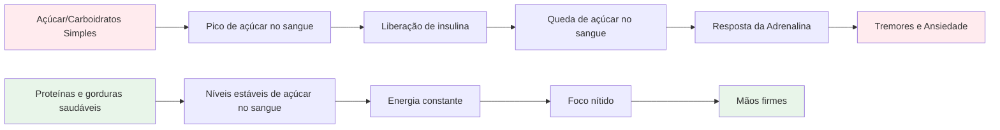

# Nutrição para um Desempenho Preciso

A petanca é um esporte de precisão, não de resistência. Suas necessidades nutricionais são diferentes das de um maratonista ou de um jogador de futebol. O mais importante é a **estabilidade do combustível cerebral** — manter a mente afiada e as mãos firmes durante um longo dia de competição.

::: tip A Grande Ideia
**Seu cérebro é sua ferramenta mais importante na petanca. Alimente-o com combustível estável, não com energia instável.** Concentre-se em proteínas, gorduras saudáveis e em manter-se hidratado. Evite picos de açúcar.
:::

## O Desafio do Atleta de Precisão

Ao contrário de esportes de alta intensidade, a petanca não exige grandes reservas de glicogênio nem reposição rápida de energia. O que ela exige é:

- **Níveis estáveis de açúcar no sangue** - sem picos ou quedas bruscas
- **Clareza mental consistente** - foco que dura o dia todo
- **Mãos firmes** - sem tremores ou abalos
- **Nervos calmos** - baixa ansiedade e resposta ao estresse

Sua estratégia nutricional deve otimizar esses fatores, e não a produção bruta de energia.

## O problema com o açúcar e os carboidratos simples

Muitos atletas optam por dietas ricas em carboidratos. Para jogadores de petanca, isso pode, na verdade, prejudicar o desempenho.

### A Montanha-Russa do Açúcar no Sangue

Quando você consome açúcar ou carboidratos simples:
1. O nível de açúcar no sangue aumenta rapidamente.
2. A insulina é liberada para diminuir a concentração de insulina.
3. Queda brusca de açúcar no sangue (hipoglicemia)
4. Seu corpo libera adrenalina para compensar.
5. Você apresenta tremores, ansiedade e dificuldade de concentração.

**Isso é o oposto do que você precisa para obter precisão.**

### Sintomas de instabilidade do açúcar no sangue

| Sintoma | Impacto no desempenho |
|---------|----------------------|
| mãos trêmulas | Lançamento inconsistente |
| Dificuldade de concentração | Tomada de decisões ruins |
| Irritabilidade | Conflito de equipe, falta de compostura |
| Fadiga após as refeições | moleza da tarde |
| Ansiedade | Sensibilidade à pressão |
| Névoa mental | Pensamento tático lento |

## Uma abordagem melhor: energia estável

O objetivo é fornecer ao seu cérebro combustível constante, sem oscilações bruscas.

### Princípios-chave

1. **Priorize proteínas e gorduras saudáveis** - Elas fornecem energia lenta e constante.
2. **Prefira carboidratos complexos aos simples** - Se for consumir carboidratos, escolha aqueles que são digeridos lentamente.
3. **Evite picos de açúcar** - Especialmente antes e durante a competição.
4. **Mantenha-se hidratado** - A desidratação afeta significativamente a concentração.
5. **Alimente-se regularmente** - Não deixe a fome chegar a um ponto em que você não consegue se controlar.

### Alimentos que ajudam

| Tipo de alimento | Exemplos | Por que funciona |
|-----------|----------|--------------|
| Proteína | Ovos, nozes, queijo, carne | Digestão lenta, energia estável |
| Gorduras saudáveis | Abacate, azeite, nozes | Combustível de longa duração |
| Carboidratos complexos | Vegetais, leguminosas | A fibra retarda a absorção. |
| Frutas com baixo teor de açúcar | Frutas vermelhas, maçãs | Nutrientes sem picos |

### Alimentos a limitar

| Tipo de alimento | Exemplos | Por que isso é problemático |
|-----------|----------|---------------------|
| Açúcar | Doces, refrigerantes, bolos | Pico e queda rápidos |
| Pão branco/massa | Sanduíches, pratos de massa | Conversão rápida em açúcar |
| Suco de frutas | Suco de laranja, smoothies | Açúcar concentrado |
| Bebidas energéticas | A maioria das marcas comerciais | Açúcar + cafeína |

## Nutrição para o dia da competição

### Antes da competição

**2 a 3 horas antes:**
- Refeição balanceada com proteínas, gorduras e vegetais.
- Evite carboidratos pesados que possam causar sonolência.
- Exemplo: Ovos com legumes ou salada com frango

**1 hora antes:**
- Lanche leve, se necessário
- Nozes, queijo ou uma pequena porção de proteína.
- Evite tudo que seja açucarado

### Durante a competição

**Entre os jogos:**
- Água (a mais importante)
- Pequenos lanches proteicos (nozes, queijo, carne)
- Evite lanches e bebidas açucaradas.

**Sinais de que você precisa comer:**
- Dificuldade de concentração
- Irritabilidade
- Sentindo-me trêmula
- Dor de cabeça

### Após a competição

- Reponha as energias com uma refeição equilibrada.
- Reidrate-se completamente.
- Não se &quot;recompense&quot; com açúcar - isso afetará sua recuperação.

## Hidratação

A desidratação afeta a função cognitiva antes mesmo de você sentir sede.

### Diretrizes

- **Comece o dia hidratado** - Beba água ao longo do dia antes da competição.
- **Durante o jogo** - Beba água regularmente, não espere até sentir sede.
- **Evite o excesso de cafeína** - Ela é diurética.
- **Fique atento aos sinais:** Dor de cabeça, urina escura, fadiga.

### Quanto?

Uma regra geral: o ideal é que a urina fique amarelo-clara. Se estiver escura, você precisa beber mais água.

## A opção com baixo teor de carboidratos

Alguns atletas de precisão adotam dietas com baixo teor de carboidratos ou cetogênicas. A teoria:

**Benefícios potenciais:**
- Níveis de açúcar no sangue muito estáveis (sem possibilidade de picos).
- Clareza mental constante
- Redução da ansiedade e dos tremores
- Sem quedas bruscas de energia à tarde.

**Considerações:**
- Requer período de adaptação (1-2 semanas)
- Não é adequado para todos.
- Requer planejamento e comprometimento.
- Consulte primeiro um profissional de saúde

Essa é uma estratégia avançada – não necessária para todos, mas que vale a pena considerar se a estabilidade do açúcar no sangue for uma questão importante para você.

## Dicas práticas

### Lanches fáceis para competição
- Mix de frutos secos (sem sal)
- Ovos cozidos
- Cubos de queijo
- Carne seca de boi ou de peru
- Legumes com húmus
- Azeitonas

### O que evitar
- salgadinhos de máquina de venda automática
- bebidas esportivas açucaradas
- Pastéis e produtos de panificação
- Barras de chocolate e doces
- A maioria das barras &quot;energéticas&quot; (verifique o teor de açúcar)

## Ponto-chave

> No jogo de petanca, seu cérebro é sua ferramenta mais importante. Alimente-o com combustível estável, não com energia instável.

Priorize proteínas, gorduras saudáveis e mantenha-se hidratado. Evite picos de açúcar. Sua concentração, compostura e firmeza nas mãos agradecerão.

