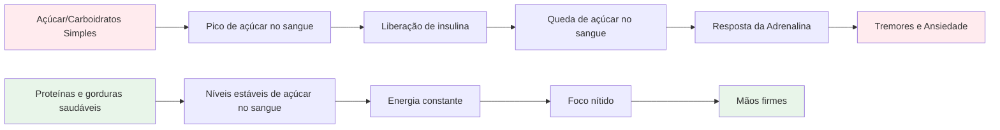
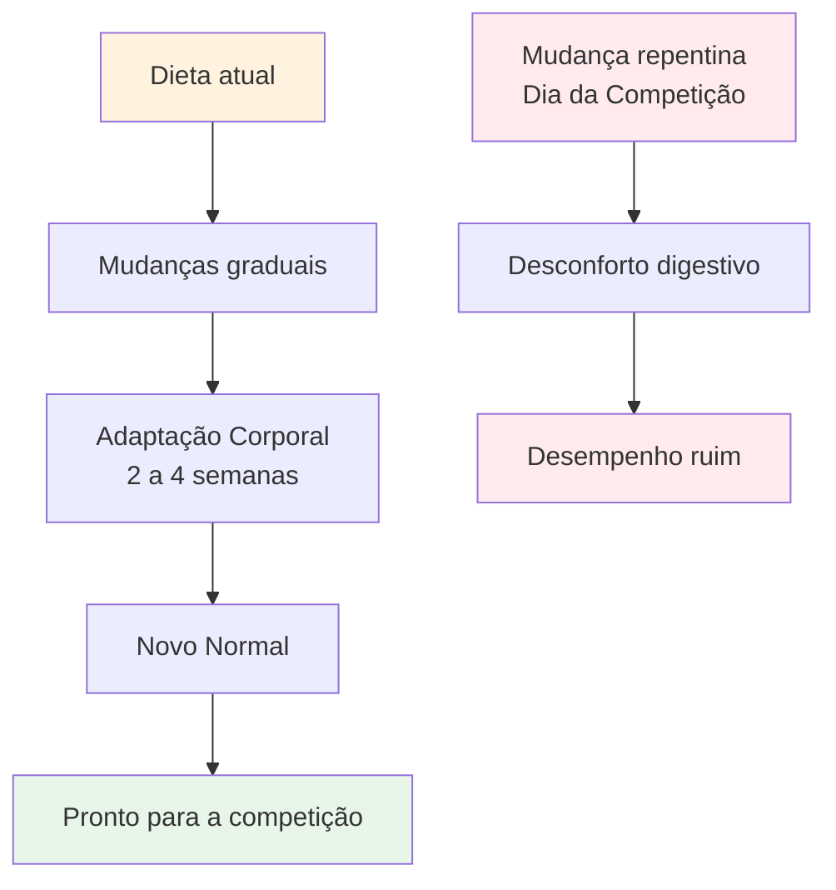

# Nutrição para um Desempenho Preciso


A petanca é um esporte de precisão, não de resistência. Suas necessidades nutricionais são diferentes das de um maratonista ou de um jogador de futebol. O mais importante é a **estabilidade do combustível cerebral** — manter a mente afiada e as mãos firmes durante um longo dia de competição.

::: tip A Grande Ideia
**Seu cérebro é sua ferramenta mais importante na petanca. Alimente-o com combustível estável, não com energia instável.** Concentre-se em proteínas, gorduras saudáveis e em manter-se hidratado. Evite picos de açúcar.
:::



## O Desafio do Atleta de Precisão

Ao contrário de esportes de alta intensidade, a petanca não exige grandes reservas de glicogênio nem reposição rápida de energia. O que ela exige é:

- **Níveis estáveis de açúcar no sangue** - sem picos ou quedas bruscas
- **Clareza mental consistente** - foco que dura o dia todo
- **Mãos firmes** - sem tremores ou abalos
- **Nervos calmos** - baixa ansiedade e resposta ao estresse

Sua estratégia nutricional deve otimizar esses fatores, e não a produção bruta de energia.

## O problema com o açúcar e os carboidratos simples

Muitos atletas optam por dietas ricas em carboidratos. Para jogadores de petanca, isso pode, na verdade, prejudicar o desempenho.

### A Montanha-Russa do Açúcar no Sangue

Quando você consome açúcar ou carboidratos simples:
1. O nível de açúcar no sangue aumenta rapidamente.
2. A insulina é liberada para diminuir a concentração de insulina.
3. Queda brusca de açúcar no sangue (hipoglicemia)
4. Seu corpo libera adrenalina para compensar.
5. Você apresenta tremores, ansiedade e dificuldade de concentração.

**Isso é o oposto do que você precisa para obter precisão.**

### Sintomas de instabilidade do açúcar no sangue

| Sintoma | Impacto no desempenho |
|---------|----------------------|
| mãos trêmulas | Lançamento inconsistente |
| Dificuldade de concentração | Tomada de decisões ruins |
| Irritabilidade | Conflito de equipe, falta de compostura |
| Fadiga após as refeições | moleza da tarde |
| Ansiedade | Sensibilidade à pressão |
| Névoa mental | Pensamento tático lento |

## Uma abordagem melhor: energia estável

O objetivo é fornecer ao seu cérebro combustível constante, sem oscilações bruscas.

### Princípios-chave

1. **Priorize proteínas e gorduras saudáveis** - Elas fornecem energia lenta e constante.
2. **Prefira carboidratos complexos aos simples** - Se for consumir carboidratos, escolha aqueles que são digeridos lentamente.
3. **Evite picos de açúcar** - Especialmente antes e durante a competição.
4. **Mantenha-se hidratado** - A desidratação afeta significativamente a concentração.
5. **Alimente-se regularmente** - Não deixe a fome chegar a um ponto em que você não consegue se controlar.

### Alimentos que ajudam

| Tipo de alimento | Exemplos | Por que funciona |
|-----------|----------|--------------|
| Proteína | Ovos, nozes, queijo, carne | Digestão lenta, energia estável |
| Gorduras saudáveis | Abacate, azeite, nozes | Combustível de longa duração |
| Carboidratos complexos | Vegetais, leguminosas | A fibra retarda a absorção. |
| Frutas com baixo teor de açúcar | Frutas vermelhas, maçãs | Nutrientes sem picos |

### Alimentos a limitar

| Tipo de alimento | Exemplos | Por que isso é problemático |
|-----------|----------|---------------------|
| Açúcar | Doces, refrigerantes, bolos | Pico e queda rápidos |
| Pão branco/massa | Sanduíches, pratos de massa | Conversão rápida em açúcar |
| Suco de frutas | Suco de laranja, smoothies | Açúcar concentrado |
| Bebidas energéticas | A maioria das marcas comerciais | Açúcar + cafeína |

## Nutrição para o dia da competição

### Antes da competição

**2 a 3 horas antes:**
- Refeição balanceada com proteínas, gorduras e vegetais.
- Evite carboidratos pesados que possam causar sonolência.
- Exemplo: Ovos com legumes ou salada com frango

**1 hora antes:**
- Lanche leve, se necessário
- Nozes, queijo ou uma pequena porção de proteína.
- Evite tudo que seja açucarado

### Durante a competição

**Entre os jogos:**
- Água (a mais importante)
- Pequenos lanches proteicos (nozes, queijo, carne)
- Evite lanches e bebidas açucaradas.

**Sinais de que você precisa comer:**
- Dificuldade de concentração
- Irritabilidade
- Sentindo-me trêmula
- Dor de cabeça

### Após a competição

- Reponha as energias com uma refeição equilibrada.
- Reidrate-se completamente.
- Não se &quot;recompense&quot; com açúcar - isso afetará sua recuperação.

## Hidratação

A desidratação afeta a função cognitiva antes mesmo de você sentir sede.

### Diretrizes

- **Comece o dia hidratado** - Beba água ao longo do dia antes da competição.
- **Durante o jogo** - Beba água regularmente, não espere até sentir sede.
- **Evite o excesso de cafeína** - Ela é diurética.
- **Fique atento aos sinais:** Dor de cabeça, urina escura, fadiga.

### Quanto?

Uma regra geral: o ideal é que a urina fique amarelo-clara. Se estiver escura, você precisa beber mais água.

## A opção com baixo teor de carboidratos

Alguns atletas de precisão adotam dietas com baixo teor de carboidratos ou cetogênicas. A teoria:

**Benefícios potenciais:**
- Níveis de açúcar no sangue muito estáveis (sem possibilidade de picos).
- Clareza mental consistente
- Redução da ansiedade e dos tremores
- Sem quedas bruscas de energia à tarde.

**Considerações:**
- Requer período de adaptação (1-2 semanas)
- Não é adequado para todos.
- Requer planejamento e comprometimento.
- Consulte primeiro um profissional de saúde


Essa é uma estratégia avançada – não necessária para todos, mas que vale a pena considerar se a estabilidade do açúcar no sangue for uma questão importante para você.

## Alimentação como prática: treinando seu corpo

::: warning Conceito Crítico
**A alimentação não é apenas combustível – é algo com que você treina.** Assim como você treina seu arremesso, você precisa treinar sua nutrição para que seu corpo se acostume com a alimentação do dia da competição.
:::

### Por que as práticas alimentares são importantes

Seu sistema digestivo pode ser treinado. O que você come regularmente se torna aquilo que seu corpo espera e processa melhor. Se você consumir apenas proteínas e vegetais nos dias de competição, seu corpo não estará adaptado a isso.

**O problema:**
- Comer alimentos desconhecidos no dia da competição pode causar desconforto digestivo.
- Seu corpo precisa de tempo para se adaptar a novos padrões alimentares.
- Estresse + comida desconhecida = potenciais problemas estomacais
- A ansiedade de desempenho já é ruim o suficiente sem adicionar a ansiedade digestiva.

**A solução:**
- Pratique a nutrição para competição durante o treino.
- Incorpore os alimentos que você consome no dia da competição à sua rotina alimentar regular.
- Treine seu corpo para se acostumar com alimentos de energia estável.

### O Processo de Adaptação



Ao mudar sua dieta:
1. **Semanas 1-2:** Seu corpo se adapta aos novos alimentos e você pode sentir algumas diferenças.
2. **Semanas 3-4:** Ocorre a adaptação, os novos alimentos passam a ser considerados normais.
3. **Semana 5+:** Seu corpo está confortável e funcionando de forma eficiente com esses alimentos.

**É por isso que você não pode simplesmente &quot;se alimentar de forma saudável&quot; no dia da competição e esperar resultados ótimos.**

### Como praticar sua nutrição

#### 1. Comece durante o treinamento

**Pratique sua alimentação do dia da competição durante os treinos:**
- Coma a mesma refeição pré-treino que você comeria antes de uma competição.
- Leve os mesmos lanches que você levaria para um torneio.
- Observe como seu corpo reage.
- Ajuste com base no que funciona.

**Exemplo de dia de treinamento:**
```
2-3 hours before: Eggs with vegetables (same as competition)
During training: Water + nuts (same as competition)
After training: Balanced meal with protein
```

#### 2. Faça disso o seu normal

**Não tenha uma &quot;dieta de competição&quot; e uma &quot;dieta normal&quot;** - isso cria dois problemas:
- Seu corpo nunca se adapta completamente a nenhum dos dois.
- A comida da competição parece estranha e estressante.

**Em vez de:**
- Faça dos alimentos com alto teor energético a sua norma diária.
- Seu corpo se torna eficiente no uso de proteínas e gorduras.
- O dia da competição parece normal, não diferente.
- Sem surpresas digestivas

#### 3. Testar e refinar

**Use o treinamento para experimentar:**

| Teste | O que observar | Ajustar |
|------|----------------|--------|
| Horário da refeição pré-treino | Níveis de energia, foco | Encontre a sua janela ideal. |
| Diferentes fontes de proteína | Digestão, conforto | Identifique o que funciona melhor |
| Tipos de lanches | Energia sustentada | Encontre seus lanches favoritos |
| Quantidades de hidratação | Concentração, pausas para ir ao banheiro | ingestão equilibrada |

**Mantenha um registro simples:**
- O que você comeu e quando?
- Como você se sentiu durante o treinamento?
- Níveis de energia e concentração
- Quaisquer problemas digestivos

#### 4. Desenvolva conforto e confiança

**O benefício psicológico:**

Quando você já praticou sua alimentação centenas de vezes durante o treinamento:
- Você sabe exatamente como seu corpo reagirá.
- Sem ansiedade em relação às opções alimentares.
- Uma preocupação a menos no dia da competição.
- Confiança na sua preparação

**Este é o mesmo princípio de praticar o arremesso** - a repetição gera conforto e confiabilidade.

### Desafios comuns de adaptação

::: details Transição de uma dieta rica em carboidratos para uma dieta com energia estável.

**Desafio:** Você está acostumado(a) a pão, macarrão e doces.

**Período de adaptação:** 2 a 4 semanas

**O que esperar:**
- Semana 1: Pode haver sensações diferentes, desejos por comidas antigas.
- Semana 2: Os níveis de energia se estabilizam e os desejos diminuem.
- Semanas 3-4: Novo normal, corpo eficiente com gorduras/proteínas

**Como praticar:**
- Comece com uma refeição de cada vez.
- Substitua primeiro os carboidratos simples por carboidratos complexos.
- Aumente gradualmente a ingestão de proteínas e gorduras saudáveis.
- Pratique primeiro durante treinos de baixo risco.
:::

::: details Encontrando alimentos que funcionam para você

**Desafio:** Nem todos digerem bem os mesmos alimentos.

**O que testar:**
- Diferentes fontes de proteína (ovos vs. carne vs. nozes)
- Horário das refeições (2 horas ou 3 horas antes)
- Tamanho das porções (muita = sensação de lentidão, pouca = fome)
- Alimentos específicos que causam desconforto

**Abordagem prática:**
- Tente uma variável de cada vez.
- Dê a cada teste de 2 a 3 sessões de treinamento.
- Anote o que te faz sentir melhor
- Monte seu &quot;cardápio de competição&quot; personalizado
:::

::: details Lidando com ambientes alimentares em torneios

**Desafio:** Os torneios geralmente têm opções limitadas de alimentação.

**Solução prática:**
- Leve sempre seus próprios lanches (pratique isso).
- Visite os locais com antecedência, sempre que possível.
- Tenha opções de backup que você sabe que funcionam.
- Pratique comer em diferentes ambientes.

**Preparação mental:**
- Não confie na comida do local.
- Trate os alimentos como parte do seu equipamento.
- Embale como você embala suas bolas de bocha.
:::

### Plano de Prática Nutricional de 30 Dias

**Objetivo:** Fazer da alimentação com energia estável o seu normal, algo que lhe seja confortável.

**Semanas 1-2: Fundamentos**
- Substitua uma refeição por dia por uma alimentação no estilo de competição.
- Pratique a nutrição pré-treino.
- Comece a levar lanches para o treino.
- Observe como seu corpo reage.

**Semanas 3-4: Expansão**
- Faça duas refeições por dia com foco em energia estável.
- Pratique a alimentação completa do dia da competição nos dias de treino.
- Aprimore suas opções de lanches
- Crie sua lista de alimentos favoritos

**Semana 5+: Domínio**
- Alimentação com níveis energéticos estáveis será o seu novo normal.
- O corpo está totalmente adaptado.
- O dia da competição parece rotineiro.
- Confiança na sua nutrição

### Seu kit de alimentos para competição

**Pratique levar este item para cada sessão de treinamento:**

**Pré-competição (2 a 3 horas antes):**
- [ ] Fonte de proteína (ovos, carne ou nozes)
- [ ] Legumes ou salada
- [ ] Gorduras saudáveis (abacate, azeite, queijo)

**Durante a competição:**
- [ ] Garrafa de água (reutilizável)
- [ ] Mix de nozes (porções pequenas)
- [ ] Ovos cozidos (se você conseguir mantê-los frescos)
- [ ] Cubos de queijo ou queijo em tiras
- [ ] carne seca ou carne desidratada
- [ ] Lanches de reserva

**Quanto mais você praticar com este kit, mais automático ele se tornará.**

## Dicas práticas

### Lanches fáceis para competição
- Mix de frutos secos (sem sal)
- Ovos cozidos
- Cubos de queijo
- Carne seca de boi ou de peru
- Legumes com húmus
- Azeitonas

### O que evitar
- salgadinhos de máquina de venda automática
- bebidas esportivas açucaradas
- Pastéis e produtos de panificação
- Barras de chocolate e doces
- A maioria das barras &quot;energéticas&quot; (verifique o teor de açúcar)

## Ponto-chave

> Seu cérebro é sua ferramenta mais importante na petanca. Alimente-o com combustível estável, não com energia instável. E pratique sua nutrição assim como pratica seu arremesso — a repetição gera conforto e confiabilidade.

Priorize proteínas, gorduras saudáveis e mantenha-se hidratado. Evite picos de açúcar. **O mais importante: adote a nutrição do dia da competição como sua nutrição diária.** Seu corpo precisa de prática para atingir o máximo desempenho.

**Lembre-se:** Você não apareceria em um torneio com uma técnica de arremesso que nunca praticou. Da mesma forma, não apareça com uma estratégia de nutrição que nunca praticou.

