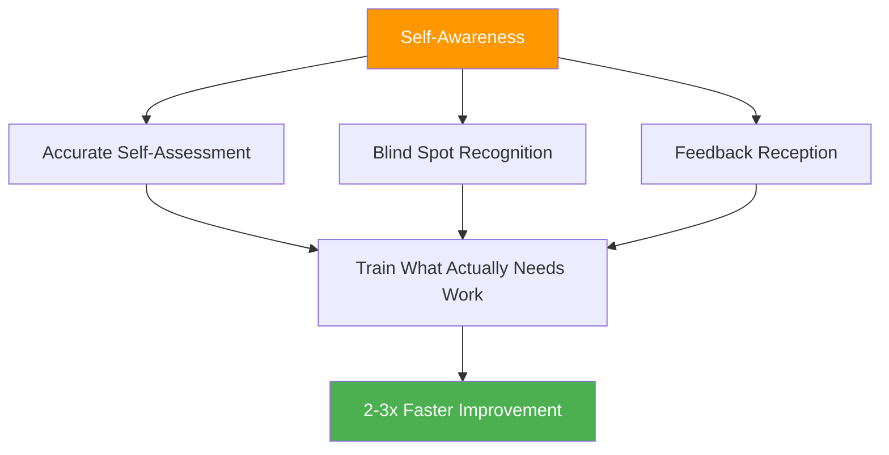

# The Self-Awareness Advantage

::: tip The Meta-Skill That Multiplies Everything
**Weight: 400 points** — Players with accurate self-perception improve 2-3x faster because they train what actually needs work.
:::

## Why This Is Your Hidden Multiplier

> "You can't improve what you can't see."

Most players spend hours practicing, but **are they practicing the right things?** Self-awareness is the meta-skill that ensures your training time is actually effective.

### The Improvement Multiplier Effect



Without self-awareness, you might:
- Practice what you're already good at (feels good, limited growth)
- Miss technical flaws you can't see
- Misattribute losses to external factors
- Resist feedback that could help you

With self-awareness, you:
- Identify actual weaknesses accurately
- Accept and integrate useful feedback
- Understand how pressure affects your specific game
- Know your patterns under different conditions

---

## The Self-Awareness Paradox

::: danger The Uncomfortable Truth
Research consistently shows: Those who need more self-awareness typically believe they have excellent self-knowledge. Those with high self-awareness constantly question themselves and seek external input.

**Which one are you?**
:::

This is called the **Dunning-Kruger effect** applied to self-perception. The very lack of awareness that holds you back also prevents you from seeing that you lack awareness.

### The Solution: External Mirrors

Since we can't fully trust our internal perception, we need external mirrors:

| Mirror | What It Reveals |
|--------|-----------------|
| **Video Analysis** | Technical reality vs. what you think you're doing |
| **Performance Data** | Patterns you might not notice |
| **Teammate Feedback** | How you're perceived under pressure |
| **Coach Observation** | Expert eye on your game |

---

## The Johari Window for Pétanque Players

The Johari Window is a psychological model that maps what you and others know about your game:

```
                    Known to Self    Unknown to Self
                   ┌────────────────┬────────────────┐
 Known to Others   │     OPEN       │     BLIND      │
                   │  Arena         │  Spot          │
                   │                │                │
                   │ Your conscious │ What others    │
                   │ skills and     │ see but you    │
                   │ tendencies     │ don't          │
                   ├────────────────┼────────────────┤
 Unknown to Others │    HIDDEN      │   UNKNOWN      │
                   │    Facade      │   Potential    │
                   │                │                │
                   │ What you know  │ Undiscovered   │
                   │ but don't      │ capabilities   │
                   │ share          │                │
                   └────────────────┴────────────────┘
```

### Your Goal: Expand the "Open" Area

**1. Reduce your Blind Spots**
- Seek video analysis
- Ask for specific feedback
- Watch for patterns in results

**2. Share More (Reduce Hidden)**
- Tell teammates when you're struggling
- Discuss your approach openly
- Ask for help when needed

**3. Discover Your Unknown Potential**
- Try new approaches
- Experiment in training
- Push outside comfort zone

---

## Self-Awareness vs. Self-Criticism

::: warning Critical Distinction
Self-awareness is **neutral observation** of reality.
Self-criticism is **negative judgment** of yourself.

They are NOT the same thing.
:::

| Self-Awareness | Self-Criticism |
|----------------|----------------|
| "I missed three carreaux today" | "I'm terrible at carreaux" |
| "I tense up in close games" | "I always choke under pressure" |
| "My pointing is less accurate when tired" | "I can't handle long tournaments" |
| "I communicate less when losing" | "I'm a bad teammate when stressed" |

**The difference matters because:**
- Self-awareness leads to targeted improvement
- Self-criticism leads to shame and avoidance
- Self-awareness is factual and specific
- Self-criticism is emotional and generalized

---

## The Three Levels of Self-Awareness

### Level 1: Technical Self-Awareness
*"How am I actually performing?"*

- Accuracy under different conditions
- Technical execution patterns
- Physical state effects on performance

### Level 2: Psychological Self-Awareness
*"How do I respond mentally and emotionally?"*

- Stress responses and triggers
- Confidence fluctuations
- Focus patterns and distractors

### Level 3: Social Self-Awareness
*"How do I affect others and how do they see me?"*

- Team communication patterns
- Leadership moments (or gaps)
- How your emotions affect teammates

---

## Self-Assessment: Your Current Self-Awareness

Rate yourself honestly (1 = Never, 5 = Always):

| Question | Score |
|----------|-------|
| I can accurately predict my performance in different situations | /5 |
| I know what conditions cause me to underperform | /5 |
| I understand how teammates perceive me under pressure | /5 |
| I welcome and integrate critical feedback | /5 |
| My self-assessment matches my coach's/teammates' assessment | /5 |
| I can objectively analyze my performance without emotional reaction | /5 |
| I notice my own mental state changes during competition | /5 |

**Scoring:**
- **28-35:** High self-awareness (but stay humble—keep seeking input)
- **21-27:** Moderate self-awareness (good foundation to build on)
- **14-20:** Self-awareness gap (this module is critical for you)
- **Below 14:** Significant blind spots (prioritize this work)

---

## In This Module

### [Getting and Using Feedback](/pt/education/self-awareness/feedback)
- Sources of objective feedback
- How to ask for feedback effectively
- Receiving feedback without defensiveness
- Turning feedback into action

### [Video Analysis for Self-Discovery](/pt/education/self-awareness/video)
- What to record and when
- What to look for in your footage
- Comparing self-perception to video reality
- Video analysis protocols

---

## Quick Win: The Three Questions

After your next training session or match, ask yourself:

1. **What did I think I did well?** (Be specific)
2. **What would an objective observer say?** (Separate perception from reality)
3. **What's one thing I'm avoiding looking at?** (Find the blind spot)

Write your answers down. Compare them over time. Patterns will emerge.

---

## Related Factors

- [Mental Game](/pt/education/mental-game/) — Self-awareness supports mental training
- [Team Dynamics](/pt/education/team-dynamics/) — Understand how others perceive you
- [Motivation](/pt/education/motivation/) — Know your real drivers
- [Technique](/pt/education/technique/) — Video analysis reveals technical truth

