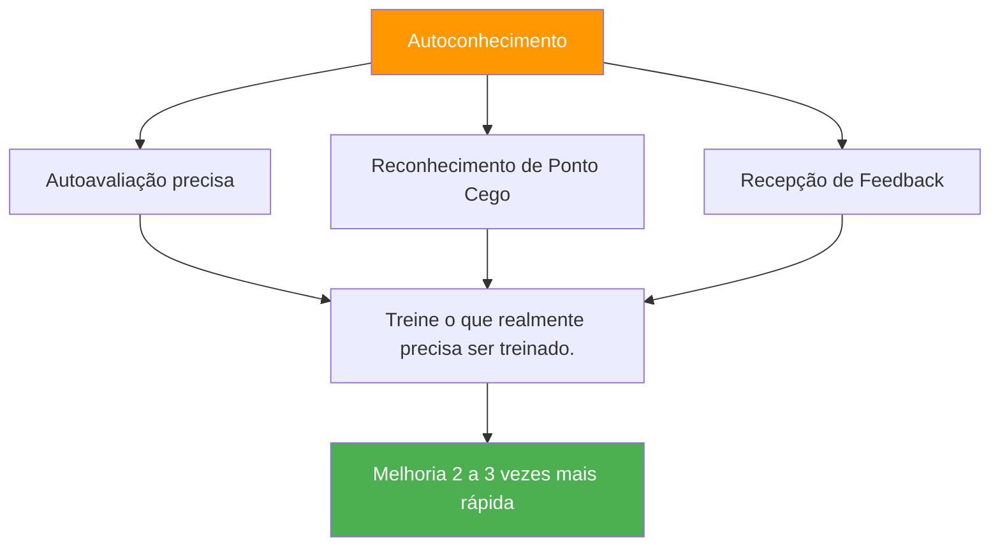

# A vantagem da autoconsciência

::: tip A Meta-Habilidade Que Multiplica Tudo
**Peso: 400 pontos** — Jogadores com autopercepção precisa melhoram de 2 a 3 vezes mais rápido porque treinam o que realmente precisa ser aprimorado.
:::

## Por que este é o seu multiplicador oculto

> &quot;Você não pode melhorar o que não consegue ver.&quot;

A maioria dos jogadores passa horas praticando, mas **será que estão praticando as coisas certas?** A autoconsciência é a meta-habilidade que garante que seu tempo de treino seja realmente eficaz.

### O Efeito Multiplicador da Melhoria



Sem autoconhecimento, você pode:
- Pratique aquilo em que você já é bom (é gratificante, mas o crescimento é limitado).
- Não perceba falhas técnicas que você não consegue ver.
- Atribuir erroneamente as perdas a fatores externos.
- Resista a feedbacks que poderiam te ajudar.

Com autoconhecimento, você:
- Identificar com precisão as reais fraquezas
- Aceitar e integrar feedback útil
- Entenda como a pressão afeta seu jogo específico.
- Conheça seus padrões em diferentes condições.

---

## O paradoxo da autoconsciência

::: danger A verdade incômoda
Pesquisas mostram consistentemente: aqueles que precisam de mais autoconhecimento geralmente acreditam ter excelente autoconhecimento. Aqueles com alto nível de autoconhecimento questionam-se constantemente e buscam opiniões externas.

Qual deles você é?
:::

Isso é chamado de **efeito Dunning-Kruger** aplicado à autopercepção. A própria falta de consciência que o impede também o impede de perceber que lhe falta consciência.

### A solução: espelhos externos

Como não podemos confiar plenamente em nossa percepção interna, precisamos de espelhos externos:

| Espelho | O que isso revela |
|--------|-----------------|
| **Análise de Vídeo** | Realidade técnica versus o que você pensa que está fazendo |
| **Dados de desempenho** | Padrões que você talvez não perceba |
| **Feedback dos colegas de equipe** | Como você é percebido sob pressão |
| **Observação do treinador** | Um olhar experiente sobre o seu jogo. |

---

## A Janela de Johari para Jogadores de Petanca

A Janela de Johari é um modelo psicológico que mapeia o que você e os outros sabem sobre o seu jogo:

```
                    Known to Self    Unknown to Self
                   ┌────────────────┬────────────────┐
 Known to Others   │     OPEN       │     BLIND      │
                   │  Arena         │  Spot          │
                   │                │                │
                   │ Your conscious │ What others    │
                   │ skills and     │ see but you    │
                   │ tendencies     │ don't          │
                   ├────────────────┼────────────────┤
 Unknown to Others │    HIDDEN      │   UNKNOWN      │
                   │    Facade      │   Potential    │
                   │                │                │
                   │ What you know  │ Undiscovered   │
                   │ but don't      │ capabilities   │
                   │ share          │                │
                   └────────────────┴────────────────┘
```

### Seu objetivo: Expandir a área &quot;aberta&quot;

**1. Reduza seus pontos cegos**
- Análise de vídeo do Seek
- Solicite feedback específico.
- Fique atento a padrões nos resultados.

**2. Compartilhar mais (reduzir o número de pessoas ocultas)**
- Avise seus colegas de equipe quando estiver com dificuldades.
- Discuta sua abordagem abertamente.
- Peça ajuda quando necessário.

**3. Descubra seu potencial desconhecido**
- Experimente novas abordagens.
- Experimento em treinamento
- Saia da sua zona de conforto

---

## Autoconhecimento versus autocrítica

::: warning Distinção Crítica
A autoconsciência é a **observação neutra** da realidade.
A autocrítica é um julgamento negativo feito a si mesmo.

Não são a mesma coisa.
:::

| Autoconhecimento | Autocrítica |
|----------------|----------------|
| &quot;Perdi três carros hoje&quot; | &quot;Sou péssimo em carreaux&quot; |
| &quot;Fico tenso em jogos acirrados&quot; | &quot;Eu sempre travo sob pressão&quot; |
| &quot;Minha precisão ao apontar diminui quando estou cansado.&quot; | &quot;Não consigo lidar com torneios longos&quot; |
| &quot;Eu me comunico menos quando estou perdendo&quot; | &quot;Sou um péssimo colega de equipe quando estou estressado&quot; |

**A diferença é importante porque:**
- A autoconsciência leva a melhorias direcionadas.
- A autocrítica leva à vergonha e à evitação.
- A autoconsciência é factual e específica.
- A autocrítica é emocional e generalizada.

---

## Os três níveis de autoconsciência

### Nível 1: Autoconhecimento Técnico
*&quot;Como estou me saindo na prática?&quot;*

- Precisão em diferentes condições
- Padrões de execução técnica
- Efeitos do estado físico no desempenho

### Nível 2: Autoconsciência Psicológica
*&quot;Como devo reagir mental e emocionalmente?&quot;*

- Respostas e fatores desencadeantes do estresse
- Flutuações de confiança
- Padrões de foco e elementos de distração

### Nível 3: Autoconsciência Social
*&quot;Como eu influencio os outros e como eles me veem?&quot;*

- Padrões de comunicação da equipe
- Momentos (ou lacunas) de liderança
- Como suas emoções afetam seus colegas de equipe

---

## Autoavaliação: Seu nível atual de autoconhecimento

Seja honesto consigo mesmo(a) ao se avaliar (1 = Nunca, 5 = Sempre):

| Pergunta | Pontuação |
|----------|-------|
| Consigo prever com precisão meu desempenho em diferentes situações. | /5 |
| Sei quais condições me levam a ter um desempenho abaixo do esperado. | /5 |
| Entendo como meus colegas de equipe me enxergam sob pressão. | /5 |
| Acolho e integro o feedback crítico. | /5 |
| Minha autoavaliação coincide com a avaliação do meu treinador/colegas de equipe. | /5 |
| Consigo analisar meu desempenho objetivamente, sem reações emocionais. | /5 |
| Percebo que meu próprio estado mental muda durante a competição. | /5 |

**Pontuação:**
- **28-35:** Alta autoconsciência (mas mantenha a humildade — continue buscando opiniões)
- **21-27:** Autoconhecimento moderado (boa base para construir)
- **14-20:** Lacuna de autoconhecimento (este módulo é fundamental para você)
- **Abaixo de 14 anos:** Pontos cegos significativos (priorizar este trabalho)

---

## Neste módulo

### [Obtendo e Utilizando Feedback](/pt/education/self-awareness/feedback)
- Fontes de feedback objetivo
- Como pedir feedback de forma eficaz
- Receber feedback sem se colocar na defensiva.
- Transformar feedback em ação.

### [Análise de vídeo para autodescoberta](/pt/education/self-awareness/video)
- O que gravar e quando
- O que procurar em suas filmagens
- Comparando a autopercepção com a realidade em vídeo
- Protocolos de análise de vídeo

---

## Vitória Rápida: As Três Perguntas

Após o seu próximo treino ou jogo, pergunte a si mesmo:

1. **O que eu acho que fiz bem?** (Seja específico)
2. **O que diria um observador objetivo?** (Separar a percepção da realidade)
3. Qual é uma coisa que estou evitando olhar? (Encontre o ponto cego)

Anote suas respostas. Compare-as ao longo do tempo. Padrões irão surgir.

---

## Fatores relacionados

- [Jogo Mental](/pt/education/mental-game/) — A autoconsciência apoia o treinamento mental
- Dinâmica de Equipe — Entenda como os outros te percebem.
- [Motivação](/pt/education/motivation/) — Conheça seus verdadeiros motivadores
- [Técnica](/pt/education/technique/) — Análise de vídeo revela verdade técnica

