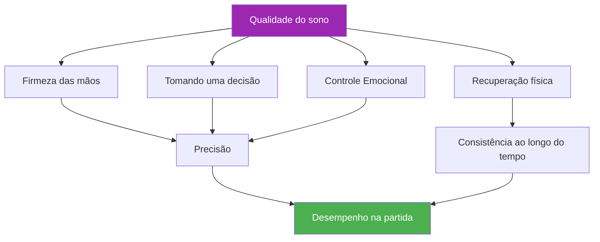

# Sono e recuperação

::: tip Um fator crítico de desempenho
**Peso: 400 pontos** — O sono é o fator mais subestimado nos esportes de precisão. Suas mãos, decisões e emoções dependem de um descanso de qualidade.
:::

## A Vantagem Oculta de Desempenho

> &quot;O jogador que dormiu melhor costuma vencer.&quot;

Na petanca, ao contrário dos esportes de resistência em que os atletas às vezes conseguem &quot;ignorar&quot; a fadiga, **a precisão é imprescindível**. Sua capacidade de colocar uma bola a centímetros do alvo depende de sistemas extremamente sensíveis à privação de sono.

- Controle motor fino
- Tomada de decisões sob pressão
- Regulação emocional
- Consolidação da memória

Este módulo revela por que o sono pode ser sua maior vantagem competitiva inexplorada.

---

## Como o sono afeta seu jogo

### Firmeza das mãos e controle motor

Pesquisas mostram que o controle motor fino degrada **10-15% da privação de sono acumulada por hora**. Para jogadores de petanca, isso se manifesta da seguinte forma:

- **Aumento de microtremores** — Imperceptíveis para você, mas que afetam a consistência da liberação.
- **Propriocepção reduzida** — Menor consciência da pressão de preensão e da posição do braço.
- **Correção de erros mais lenta** — Seu corpo não consegue fazer os microajustes que produzem precisão.

::: warning Por que apontar sofre primeiro
Apontar exige o controle motor mais preciso de qualquer tiro. Muitas vezes, é a primeira habilidade a se deteriorar quando você não dormiu o suficiente — mesmo quando você &quot;se sente bem&quot;.
:::

### Tomada de Decisão e Táticas

Seu córtex pré-frontal — responsável pelo planejamento, avaliação de riscos e pensamento estratégico — é altamente sensível à privação de sono:

- **A avaliação de risco fica comprometida** — Você pode tentar chutes com menor probabilidade de acerto.
- **A flexibilidade tática diminui** — Mais difícil de se adaptar durante o jogo.
- **O fenômeno da &quot;decisão das 2 da manhã&quot;** — Escolhas que parecem razoáveis quando se está cansado tornam-se questionáveis em retrospectiva.

### Regulação Emocional

A privação de sono causa **hiperatividade na amígdala**, o centro emocional do cérebro:

- A pressão parece mais intensa.
- A frustração após erros é amplificada.
- A recuperação de contratempos leva mais tempo.
- A dinâmica de equipe pode ser prejudicada por ânimos exaltados.

### Consolidação da memória

A memória motora se consolida durante o sono, particularmente durante as fases de sono profundo:

- **Praticar sem dormir = retenção limitada**
- **&quot;Dormir sobre o assunto&quot; realmente funciona** para mudanças de técnica.
- A fórmula: **Prática de qualidade + Sono de qualidade = Habilidade permanente**

---

## A conexão entre sono e desempenho

---

## A realidade da dívida de sono

### O que é débito de sono?

A privação de sono é **cumulativa**. Perder uma hora de sono não afeta apenas aquele dia — ela se acumula:

| Dias | Horas a menos | Dívida Total | Impacto no desempenho |
|------|-------------|------------|-------------------|
| 1 | -1 hora | 1 hora | Mínimo |
| 3 | -1 hora/dia | 3 horas | Perceptível |
| 7 | -1 hora/dia | 7 horas | Significativo |
| 14 | -1 hora/dia | 14 horas | Forte |

::: danger O Mito do Fim de Semana
Você **não consegue &quot;recuperar&quot; totalmente as dívidas** nos fins de semana. Embora dormir mais ajude, não elimina as dívidas acumuladas. A consistência é mais importante do que dormir bastante de vez em quando.
:::

### De quanto você precisa?

A ideia de que &quot;8 horas são para todos&quot; é um mito. As necessidades individuais variam.

- **A maioria dos adultos:** 7 a 9 horas
- **Algumas funcionam bem com:** 6 a 7 horas
- **Alguns exigem:** 9 horas ou mais

**Descobrindo a SUA necessidade ideal de sono:**
1. Durante as férias (sem despertador), deixe-se dormir naturalmente por 5 a 7 dias.
2. Após a fase inicial de &quot;recuperação&quot;, observe quanto tempo você dorme.
3. Isso provavelmente está próximo da sua necessidade biológica.

---

## A Ciência em Resumo

### Estágios do sono que importam

| Estágio | Função | Relevância da Petanca |
|-------|----------|-------------------|
| **Sono Profundo (N3)** | Recuperação física, hormônio do crescimento | Recuperação muscular, restauração de energia |
| **Sono REM** | Processamento emocional, consolidação da memória | Retenção de habilidades motoras, resiliência emocional |
| **Sono Leve (N1-N2)** | Transição, manutenção | Suporta a arquitetura geral. |

### Principais conclusões da pesquisa

1. **Estudo de Basquete de Stanford** — Jogadores que aumentaram o tempo de sono para 10 horas melhoraram a precisão nos lances livres em 9% (Mah et al., 2011)
2. **Precisão do saque no tênis** — A restrição de sono reduziu a precisão do saque em 53% (Reyner &amp; Horne, 2013)
3. **Meta-análise do tempo de reação** — Mesmo uma única noite de sono ruim diminui o tempo de reação em 300% (Lim &amp; Dinges, 2010)

---

## Autoavaliação: A realidade do seu sono

Dê uma autoavaliação honesta (de 1 a 5):

| Pergunta | Pontuação |
|----------|-------|
| Durmo a mesma quantidade de horas na maioria das noites. | /5 |
| Adormeço em 15 a 20 minutos. | /5 |
| Eu raramente acordo durante a noite. | /5 |
| Acordo me sentindo revigorado. | /5 |
| Mantenho a energia ao longo do dia. | /5 |

**Pontuação:**
- **20-25:** Excelentes hábitos de sono
- **15-19:** Bom, mas há espaço para melhorias
- **10-14:** É provável que o sono esteja afetando seu desempenho.
- **Abaixo de 10:** Melhorar o sono deve ser uma prioridade.

---

## Neste módulo

### [Protocolos de sono para competição](/pt/education/sleep/competition)
- Na semana anterior à competição
- Gestão de viagens e fusos horários
- protocolos de cochilos revigorantes
- Estratégias de emergência para &quot;Não consegui dormir&quot;

### [Higiene do Sono para Atletas](/pt/education/sleep/habits)
- Os 10 fundamentos do sono
- Modelos de rotina noturna
- O desafio de 30 dias para dormir bem
- Solução de problemas comuns

---

## Vitória Rápida: Hoje à Noite

Se você não fizer mais nada, implemente estas duas mudanças hoje à noite:

1. **Defina um horário de despertar consistente** — O mesmo horário amanhã e hoje, com uma margem de erro de 30 minutos.
2. **Sem telas 30 minutos antes de dormir** — Em vez disso, leia, alongue-se ou prepare-se para o dia seguinte.

Somente essas duas mudanças podem melhorar a qualidade do sono em poucos dias.

---

## Fatores relacionados

O sono está interligado a todos os outros aspetos do seu desempenho:

- [Gestão da Tensão](/pt/education/tension/) — Técnicas de relaxamento e de liberação miofascial para auxiliar o sono
- Nutrição — O horário das refeições e o nível de açúcar no sangue afetam a qualidade do sono.
- [Jogo Mental](/pt/education/mental-game/) — O sono favorece a função cognitiva e o controle emocional
- Autoconsciência — Reconhecer quando a fadiga está afetando seu jogo

