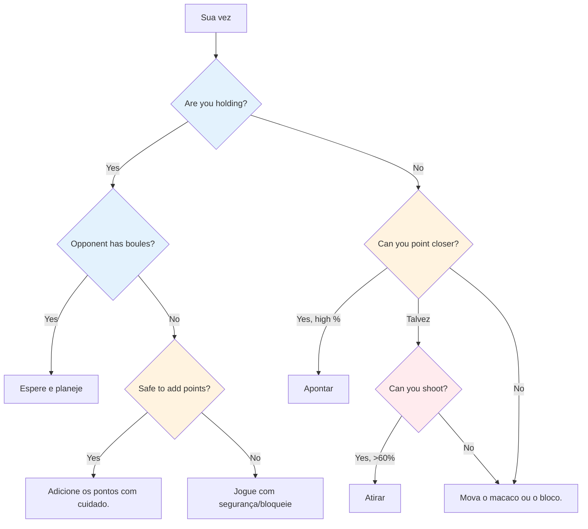
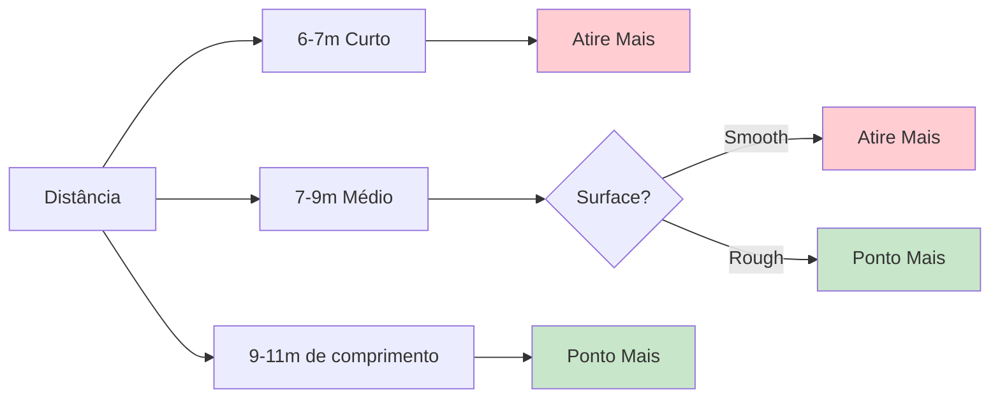

# Pensamento tático na petanca

No nível de elite, a habilidade técnica é pressuposta. O que diferencia os vencedores dos demais é a inteligência tática — saber qual lance tentar e quando. Os melhores jogadores antecipam o jogo em várias jogadas e exploram todas as vantagens.

::: tip O princípio fundamental
**Em nível de elite, a diferença raramente está na técnica, mas sim na tomada de decisões.** A equipe que comete menos erros táticos vence.
:::

## Estrutura de Decisão Rápida

## A Mentalidade Tática

### Pense em probabilidades

Cada lançamento tem uma probabilidade de sucesso. Uma boa tática consiste em escolher lançamentos em que:
- A probabilidade de sucesso é suficientemente alta.
- A recompensa justifica o risco.
- O fracasso não dói muito.

**Exemplo de decisão:**
- Chute difícil: 40% de sucesso, ganha 3 pontos.
- Ponto seguro: 80% de sucesso, ganha 1 ponto.

Qual é a melhor opção? Depende da pontuação, da situação e da sua confiança.

### Considere todas as opções

Antes de cada arremesso, considere:
1. **Ponto:** Coloque uma bola perto do macaco
2. **Ataque:** Remova a bola de um oponente.
3. **Bloqueio:** Coloque uma bola para obstruir o bloqueio.
4. **Mova o macaco:** Bata intencionalmente no macaco
5. **Sacrifício:** Aceitar uma posição desfavorável para depois melhorar a situação.

Não escolha a opção mais óbvia. Pense em alternativas.

### Leia a situação

Fatores a considerar:
- Placar atual (quem está na frente e por quanto)
- Bolas restantes (suas e deles)
- Posição no terreno
- Tendências opostas
- Pontos fortes da sua equipe

## Princípios Táticos Essenciais

::: tip Os 6 Princípios Táticos
1. **Controle o macaco** - A posição é energizada
2. **Estratégia de Distância e Superfície** - Adapte-se às condições
3. **Dite o estilo de jogo** - Explore seus pontos fortes
4. **Gerencie o risco versus a recompensa** - Adeque o risco à situação.
5. **Use as bolas com sabedoria** - Às vezes, conceda 1 ponto para evitar 3.
6. **Pense no futuro** - Visualize os próximos 2 a 3 movimentos.
:::

### Princípio 1: Controle o macaco

A equipe que controla a posição do jack tem uma vantagem significativa.

**Formas de controlar:**
- Ganhe o direito de lançar o valete.
- Mova o macaco para um terreno favorável.
- Proteja o macaco para que ele não seja movido.

**Estratégia de posicionamento do valete:**
- A curta distância é ideal para tiros, facilitando o acerto de alvos a curta distância.
- Long jack: Favorece apontar, atirar fica mais difícil
- Obstáculos próximos: Cria desafios para os oponentes.

**Explore as fraquezas do oponente:**
- Observe a técnica de apontar deles - eles sempre usam o mesmo arco ou estilo?
- Se eles não conseguirem se adaptar (por exemplo, só rolar, só lançar), coloque o bolim para forçar lançamentos desconfortáveis.
- Posicione o macaco a distâncias ou posições que exponham suas limitações.
- Só explore uma fraqueza se você não a compartilhar — considere primeiro os pontos fortes da sua própria equipe.

### Princípio 2: Estratégia de Distância e Superfície

O equilíbrio ideal entre apontar e disparar depende muito da distância e do terreno:

::: info Estratégia de Distância
**Curto alcance (6-7 m):** Favorece o tiro - mais fácil de acertar a curta distância.
**Médio (7-9m):** A superfície é o fator mais importante
- Superfície lisa → fotografe mais
- Superfície áspera → apontar mais

**Longo alcance (9-11 m):** Priorize apontar - a precisão do tiro diminui significativamente.
:::

**Sua porcentagem pessoal de acertos nos arremessos:**
- Se você tiver uma taxa de acerto de 75% ou mais nos disparos, dispare com mais frequência.
- Considere a possibilidade de arremessar para reduzir os pontos do adversário (mesmo que não assuma a liderança).
- Atirar para reduzir as bolas de pontuação do oponente (de 3 para 1) é uma estratégia valiosa para minimizar os danos.

**Atirar como estratégia de longo prazo:**
- Se você atirar com todas as suas bolas, considere sua taxa de sucesso cumulativa.
- Calcule: ao acertar todos os arremessos, você ganha muito mais pontos.
- Mesmo errar alguns arremessos pode reduzir os pontos do adversário.
- Exemplo: Erre 1 ou 2 tiros, mas ainda assim elimine as ameaças, e então ganhe muito quando acertar todos.
- Este é um risco calculado: aceitar algumas perdas em troca de ganhos maiores quando funciona.

### Princípio 3: Dite o estilo de jogo

Em nível de elite, a maioria dos jogadores consegue tanto apontar quanto arremessar bem. A chave é forçar o jogo a se adequar ao estilo mais forte da sua equipe.

**Se sua equipe tiver bons arremessadores:**
- Atire o máximo possível - aproveite a sua vantagem.
- Não desperdice sua força apontando quando você pode dominar atirando.
- Controle o jogo eliminando as ameaças antes que elas se acumulem.
- O tiro de curta a média distância é eficaz.

**Contra atiradores igualmente fortes:**
- Negue-lhes alvos fáceis atirando primeiro.
- Jogue a longa distância para reduzir a porcentagem de acerto de todos.
- A equipe que ataca primeiro geralmente controla o resultado final.

**Se os adversários tiverem mais finalizações que você:**
- Jogue jack de longa distância consistentemente - mesmo os melhores arremessadores perdem a porcentagem a partir de 10 metros.
- Force uma batalha de apontar onde você pode competir.
- Faça-os atirar em ângulos difíceis ou através de obstáculos.

### Princípio 4: Gerenciar Risco versus Recompensa

| Situação | Tolerância ao risco |
|-----------|---------------|
| Adiante, confortavelmente | Baixo - proteja seu chumbo |
| Jogo apertado | Médio - riscos calculados |
| Atrasado significativamente | Alto - precisa arriscar |
| Fim final | Depende da diferença de pontuação |

### Princípio 5: Use suas bolas com sabedoria

A gestão da bocha distingue os jogadores de elite:
- Quando o adversário ficar sem bolas, decida com cuidado: somar pontos ou jogar na defensiva?
- Quando estiver em desvantagem, calcule se você realmente consegue recuperar o ponto.
- Às vezes, ceder 1 ponto é melhor do que desperdiçar bolas e desistir de 3.
- Acompanhe sempre as bolas restantes — as suas e as deles.

### Princípio 6: Pense em várias jogadas à frente.

Pensamento de elite:
- Antes de lançar a bola, visualize as próximas 2 ou 3 bolas de cada equipe.
- Qual a melhor resposta do seu oponente se você tiver sucesso? E se você falhar?
- Como esse arremesso prepara o terreno para o próximo?
- Considere o cenário final a partir da posição atual.

## Situações Táticas Comuns

### Você está segurando as bolas e seu oponente ainda tem bolas restantes.

Você precisa esperar - agora é a vez deles de arremessar. Aproveite esse tempo para:
- Analise o que eles provavelmente farão.
- Planeje sua resposta aos possíveis arremessos deles.
- Mantenha o foco e esteja preparado.

### Você está segurando a bola e seu oponente está sem bolas.

Agora você pode jogar com as bolas restantes. **Opções:**
- Adicione mais pontos se puder fazê-lo com segurança.
- Bloco para proteger contra o movimento do macaco
- Jogue com segurança - não arrisque transformar uma vitória por 2 pontos em uma derrota.

**Decisão crucial:** Vale a pena correr o risco de adicionar pontos e potencialmente abrir o jogo?

### Você não está segurando

Você deve arremessar. **Opções:**
- Ponto mais próximo do que sua melhor bola de bocha.
- Atirem sua melhor bola
- Mova o bolim para suas bolas.
- Bloqueie para limitar a pontuação deles (se você não puder pegar o ponto).

**Fatores de decisão:** Sua porcentagem de acertos, número de bolas restantes (ambas as equipes), pontuação atual

### Últimas situações de bocha

Quando você tiver a última bola:
- Pressão máxima, mas também controle máximo.
- Não tenha pressa - avalie todas as opções.
- Considere: apontar, disparar ou mover o macaco?
- Executar com total comprometimento

Quando o oponente tiver a última bola:
- Você fez o que pôde - aceite o resultado.
- Se possível, crie uma situação sem resposta fácil para eles.
- Várias ameaças são melhores do que uma.

## Lendo seus oponentes

No nível de elite, o estudo do adversário é fundamental. Conheça seus oponentes antes de jogar.

### Informações pré-jogo
- Qual é o estilo de jogo preferido deles (equipe de arremesso versus equipe de armação)?
- Quem é o melhor atirador deles? E o melhor apontador?
- Quais distâncias eles preferem?
- Como eles se comportam sob pressão nas finais?

### Observação durante a partida
- Acompanhe as taxas de sucesso deles ao longo da partida.
- Observe se alguém está tendo um dia ruim.
- Identifique quem lida bem com a pressão e quem não lida.
- Ajuste a posição do macaco com base no que você observar.

### Aproveite o que você encontrar
- Ataque os jogadores mais fracos sempre que possível.
- Force o jogador com pior pontaria a atirar, ou o jogador com pior pontaria a apontar.
- Se alguém estiver com dificuldades, mantenha a pressão sobre essa pessoa.

## Nesta seção

- **[Decisões Baseadas em Probabilidade](/en/education/tactics/probability)** - Usando a matemática para fazer escolhas melhores

## Resumo: Todas as Regras Táticas

::: tip Regra nº 1: A Regra da Probabilidade
**Escolha lançamentos em que a probabilidade de sucesso justifique o risco.**
Considere: taxa de sucesso, recompensa em caso de sucesso e custo em caso de falha.
:::

::: tip Regra nº 2: A Regra de Controle do Jack
**A equipe que controla a posição do jack tem a vantagem.**
Use o posicionamento dos valetes para explorar as fraquezas do oponente e favorecer seus pontos fortes.
:::

::: tip Regra nº 3: A Regra da Distância
**Em curtas distâncias, o tiro é mais vantajoso; em longas distâncias, apontar é mais vantajoso.**
Distância média: a qualidade da superfície determina o equilíbrio
:::

::: tip Regra nº 4: A Regra de Estilo
**Imponha o jogo ao estilo mais forte da sua equipe.**
Se vocês são bons atiradores, atirem mais. Não desperdicem a vantagem.
:::

::: tip Regra nº 5: A Regra de Gestão da Bola de Bocha
**Às vezes, ceder 1 ponto é melhor do que arriscar 3.**
Saiba quando desistir e guardar as bolas para a próxima rodada.
:::

::: tip Regra nº 6: A Regra do Pensamento Antecipado
**Visualize os próximos 2 a 3 movimentos de ambas as equipes.**
Qual é a melhor resposta deles? Como isso influencia seu próximo arremesso?
:::

::: tip Regra nº 7: A Regra do Escotismo
**Conheça seus oponentes antes de jogar.**
Acompanhe suas preferências, taxas de sucesso e respostas à pressão.
:::

## Ponto-chave

> No nível de elite, a diferença raramente está na técnica, mas sim na tomada de decisões. A equipe que comete menos erros táticos vence.

Estude o jogo. Conheça seus pontos fortes. Explore as fraquezas do adversário. Execute com confiança.

