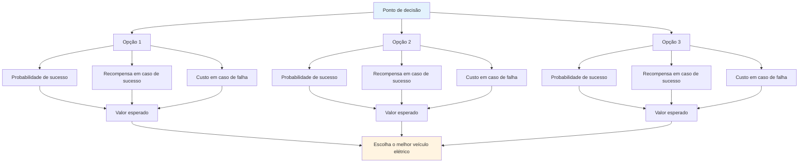

# Tomada de decisão baseada em probabilidade

O pensamento tático de elite utiliza a probabilidade para tomar decisões melhores. Em vez de adivinhar ou seguir a intuição, você pensa sistematicamente sobre suas opções.

::: tip A Grande Ideia
**Pense em probabilidades, não em certezas.** A melhor decisão nem sempre é a mais agressiva ou a mais segura – é aquela que oferece o melhor valor esperado em diversas situações semelhantes.
:::

## A estrutura básica

Cada arremesso possui três componentes:

| Componente | Pergunta | Exemplo |
|-----------|----------|---------|
| **Probabilidade de sucesso** | Qual a probabilidade de eu conseguir executar isso? | Taxa de sucesso de 70% a essa distância. |
| **Recompensa em caso de sucesso** | O que eu ganho com isso? | Ganhe o ponto, ganhe posição |
| **Custo em caso de insucesso** | O que eu perco? | Dê pontos fáceis ao adversário. |

::: info A Fórmula
**Valor Esperado = (Probabilidade × Recompensa) - ((1 - Probabilidade) × Custo)**

Boas decisões maximizam o valor esperado ao longo do tempo.
:::

## Pensando em Probabilidades

Ao escolher entre as opções, considere:
- Qual é a minha taxa de sucesso realista para cada opção?
- O que eu ganho se isso funcionar?
- Qual o custo se falhar?
- Como a situação do jogo afeta minha escolha?

A melhor opção nem sempre é a mais agressiva ou a mais segura – é aquela que oferece o melhor resultado em diversas situações semelhantes.

## Conheça seus números

Para usar o raciocínio probabilístico, você precisa conhecer suas taxas de sucesso reais:

| Tipo de arremesso | Distância | Sua taxa de sucesso |
|------------|----------|-------------------|
| Ponto (fechar) | 6-7m | ___% |
| Ponto (médio) | 8-9m | ___% |
| Ponto (longo) | 10m+ | ___% |
| Atirar (de perto) | 6-7m | ___% |
| Tiro (médio) | 8-9m | ___% |
| Tiro (longo) | 10m+ | ___% |

Acompanhe isso na prática. Seja honesto: a maioria dos jogadores superestima suas taxas de sucesso.

## Ajustando às condições

Suas tarifas base variam de acordo com:

| Fator | Efeito na taxa de sucesso |
|--------|----------------------|
| terreno desconhecido | -10 a -20% |
| Situação de pressão | -5 a -15% |
| Fadiga | -5 a -10% |
| Confiança (alta) | +5 a +10% |
| Sucesso recente | +5% |
| Falha recente | -5 a -10% |

Seja realista quanto a esses ajustes.

## O Princípio da Vantagem da Boule

Quando você tiver mais bolas restantes do que seu oponente:

**Prioridade 1: Garantir o ponto**
- Primeiro, certifique-se de estar segurando pelo menos um ponto.
- Não seja ganancioso antes de garantir o básico.

**Prioridade 2: Maximizar pontos com risco calculado**
- Depois de conseguir segurar a posição, avalie se consegue adicionar mais pontos.
- Cada lançamento adicional é uma decisão de risco/recompensa.
- Não transforme uma vitória segura por 2 pontos em uma derrota por excesso de zelo.

**Poucas bolas restantes:** Você precisa fazer com que cada arremesso conte. Jogadas conservadoras podem não ser suficientes - considere opções com maior potencial de recompensa para se recuperar no final.

## O Princípio &quot;Une Boule Devant&quot;

Uma bola em frente ao bolim (entre o bolim e o adversário) é extremamente valiosa:
- Ele bloqueia linhas de apontamento direto.
- Isso força os adversários a contornar ou passar por cima.
- Ele pode desviar bolas de projéteis que se aproximam.
- É uma &quot;bola de dinheiro&quot; - que vale a pena proteger.

**Implicação tática:** Às vezes, posicionar uma bola de bloqueio é melhor do que tentar chegar mais perto.

## Tolerância ao risco por estado do jogo

### Com limite de tempo

Ao jogar com limite de tempo, a diferença de pontuação importa:

| Situação da pontuação | Abordagem de Risco |
|-----------------|---------------|
| Liderando por mais de 4 | Muito conservador - proteger o líder, deixar o relógio correr. |
| Liderando por 1-3 | Conservador - não ceda pontos |
| Ligado | Equilibrado - riscos calculados |
| Perdendo por 1-3 | Agressivo - precisa ganhar terreno |
| Atrás por mais de 4 | Muito agressivo - é preciso arriscar, o tempo está se esgotando. |

### Sem limite de tempo

Quando não há pressão de tempo:
- Mantenha-se fiel ao seu plano de jogo - não mude de estratégia só por causa do placar.
- A pontuação irá oscilar - confie na sua abordagem.
- Considere mudar sua estratégia apenas se ela claramente não estiver funcionando contra esse adversário.
- Mudanças de atitude em pânico quando se está em desvantagem geralmente pioram as coisas.

### Ajustes de fim de jogo

**Se vencer esta extremidade significar vencer o jogo:**
- Seja mais conservador
- Não arrisque perder vários pontos.
- Um único ponto pode ser suficiente.

**Se perder esta extremidade, perde o jogo:**
- Assumir riscos maiores
- Precisa marcar vários pontos
- Jogar pelo seguro não vai te salvar.

## Erros comuns em probabilidade

### 1. Excesso de confiança
&quot;Eu consigo acertar esse arremesso&quot; - mas você consegue acertá-lo 7 vezes em 10? Seja sincero.

### 2. Ignorando as taxas básicas
Sua porcentagem de acertos nos arremessos não muda porque o momento é importante.

### 3. Falácia do Custo Irrecuperável
&quot;Já errei duas vezes, devo continuar tentando&quot; - cada arremesso é independente.

### 4. Viés de resultado
Uma jogada arriscada que deu certo continuava sendo arriscada. Uma jogada segura que falhou continuava sendo correta.

### 5. Ignorar as opções do oponente
Considere o que eles farão depois do seu arremesso, seja ele bem-sucedido ou não.

## Aplicação prática

### Antes de cada arremesso

1. **Identificar opções** (apontar, atirar, bloquear, etc.)
2. **Estime a probabilidade de sucesso** para cada um
3. **Considere os resultados** (sucesso e fracasso)
4. **Considere o estado do jogo** (pontuação, bolas restantes)
5. **Escolha** a opção com o melhor valor esperado.
6. **Comprometa-se totalmente** - sem hesitações durante a execução.

### Desenvolvendo a intuição

Com o tempo, o pensamento probabilístico torna-se intuitivo:
- Acompanhe seus resultados com honestidade.
- Analisar as decisões após os jogos
- Observe os padrões nas suas taxas de sucesso.
- Ajuste seu modelo mental

## Ponto-chave

> Boas decisões nem sempre levam a bons resultados. Mas boas decisões ao longo do tempo levam a melhores resultados.

Pense em probabilidades. Conheça os números. Faça a jogada inteligente, não a jogada baseada na esperança.

