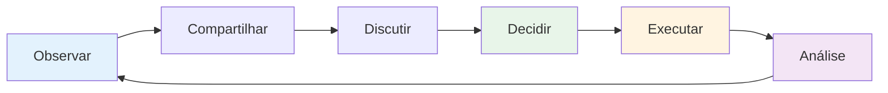

# Comunicação em equipe
<AdBanner />

A comunicação eficaz é o que transforma um grupo de indivíduos em uma equipe. Na petanca, onde a estratégia muda constantemente e a pressão é alta, a forma como você se comunica pode determinar o resultado.

::: tip A Grande Ideia
**A comunicação é o que transforma indivíduos em uma equipe.** Uma comunicação clara, específica e de apoio sob pressão diferencia as boas equipes das excelentes.
:::

## O Ciclo de Comunicação

Uma boa comunicação em equipe segue um ciclo:

| Etapa | Ação | Exemplo |
|------|--------|---------|
| **Observar** | Observe o que está acontecendo | Terreno, posições, adversários |
| **Compartilhar** | Compartilhe com seus colegas o que você vê. | &quot;O terreno se inclina para a esquerda ali&quot; |
| **Discutir** | Trocar perspectivas | &quot;Devo bloquear ou tentar o ponto?&quot; |
| **Decidir** | Concordar com a abordagem. | &quot;Vamos tentar o passe alto&quot; |
| **Executar** | Faça isso com comprometimento. | Foco total no arremesso |
| **Análise** | Aprenda com os resultados. | &quot;Isso funcionou bem&quot; ou &quot;Na próxima vez...&quot; |

## Quando comunicar

### Antes de cada fim
- Avalie o terreno juntos
- Discuta a abordagem geral.
- Esclareça quem vai arremessar e quando.
- Defina o tom (calmo, concentrado)

### Durante o Fim
- Compartilhe suas observações (&quot;O terreno inclina-se para a esquerda ali&quot;)
- Estratégia coordenada (&quot;Devo tentar bloquear ou partir para o ponto?&quot;)
- Ofereça apoio (&quot;Não se apresse, você consegue&quot;)
- Ajuste os planos conforme a situação mudar.

### Entre extremidades
- Breve resumo (o que funcionou, o que não funcionou)
- Reiniciar mentalmente
- Prepare-se para o próximo fim
- Mantenham-se conectados como equipe.

### Após o jogo
- Debriefing completo (quando apropriado)
- Agradecer as contribuições
- Identificar aprendizados
- Manter relacionamento

## Como se comunicar

### Seja claro e específico.

**Vago:** &quot;Tente se aproximar&quot;
**Instruções:** &quot;Mire no lado esquerdo do macaco, a cerca de 20 cm de distância&quot;

**Vago:** &quot;Boa tentativa&quot;
**Limpo:** &quot;Bom peso, apenas um pouco à esquerda da linha&quot;

### Seja construtivo

Foque nas soluções, não nos problemas:

**Focado no problema:** &quot;Você continua errando para a direita&quot;
**Focado na solução:** &quot;Talvez tente mirar um pouco mais para a esquerda para compensar?&quot;

### Seja solidário

Seu tom de voz importa tanto quanto suas palavras:
- Mantenha a calma, mesmo quando estiver frustrado.
- Use linguagem corporal encorajadora.
- Reconheça o esforço, não apenas os resultados.
- Construa, não destrua.

### Escute ativamente

A comunicação é bidirecional:
- Preste total atenção quando seus colegas de equipe estiverem falando.
- Faça perguntas para esclarecer.
- Reconheça o que você ouviu.
- Não interrompa nem dispense.

<AdInArticle />

## Desafios de comunicação

### Divergência sobre a estratégia

**Abordagem inadequada:**
- Insista em seguir o seu caminho.
- Adote uma postura defensiva.
- Ceder com ressentimento
- Discutir durante o jogo

**Melhor abordagem:**
1. Compartilhe sua perspectiva com clareza.
2. Ouça atentamente o que eles têm a dizer.
3. Discuta brevemente as vantagens e desvantagens.
4. Decidam juntos (ou deixem a decisão para o líder designado).
5. Comprometa-se totalmente com a decisão.
6. Análise após o jogo

### Após o erro de um companheiro de equipe

**Do que eles precisam:**
- Reconhecimento rápido
- Permissão para prosseguir.
- A confiança de que você ainda confia neles.
- Concentre-se no próximo arremesso.

**O que dizer:**
- &quot;Sem problema, próximo.&quot;
- &quot;Que azar, mas você tem o próximo.&quot;
- &quot;Ainda estamos nisso&quot;
- Às vezes, um aceno de cabeça ou um tapinha já bastam.

**O que NÃO dizer:**
- Nada (o silêncio parece um julgamento)
- &quot;Está tudo bem&quot; (pode soar como alguém que ignora o problema)
- Qualquer informação sobre o que deu errado (não agora).
- Frustração visível (a linguagem corporal conta)

### Quando você comete um erro

**O que fazer:**
- Breve agradecimento (&quot;Foi mal&quot;)
- Não peça desculpas em excesso.
- Não dê desculpas.
- Recomece e concentre-se no próximo arremesso.
- Confie que seus colegas de equipe te apoiarão.

### Tensão na equipe

Se a tensão aumentar durante um jogo:
1. Reconheça que está acontecendo.
2. Respire fundo antes de responder.
3. Concentre-se no jogo, não no conflito.
4. Aborde o assunto adequadamente após o jogo.
5. Não deixe que isso afete seu jogo.

## Comunicação não verbal

Grande parte da comunicação em equipe é não verbal:

### Sinais Positivos
- Contato visual
- Acenando com a cabeça
- Afirmativo
- postura relaxada
- Aproximando-se dos companheiros de equipe
- Sorrir (quando apropriado)

### Sinais negativos (evite-os)
- Revirar os olhos
- Virando as costas
- Braços cruzados
- Suspirando
- Balançando a cabeça
- linguagem corporal tensa

**Lembre-se:** Seus colegas de equipe veem tudo. Sua linguagem corporal afeta a confiança e o desempenho deles.

## Desenvolvendo Hábitos de Comunicação

### Praticar a comunicação

Não espere que a concorrência se comunique:
- Praticar discussões estratégicas em treinamentos
- Dêem feedback uns aos outros regularmente
- Desenvolva a linguagem da sua equipe.
- Construa um relacionamento confortável através de conversas honestas.

### Desenvolver sinais de equipe

Algumas equipes desenvolvem taquigrafia:
- Sinais com as mãos para estratégia
- Códigos para situações
- Frases curtas com significado compartilhado

### Check-ins regulares

Fora dos jogos:
- Como estamos trabalhando juntos?
- O que está indo bem?
- O que poderia ser melhor?
- Há algum problema a ser resolvido?

## O papel do capitão

Se sua equipe tiver um líder designado:

**Responsabilidades do capitão:**
- Decisão final quando a equipe discorda.
- Definindo o tom e a energia.
- Gerenciando a dinâmica da equipe
- Manter o foco sob pressão

**Todos os outros:**
- Compartilhe sua perspectiva.
- Apoie a decisão tomada.
- Ajude a manter a energia da equipe.
- Assuma a responsabilidade pelo seu papel.

## Ponto-chave

> Grandes equipes conversam entre si, não falam umas das outras. Elas se comunicam com honestidade, respeito e um compromisso compartilhado com o sucesso.

Pratique a comunicação como você pratica arremessos. É uma habilidade que melhora com atenção.

<AdBanner />
