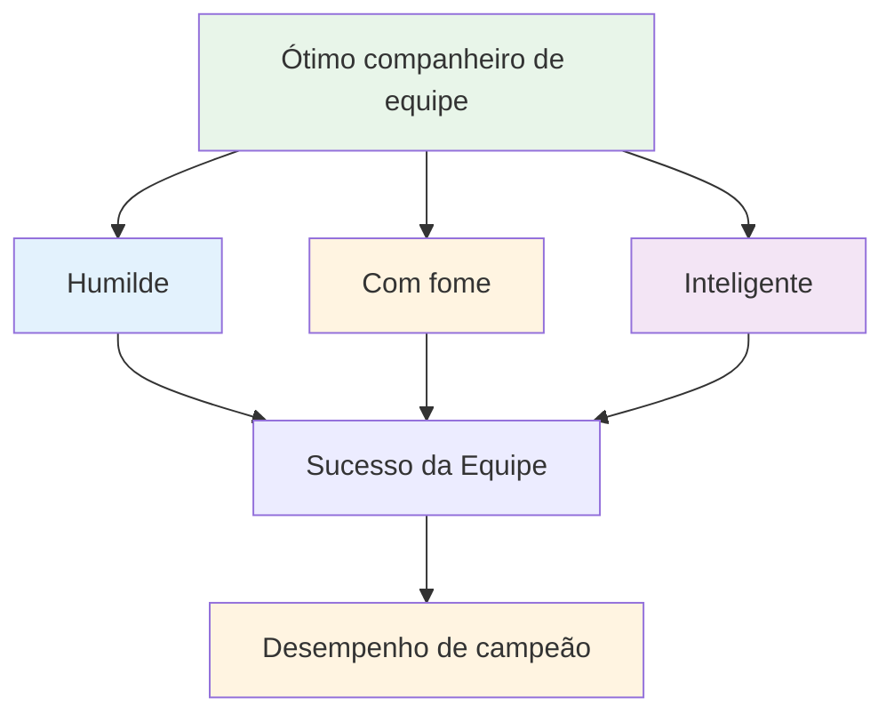

# Ser um ótimo jogador de equipe

A petanca é frequentemente jogada em equipes — duplas (doubletes) ou trios (tripletes). A habilidade individual é importante, mas a dinâmica da equipe pode determinar o sucesso ou o fracasso. As melhores equipes nem sempre são as mais habilidosas, mas sim aquelas que melhor trabalham juntas.

::: tip A Grande Ideia
**As melhores equipes nem sempre são as mais habilidosas, mas sim aquelas que trabalham melhor juntas.** Ser humilde, ambicioso e emocionalmente inteligente faz de você um ótimo membro de equipe.
:::

## O que define um ótimo companheiro de equipe?

Pesquisas e experiências apontam para três qualidades principais:

### 1. Humilde
- Prioriza o sucesso da equipe em detrimento da glória pessoal.
- Reconhece as contribuições dos outros.
- Admite os erros sem dar desculpas.
- Aberto a feedback e aprendizado
- Não precisa ser a estrela.

### 2. Com fome
- Automotivado e determinado
- Executa o trabalho sem que lhe peçam.
- Sempre em busca de melhorias.
- Traz energia para a equipe.
- Não se apoia apenas no talento.

### 3. Inteligente (emocionalmente)
- Sabe ler situações e pessoas.
- Sabe quando falar e quando ouvir.
- Gerencia suas próprias emoções
- Apoia os colegas de equipe de forma adequada.
- Lida com conflitos de forma construtiva.

## Os fundamentos do sucesso em equipe

### Objetivos e visão compartilhados

Equipes fortes possuem:
- Objetivos claros e acordados
- Metas individuais alinhadas com as metas da equipe
- Entendimento compartilhado sobre o que significa sucesso.
- Compromisso com a missão coletiva

**Perguntas para discutir com sua equipe:**
- O que estamos tentando alcançar juntos?
- O que significa sucesso para nós?
- De que forma nossos objetivos individuais contribuem para o sucesso da equipe?

### Comunicação eficaz

A comunicação é a essência do desempenho da equipe.

**Boa comunicação em equipe:**
- Aberto e honesto
- Respeitoso, mesmo em discordância.
- Claro e específico
- Comunicação bidirecional (fala E escuta)
- Oportuno (informação correta no momento certo)

**Durante os jogos:**
- Discuta a estratégia antes de cada final.
- Compartilhe observações sobre o terreno e os oponentes.
- Coordenar quem arremessa e quando.
- Apoiem-se mutuamente após os lançamentos (bons ou ruins).

### Confiança e Respeito

Sem confiança, as equipes se desfazem sob pressão.

**Construindo confiança:**
- Seja confiável (faça o que você diz)
- Seja competente (faça bem o seu trabalho)
- Seja honesto (mesmo quando for difícil)
- Demonstre vulnerabilidade (admita as dificuldades)
- Apoie os outros de forma consistente.

**Demonstrando respeito:**
- Valorize a contribuição de cada pessoa.
- Ouça diferentes perspectivas.
- Reconheça o esforço, não apenas os resultados.
- Trate o papel de cada um como importante.

### Funções claras

Todos devem entender:
- Suas principais responsabilidades
- Como eles contribuem para a equipe
- O que os outros esperam deles.
- Quando avançar e quando recuar.

**Em trios:**
| Papel | Foco principal | Qualidades Essenciais |
|------|--------------|---------------|
| Ponteiro | Coloque as bolas perto do jack | Precisão, consistência |
| Meio | Adapte-se à situação. | Versatilidade, jogo de leitura |
| Atirador | Remova as bolas do oponente | Precisão sob pressão |

As funções podem ser flexíveis, mas a clareza ajuda.

## Dinâmica de equipe durante a competição

### Antes do jogo
- Chegar juntos, aquecer juntos
- Discutir a estratégia geral
- Defina o tom (positivo, focado)
- Veja como todos estão se sentindo.

### Durante o jogo
- Comunicação entre as extremidades
- Mantenha uma atitude positiva, independentemente do placar.
- Apoiem-se mutuamente após erros.
- Comemorem juntos as conquistas (brevemente)
- Mantenha o foco no processo, não no resultado.

### Após erros
O que NÃO fazer:
- Demonstre frustração visivelmente
- Criticar ou culpar
- Retirar-se ou ficar em silêncio
- Reflita sobre o que aconteceu.

O que fazer:
- Resposta rápida (&quot;sem problema&quot;)
- Concentre-se no próximo arremesso.
- Mantenha uma linguagem corporal positiva.
- Confie que seu companheiro de equipe se recuperará.

### Após o jogo
- Analisar juntos o resultado (o que funcionou, o que não funcionou).
- Reconhecer as contribuições individuais
- Discutir melhorias para a próxima vez.
- Mantenha os relacionamentos independentemente do resultado.

## Padrões de comunicação

### Feedback construtivo
**Pobre:** &quot;Você continua errando esses arremessos&quot;
**Melhor:** &quot;Notei que os golpes estão indo para a esquerda - quer tentar ajustar sua postura?&quot;

### Resposta de apoio aos erros
**Ruim:** *Silêncio ou frustração visível*
**Melhor:** &quot;Essa foi difícil. Você consegue lidar com a próxima.&quot;

### Discussão estratégica
**Pobre:** &quot;Apenas atire&quot;
**Melhor:** &quot;O que você acha: apontar para bloquear ou tentar chutar? Vejo prós e contras nas duas opções.&quot;

## Construindo uma Cultura de Equipe

Grandes equipes desenvolvem habilidades compartilhadas:
- **Valores:** Aquilo que defendemos
- **Normas:** Como nos comportamos
- **Linguagem:** Como nos comunicamos
- **Rituais:** O que fazemos juntos

**Exemplos:**
- Aperte sempre as mãos antes e depois.
- Frases específicas de incentivo
- Rotina pré-jogo juntos
- Refeição ou bebida pós-jogo

## Nesta seção

- **[Comunicação em Equipe](/pt/education/team-player/communication)** - Guia detalhado para se comunicar de forma eficaz

## Ponto-chave

> A força de uma equipe é medida pelo seu elo mais frágil, não pelo seu jogador mais fraco.

Invista em seus companheiros de equipe. Construa confiança. Comunique-se bem. Vençam juntos.

