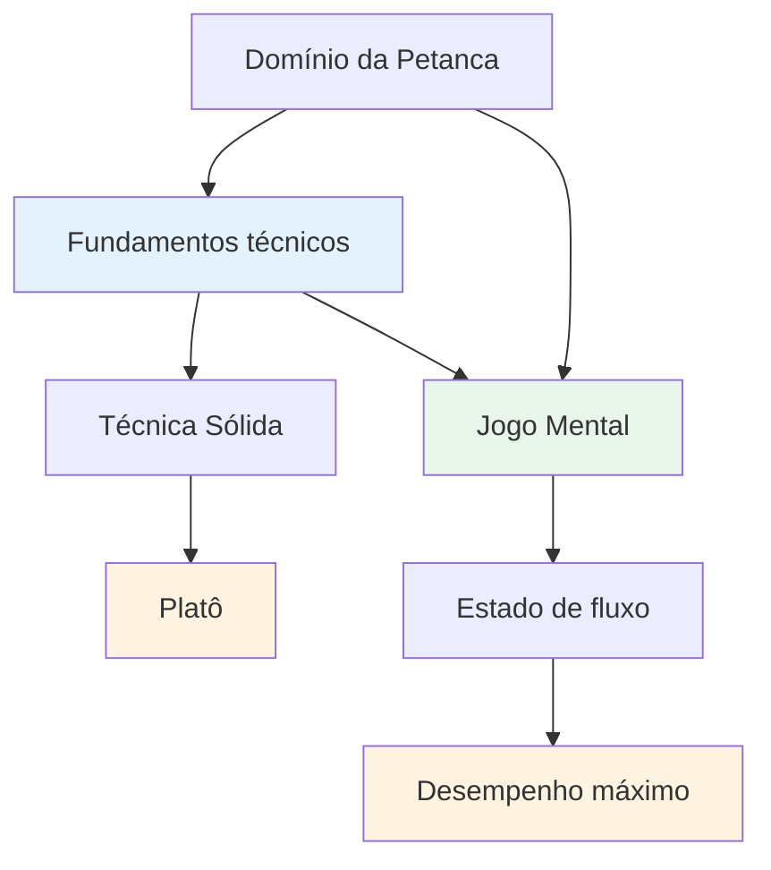
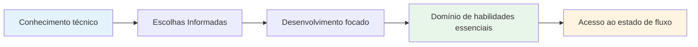

# Assessoria técnica

## Uma nota sobre técnica

Embora nosso foco principal seja o aspecto mental e o estado de fluxo, reconhecemos que a técnica é a base sobre a qual tudo o mais se constrói.

::: info Nossa filosofia
**A técnica é a base, mas a fluidez é o teto.** Você precisa de uma técnica sólida para alcançar o nível de elite, mas o domínio mental é o que te leva além.
:::

## O erro mais comum no treinamento técnico

::: info Esta seção é destinada a jogadores experientes.
Se você é iniciante na petanca, naturalmente precisará desenvolver sua técnica básica desde o início — e essa é uma jornada diferente.

**Esta dica é para jogadores que jogam há anos** e já possuem uma técnica consolidada que lhes parece natural, relaxada e confiável. Você encontrou seu jeito de arremessar. Agora a questão é: como evoluir a partir daqui?
:::

::: warning A Armadilha Comum
Quando jogadores experientes querem melhorar, muitas vezes voltam ao básico — ajustando a pegada, o movimento do braço, o ponto de liberação, a posição do corpo. Horas de treino. Ajustes intermináveis.

**Mas eles ignoraram a pergunta mais importante:** O que exatamente você quer que a bola de boliche faça?
:::

Antes de mexer na sua técnica, você precisa ter clareza sobre o **resultado** que deseja alcançar. Não pense &quot;Quero bater mais vezes&quot; ou &quot;Quero ser mais consistente&quot; — esses não são resultados, são apenas desejos.

Um resultado real se parece com isto:
- &quot;Quero um lob alto que pare a 20 cm do ponto de aterrissagem.&quot;
- &quot;Quero uma tomada rolando que faça uma curva para a esquerda nesse tipo de terreno.&quot;
- &quot;Quero um golpe devant suave que mal toque na bola alvo.&quot;

**Primeiro, explore a [Paleta de Arremessos](/pt/education/technique/throws)** para entender o que é possível. Depois, decida qual arremesso específico você deseja adicionar ao seu repertório. Só então você deve começar a trabalhar em como seu braço, pulso e corpo precisam se mover para criar esse resultado.

## A maneira correta de trabalhar a técnica

Não estamos dizendo que você nunca deve trabalhar o braço, o pulso, a liberação ou a posição do corpo. **O trabalho técnico na execução é absolutamente válido** — mas deve ter o propósito certo.

::: info O propósito certo para o trabalho técnico
**Objetivo correto:** &quot;Quero adicionar uma nova cor à minha paleta&quot;

**Objetivo errado:** &quot;Quero acertar mais arremessos&quot; ou &quot;Quero ser mais consistente&quot;
:::

Eis o processo:

1. **Explore a [Paleta de Arremessos](/pt/education/technique/throws)** — Identifique qual arremesso ou técnica você deseja adicionar ao seu repertório.
2. **Visualize o resultado** — O que a bola deve fazer? Qual trajetória, aterrissagem, rotação e comportamento você precisa?
3. **Em seguida, trabalhe na execução** — Agora você pode se concentrar na posição do braço, do pulso e do corpo, e na liberação para alcançar esse resultado específico.

Essa abordagem proporciona ao seu treinamento técnico **direção clara e progresso mensurável**. Você não está apenas &quot;praticando&quot; — você está expandindo suas capacidades de forma deliberada.

::: tip Exemplo: Adicionando um Plombée
**Objetivo:** Adicionar um drop shot (plombée) ao seu repertório de apontamento

**Visualização do resultado:** A bola deve descrever um arco alto, aterrissar suavemente com rotação para trás e parar quase imediatamente.

**Foco técnico:** Ponto de liberação mais alto, maior movimento do pulso para gerar efeito reverso, empunhadura mais macia

**Critério de sucesso:** Você consegue executar esse arremesso quando quiser? Esse é o objetivo.
:::

## Melhores chutes vs. Mais chutes: entendendo a diferença

Existe uma distinção crucial que muitos jogadores ignoram:

::: tip A principal descoberta
**Se você quer fazer fotos MELHORES** → Trabalhe na sua técnica

**Se você quer acertar MAIS arremessos** → Trabalhe sua força mental
:::

### O que isto significa?

**Para melhorar suas fotos**, você precisa expandir seu repertório técnico:
- Adicionando novos tipos de arremessos (plombée, portée, demi-portée)
- Aprimorando a precisão em tipos específicos de tiros
- Desenvolver novas habilidades que você ainda não possui.
- **Isso requer prática técnica e treinamento físico.**

**Fazer mais arremessos** significa executar o que você já sabe fazer:
- Acertar os golpes que você já consegue fazer nos treinos.
- Desempenho consistente sob pressão
- Confiar na sua técnica quando isso importa
- **Isso requer treinamento mental e acesso ao estado de fluxo.**

### O Confronto com a Realidade

Pergunte a si mesmo honestamente:
- Você consegue executar o arremesso no treino quando está relaxado? ✅ **Então você tem a técnica**
- Você tem dificuldades para se destacar em competições? ⚠️ **Então você precisa de trabalho mental, não de mais treino técnico**

::: warning Erro comum
Muitos jogadores experientes passam anos aprimorando a técnica que já possuem, quando o que realmente precisam é desenvolver a força mental para executá-la sob pressão.

**Você não precisa de um movimento de braço melhor. Você precisa de uma mente mais tranquila.**
:::

### O Caminho a Seguir

**Para fotos melhores (novos recursos):**
- Explore a [Paleta de Arremessos](/pt/education/technique/throws)
- Escolha um novo arremesso específico para desenvolver.
- Pratique a execução técnica.

**Para mais chutes (consistência sob pressão):**
- Trabalhe na [Força Mental](/pt/education/mental-game/mental-strength/)
- Aprenda a acessar [O Estado de Fluxo](/pt/education/mental-game/the-zone/)
- Desenvolva [Rotinas Pré-Arremesso](/pt/education/mental-game/mental-strength/pre-shot-routine)

## Nossa Perspectiva

::: tip Você não precisa dominar tudo.
**Você não precisa dominar todas as técnicas**, mas entender toda a gama de possibilidades ajuda você a:

- ✅ Saiba o que é possível
- ✅ Faça escolhas informadas sobre o que desenvolver
- ✅ Aprecie o jogo em um nível mais profundo
- ✅ Entenda o que os jogadores de elite conseguem fazer
:::

::: info O objetivo
Se você tem um foco técnico e deseja expandir seu repertório, esta seção descreve o objetivo final: a gama completa de lançamentos disponíveis para um jogador de petanca.

**Lembre-se:** O objetivo não é dominar tudo. É ter uma base técnica suficiente para que você consiga entrar no estado de fluxo e deixar seu corpo escolher o arremesso certo naturalmente.
:::

## Tópicos

### [Paleta de Arremessos](/pt/education/technique/throws)
Quais são todos os tipos de arremesso que existem? Uma visão geral abrangente das possibilidades técnicas na petanca.

::: tip Depois da técnica, o que vem a seguir?
Depois de dominar a técnica, o verdadeiro crescimento vem de:
- **A Zona** - Acessando estados de fluxo
- **[Força Mental](/pt/education/mental-game/mental-strength/)** - Lidar com a pressão
- **[Métodos de Treinamento](/pt/education/technique/training/)** - Como praticar com eficácia
:::

