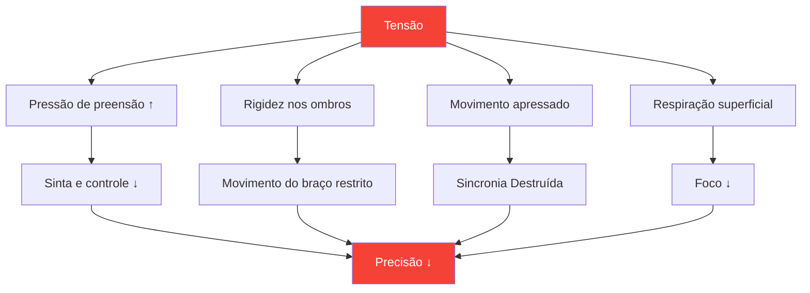

# Entendendo a tensão em esportes de precisão

::: tip A tensão é inimiga da precisão.
**Peso: 300 pontos** — Não é possível ser tenso e preciso ao mesmo tempo. Aprender a gerenciar a tensão é essencial para um desempenho consistente.
:::

## O Paradoxo da Precisão

> &quot;Quanto mais você se esforça, pior fica.&quot;

Isso não é fraqueza — é física e fisiologia. A petanca exige movimentos relaxados e fluidos. A tensão destrói as próprias qualidades que produzem lançamentos precisos.

### Como a tensão destrói a precisão



---

## Tensão física versus tensão mental

A tensão existe em duas formas interligadas:

### Tensão física

Rigidez muscular que afeta diretamente o seu arremesso:

| Área | Efeito no arremesso |
|------|-----------------|
| **Pegada** | Perda de sensibilidade, liberação inconsistente |
| **Antebraço** | Movimento restrito do pulso |
| **Ombro** | Movimento de braço encurtado e irregular |
| **Pescoço** | Posição da cabeça restrita, visão |
| **Mandíbula** | Relacionado à tensão corporal geral |
| **Essencial** | Problemas de equilíbrio e transferência de peso |

### Tensão mental

Estresse psicológico que causa sintomas físicos:

- Pensamentos de corrida
- Preocupação com os resultados
- Medo do fracasso
- consciência da pressão
- Repetição de erros do passado

::: warning O laço de tensão
Tensão mental → Tensão física → Desempenho ruim → Mais tensão mental

Quebrar esse ciclo é essencial para um jogo consistente.
:::

---

## A Lei Yerkes-Dodson

A relação entre excitação (nível de ativação) e desempenho segue uma curva em forma de U invertido:

```
Performance
    ↑
    │         ★ Optimal Zone
    │        /\
    │       /  \
    │      /    \
    │     /      \
    │    /        \
    │   /          \
    └──┴────────────┴──→ Arousal
     Low           High

   "Flat"   "Alert"   "Tense"
   Unfocused Relaxed  Anxious
```

### Muito baixo (pouco excitado)
- Plano, sem foco
- erros por descuido
- Falta de intensidade
- Fazendo por obrigação

### Nível muito alto (excitação excessiva)
- Tenso, apressado
- Pensar demasiado
- Aperto firme, movimento restrito
- Não consigo me recuperar dos meus erros.

### Zona ideal
- Alerta, mas relaxado
- Focado, porém fluido
- Intensidade adequada
- Recuperação rápida

---

## Encontrando a SUA zona ideal

Cada jogador tem um nível de excitação ideal diferente:

### O Processo de Autoavaliação

1. **Relembre suas melhores atuações**
   - Como você se sentiu fisicamente?
   - Qual era o seu nível de energia?
   - Como você classificaria seu nível de excitação (de 1 a 10)?

2. **Relembre suas piores atuações**
   - Você estava muito apático ou muito tenso?
   - Quais sintomas físicos você notou?
   - O que desencadeou o estado subótimo?

3. **Identifique seu padrão**
   - Você tende à hiperestimulação ou à hipoestimulação?
   - Que situações desencadeiam esse padrão?
   - O que te ajuda a voltar ao estado ideal?

### Perfis de Jogadores Comuns

| Perfil | Tendência | Situações de risco | Estratégia |
|---------|----------|-----------------|----------|
| **O Preocupado** | Hiperexcitação | Jogos de alto risco e disputa acirrada. | Técnicas de relaxamento |
| **O Flat-liner** | Subexcitação | Rodadas iniciais com apostas baixas | Técnicas de ativação |
| **O Reator** | Variável | Após erros, o ímpeto muda. | Regulação emocional |
| **O Perseguidor** | Hiperexcitação quando atrás | Retornos, pressão do tempo | Técnicas de aceitação |

---

## Reconhecendo sinais de tensão

### Sinais de alerta físicos

Aprenda a perceber esses sinais antes que eles afetem seu arremesso:

| Sinal | Localização | Ação |
|--------|----------|--------|
| **Aperto firme** | Mão | Amoleça antes de cada arremesso |
| **Ombros erguidos** | Parte superior das costas | Solte e role |
| **Mandíbula cerrada** | Face | Abra ligeiramente a boca. |
| **Respiração superficial** | Peito | Respiração abdominal profunda |
| **Movimento apressado** | Corpo inteiro | Diminua a velocidade deliberadamente |
| **Inquietação e agitação** | Em geral | Conecte-se com a terra |

### Sinais de alerta mentais

- Pensamentos de corrida
- O diálogo interno negativo está aumentando.
- Foque no resultado, não no processo.
- Consciência dos riscos/pontuação
- Refletindo sobre erros passados

---

## Autoverificação de Tensão-Desempenho

Utilize esta avaliação rápida entre lançamentos ou durante pausas:

**Exame físico (5 segundos):**
1. Aderência → Macia?
2. Ombros → Para baixo?
3. Mandíbula → Relaxada?
4. Respiração → Lenta e profunda?

**Análise Mental (5 segundos):**
1. Pensamentos → Focado no presente?
2. Energia → Alcance ideal?
3. Próxima ação → Limpar?

::: tip Faça disso um hábito.
Os melhores jogadores fazem isso automaticamente. Você pode treinar para fazer o mesmo através da repetição.
:::

---

## Neste módulo

### [Técnicas de Liberação de Tensão](/pt/education/tension/techniques)
- Relaxamento Muscular Progressivo (RMP)
- Técnicas de liberação rápida para competição
- Protocolos de respiração
- Reajuste de tensão pré-arremesso

### [Gerenciando a tensão na competição](/pt/education/tension/competition)
- Preparação pré-jogo
- Protocolos durante a partida
- recuperação de emergência &quot;muito tensa&quot;
- Recuperação pós-erro

---

## Vitória Rápida: A Reinicialização de 10 Segundos

Antes do seu próximo arremesso, siga este protocolo rápido:

1. **Ombros** — Abaixe-os conscientemente
2. **Aderência** — Reduza o peso em 20%
3. **Mandíbula** — Relaxe, tire a língua do céu da boca.
4. **Respiração** — Uma expiração lenta e completa.

Isso leva 10 segundos e pode melhorar imediatamente seu próximo arremesso.

---

## Fatores relacionados

- [Força Mental](/pt/education/mental-game/mental-strength/) — Lidar com a pressão
- [Sono e Recuperação](/pt/education/sleep/) — O repouso reduz a tensão basal
- [Mindfulness](/pt/education/mental-game/mindfulness/) — Consciência do momento presente
- [A Zona](/pt/education/mental-game/the-zone/) — Estado de desempenho ideal

