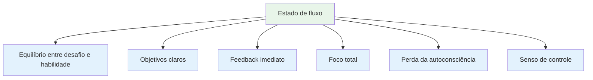
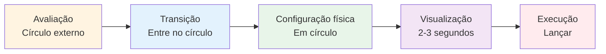
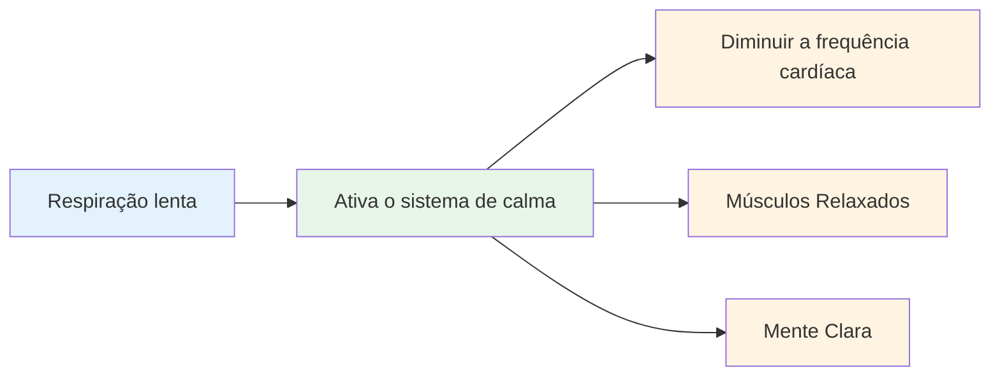
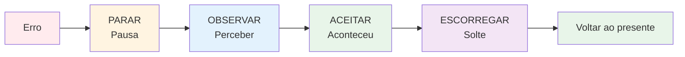

# Entrando no Estado de Fluxo: Técnicas Práticas
<AdBanner />

O estado de fluxo não é algo que simplesmente acontece. Com prática, você pode aprender a acessá-lo com mais consistência. Aqui estão algumas técnicas comprovadas usadas por atletas de elite.

::: tip A Grande Ideia
**Você pode treinar para entrar em estado de fluxo com mais frequência.** O estado de fluxo não é mágica – é uma habilidade que você desenvolve por meio de técnicas específicas e prática consistente.
:::

## As seis condições para o fluxo

Pesquisas mostram que os estados de fluxo requerem certas condições:

| Doença | O que isso significa | Em Pétanque |
|-----------|---------------|-------------|
| **Equilíbrio entre desafio e habilidade** | A tarefa exige esforço, mas é possível realizá-la. | Competir no seu nível não é muito fácil nem impossível. |
| **Objetivos claros** | Você sabe exatamente o que está tentando fazer. | Alvo específico, intenção clara para cada arremesso. |
| **Feedback imediato** | Você vê os resultados de suas ações. | A bola aterrissa, você sabe se funcionou. |
| **Foco Total** | Atenção total à tarefa | Sem distrações, apenas o momento presente. |
| **Perda da autoconsciência** | Não se preocupe com a sua aparência. | Não me importo com quem está assistindo. |
| **Sensação de Controle** | Sinta-se capaz de lidar com isso. | Confie no seu treinamento e na sua capacidade. |

::: info Principais conclusões
Quando essas seis condições se alinham, o estado de fluxo se torna possível. Sua tarefa é criar essas condições deliberadamente.
:::

## Técnica 1: A Rotina Pré-Arremesso

Sua rotina pré-arremesso é a porta de entrada para o estado de fluxo. É uma sequência consistente que sinaliza ao seu cérebro: &quot;É hora de executar.&quot;

### Construindo sua rotina

Uma boa rotina possui estes elementos:

::: details 1. Avaliação visual (fora do círculo)
- Leia o terreno
- Escolha seu alvo e local de pouso
- Decida o tipo de arremesso

**É aqui que a reflexão acontece.** Reserve um tempo para isso.
:::

::: details 2. Transição (Entrando no Círculo)
- Respire fundo.
- Deixe de lado a análise.
- Mudar para o modo de execução

**Este é o interruptor.** A análise termina aqui.
:::

::: details 3. Gatilho Físico (No Círculo)
- Uma postura consistente
- Uma verificação específica de aderência
- Um pequeno movimento que lhe parece natural.

**Mantenha a consistência.** Sempre da mesma forma.
:::

::: details 4. Visualização (Breve, 2-3 segundos)
- Veja a trajetória da bola
- Sinta o arremesso bem-sucedido
- Conecte-se com seu público-alvo

**Seja breve.** Textos muito longos = excesso de reflexão.
:::

::: details 5. Execução
- Concentre-se apenas no alvo.
- Confie no seu corpo.
- Liberte sem hesitação

**Foco apenas no exterior.** Alvo, não técnica.
:::

### Por que as rotinas funcionam

Sua rotina se torna um &quot;sino da atenção plena&quot; - um sinal que altera seu estado mental. Com repetição suficiente, o simples ato de iniciar sua rotina já desencadeia a mudança mental para o estado de fluxo.

::: tip Dica prática
Use sua rotina em TODOS os lançamentos durante o treino, não apenas nas competições. A rotina precisa se tornar automática.
:::

<AdInArticle />

## Técnica 2: Foco Externo

Onde você concentra sua atenção é extremamente importante.

| Tipo de foco | O que você pensa sobre | Exemplos de Pensamentos |
|------------|---------------------|------------------|
| **Interno** ❌ | A mecânica do seu corpo | &quot;Mantenha meu cotovelo reto&quot;  &quot;Dê continuidade ao processo adequadamente&quot;  &quot;Não aperte com muita força&quot; |
| **Externo** ✅ | Meta e resultado | &quot;Aterre bem aí&quot;  &quot;Veja o caminho&quot;  &quot;Acerte o alvo&quot; |

::: tip Resultados da pesquisa
Estudos mostram consistentemente que o foco externo produz melhores resultados para jogadores habilidosos. Seu corpo sabe o que fazer - deixe-o trabalhar.
:::

### Prática com foco externo
- Escolha um local específico no chão (não apenas &quot;perto do macaco&quot;)
- Visualize toda a trajetória da bola.
- Mantenha os olhos no alvo, não na sua mão.

::: warning Erro comum
Sob pressão, os jogadores muitas vezes se concentram apenas em si mesmos (&quot;Não estrague minha técnica&quot;). É exatamente nesses momentos que você mais precisa de foco externo.
:::

## Técnica 3: Aperto com a mão esquerda

Essa técnica incomum possui respaldo científico.

::: info A Ciência
Aperte a mão esquerda (se for destro) por 10 a 15 segundos antes de arremessar:
- ✅ Ativa o hemisfério direito do cérebro (espacial, intuitivo)
- ✅ Acalma o hemisfério esquerdo (verbal, analítico)
- ✅ Reduz o excesso de pensamentos
:::

**Como usar:**
1. Feche a mão que não está usando para arremessar em um punho.
2. Aperte firmemente por 10 a 15 segundos.
3. Solte e comece sua rotina.
4. Lançar

::: tip Quando usar
Isso funciona melhor quando você percebe que está pensando demais ou sentindo pressão. É um &quot;botão de reinicialização&quot; para o seu cérebro.
:::

## Técnica 4: Controle da Respiração

A sua respiração afeta diretamente o seu estado mental.

**Antes de entrar no círculo:**
- Respire fundo e devagar.
- Expire completamente
- Sinta seus ombros relaxarem.

**No círculo:**
- Respire naturalmente
- Não prenda a respiração durante o arremesso.
- Deixe a expiração acompanhar sua liberação.

::: details A técnica 4-7-8 (para alta pressão)
1. Inspire contando até 4.
2. Mantenha a posição por 7 tempos.
3. Expire contando até 8.
4. Repita uma ou duas vezes.

**Por que funciona:** Isso ativa o seu sistema nervoso parassimpático (o sistema de &quot;acalmar-se&quot;).
:::

## Técnica 5: Palavras-gatilho

Uma palavra ou frase-gatilho pode mudar instantaneamente seu estado mental.

::: tip Palavras-gatilho populares
- &quot;Suave&quot;
- &quot;Confiar&quot;
- &quot;Veja, seja&quot;
- &quot;Solte&quot;
- &quot;Fluxo&quot;
- &quot;Fácil&quot;
:::

**Como desenvolver o seu:**
1. Pense em uma ocasião em que você teve um desempenho perfeito.
2. Que palavra captura esse sentimento?
3. Use essa palavra na sua rotina.
4. Diga isso em silêncio enquanto se prepara para arremessar.

::: info Por que funciona
Com a repetição, a palavra passa a ser associada ao seu melhor estado de desempenho. É um atalho mental para o estado de fluxo.
:::

## Técnica 6: Reiniciar após erros

Erros acontecem. O importante é não deixar que um arremesso ruim se transforme em dois.

**O Método SOAS:**

| Etapa | Ação | O que isso significa |
|------|--------|---------------|
| **Parar | Faça uma pausa, não reaja imediatamente. | Não levante as mãos, não xingue. |
| **Observar | Observe o que aconteceu sem julgar. | &quot;A bola foi para a esquerda&quot;, não &quot;Eu sou péssimo&quot;. |
| **Aceitar | Aconteceu, está feito. | Não se pode mudar o passado. |
| **Escorregar | Solte, liberte-o | Retorne ao momento presente. |

::: warning Habilidade Crítica
Isso requer prática, mas evita a espiral de frustração que acaba com o estado de fluxo. Pratique o SOAS no dia a dia para que se torne automático durante as competições.
:::

## Construindo seu Kit de Ferramentas de Fluxo

Nem todas as técnicas funcionam para todos. Experimente e descubra o que funciona para você:

| Situação | Experimente isto |
|-----------|----------|
| Pensar demasiado | Aperto com a mão esquerda, foco externo |
| Nervoso/tenso | Controle da respiração, palavra-gatilho |
| Após um erro | Método SOAS |
| Arremesso importante | Rotina completa antes da gravação |
| Perder o foco | Retorne ao básico da rotina |

## A prática leva à perfeição.

Essas técnicas só funcionam se você as praticar:

1. **Utilize sua rotina em todos os treinos de arremesso** - não apenas em competições.
2. **Simule pressão** - crie consequências na prática
3. **Observe quando você estiver em estado de fluxo** - o que o desencadeou?
4. **Avaliação após as sessões** - o que ajudou e o que não ajudou?

## Ponto-chave

::: tip Lembrar
**Estar na zona não é questão de sorte. É uma habilidade que você pode desenvolver.**

Comece com sua rotina pré-tirada. Seja consistente. Confie nela. O estado de concentração virá naturalmente.
:::

<AdBanner />
