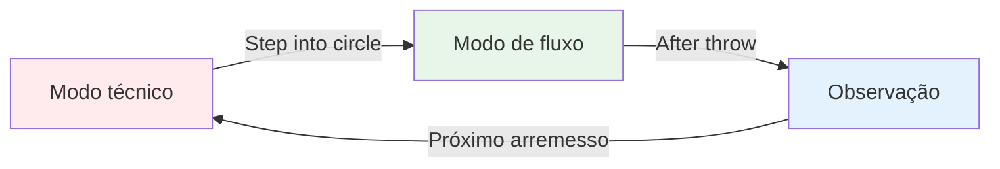
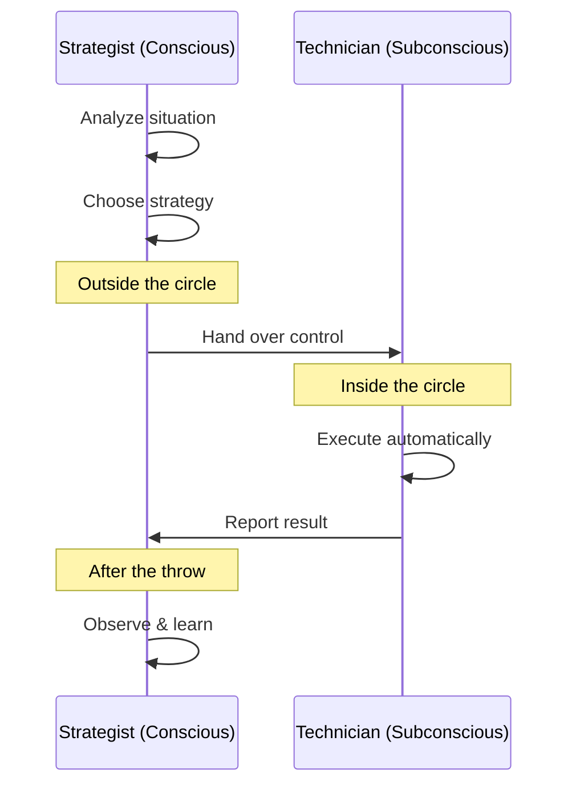

# A Zona: Compreendendo o Estado de Fluxo

Você já teve uma partida em que tudo simplesmente se encaixou? Em que você não pensou na sua técnica e cada bola caiu exatamente onde você queria? Isso é &quot;estar no fluxo&quot; - e aprender a acessá-lo consistentemente é o que diferencia os jogadores de elite dos demais.

::: tip A Grande Ideia
**O estado de fluxo ocorre quando seu cérebro analítico se aquieta e seus instintos treinados assumem o controle.** Você não consegue entrar nesse estado apenas pensando — você precisa se deixar levar.
:::

## O que é a Zona?

O estado de fluxo, também chamado de &quot;zona&quot;, é um estado mental em que você fica completamente absorto no que está fazendo. O tempo parece desacelerar. Seus movimentos parecem não exigir esforço. Você não está pensando na técnica - você está apenas *fazendo*.

Os cientistas chamam esse estado de **hipofrontalidade transitória**. Em termos simples, a parte analítica do cérebro (o córtex pré-frontal) se aquieta, permitindo que os instintos treinados assumam o controle.

### Os dois modos cerebrais

**Modo Técnico (Planejamento):**
- Analise a situação
- Escolha sua estratégia
- Decida qual arremesso fazer.

**Modo de fluxo (execução):**
- Confie no seu treinamento
- Concentre-se apenas no alvo.
- Deixe seu corpo executar automaticamente

**Observação (Aprendizagem):**
- Observe o resultado sem julgamento.
- Aprenda com o que aconteceu.
- Reiniciar para o próximo lançamento

## O Paradoxo da Petanca

Eis o desafio: a petanca lhe dá bastante tempo para pensar entre os lançamentos. Ao contrário de esportes rápidos em que você reage instantaneamente, na petanca você tem tempo para caminhar até o círculo, avaliar a situação e preparar o seu lançamento.

Esse &quot;tempo para pensar&quot; é ao mesmo tempo uma dádiva e uma maldição:
- **Presente:** Você pode planejar estratégias e tomar decisões inteligentes.
- **Maldição:** Você pode pensar demais e interferir em sua habilidade natural.

O jogador de elite aprende a usar esse tempo com sabedoria – pensando durante o planejamento e depois “desligando” durante a execução.

## Dois modos de jogo

Seu cérebro opera em dois modos diferentes:

| Recurso | Modo técnico | Modo de fluxo |
|---------|---------------|-----------|
| **Quando usar** | Treinamento, aprendizado de novas habilidades | Competição, execução |
| **Atividade cerebral** | Alto nível de pensamento analítico | Silencioso, automático |
| **Foco** | Mecânica interna (corporal) | Externo (alvo) |
| **Sentimento** | Esforçado, consciente | Sem esforço, natural |

A habilidade fundamental é aprender a **alternar** entre esses modos no momento certo.

## O Momento da &quot;Mudança&quot;

::: warning A Regra da Troca
**Antes do círculo:** Analise, elabore estratégias e decida qual arremesso fazer.
**No círculo:** Deixe de lado a análise, confie no seu treinamento, concentre-se apenas no alvo.
**Após o lançamento:** Observe o resultado sem julgamento.
:::

A transição acontece quando você entra no círculo. Essa é a habilidade mais importante na petanca de elite.

Pense da seguinte forma: sua mente consciente é o **estrategista** que elabora o plano, e sua mente subconsciente é o **técnico** que o executa. O estrategista precisa dar um passo para trás e deixar o técnico trabalhar.

## Por que pensar demais prejudica o desempenho

Ao monitorar conscientemente seus movimentos durante a execução, você interrompe os processos automáticos que treinou. Isso se chama &quot;bloqueio&quot; — e acontece com todo mundo.

::: danger Sinais de que você está pensando demais
- ❌ Pensando na posição do braço durante o arremesso
- ❌ Preocupar-se com o resultado antes de lançar
- ❌ Sensação de tensão ou rigidez mecânica
- ❌ Duvidar de si mesmo no círculo
:::

::: tip A solução
A solução não é pensar *menos*, mas sim pensar nas **coisas certas** no **momento certo**.

✅ **Pensamento correto:** &quot;Vejo o alvo claramente&quot;
❌ **Pensamento errado:** &quot;Manter o cotovelo reto&quot;
:::

## Nesta seção

Aprenda a dominar o estado de fluxo:

- **[Treinamento Técnico vs. Treinamento de Fluidez](/en/education/the-zone/technical-vs-flow)** - Entendendo quando focar na técnica e quando relaxar
- **[Entrando na Zona](/en/education/the-zone/entering-the-zone)** - Técnicas práticas para acessar o estado de fluxo

## Resumo: As Regras da Zona

::: tip Regra nº 1: A Regra da Troca
**Analise antes do círculo, execute dentro do círculo, observe depois.**
Sua mente consciente planeja, seu subconsciente executa.
:::

::: tip Regra nº 2: A Regra da Inversão
**À medida que a habilidade aumenta, o treinamento mental torna-se mais importante do que o treinamento técnico.**
Iniciantes: 90% técnico / 10% mental
Especialistas: 20% técnicos / 80% mentais
:::

::: tip Regra nº 3: A Regra da Confiança
**Não se chega à execução perfeita apenas com o pensamento.**
Confie no seu treinamento. Concentre-se no alvo, não na sua técnica.
:::

## Ponto-chave

> Não existem técnicas que sempre produzam uma bola perfeita. Mas existe um estado mental em que bolas perfeitas se tornam naturais.

Sua técnica é a base. A zona é onde essa base se transforma em arte.

