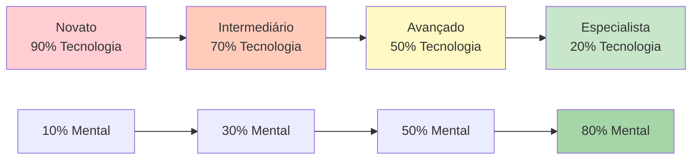

# Treinamento Técnico vs. Treinamento de Fluxo

Compreender a diferença entre treinamento técnico e treinamento de fluxo é essencial para o desenvolvimento de atletas de elite. Ambos são necessários, mas servem a propósitos diferentes e exigem abordagens distintas.

::: tip O princípio fundamental
**Não se pode treinar um iniciante como um especialista** (eles não possuem as conexões neurais necessárias), e **não se pode treinar um especialista como um iniciante** (o alto volume de informações técnicas leva ao excesso de reflexão).
:::

## Dois tipos de treinamento

::: info Treinamento técnico (aprendizagem explícita)
**Foco:** Mecânica e forma
**Atenção:** Movimentos corporais conscientes
**Método:** Decomposição de habilidades, prática repetitiva
**Ideal para:** Aprender novas habilidades, corrigir maus hábitos, construir uma base sólida

**Exemplo:** Praticar o ponto de liberação 50 vezes com análise de vídeo
:::

::: info Treinamento de fluxo (aprendizagem implícita)
**Foco:** Resultados, não mecanismos
**Atenção:** Deixar o subconsciente assumir o controle
**Método:** Prática variada, semelhante a jogos, visualização
**Ideal para:** Preparação para competições, desenvolvimento da autoconfiança, desempenho máximo

**Exemplo:** Jogar partidas de treino sob pressão, concentrando-se apenas nos alvos.
:::

## O Modelo de Inversão Dinâmica

A proporção ideal de treino está inversamente relacionada com a competência técnica. À medida que se domina a técnica, o treino mental torna-se mais importante, e não menos.

### 1. Iniciante (Estágio Cognitivo)
- Você pensa conscientemente sobre *o que* fazer.
- Os movimentos parecem desajeitados e exigem esforço.
- O cérebro está completamente saturado de mecânica.
- **Proporção:** 90% Técnico / 10% Mental
- **Foco mental:** Prazer, foco externo (olhar para o alvo), sem visualização complexa.

### 2. Intermediário (Estágio Associativo)
- Você aprimora a habilidade com menos pensamento consciente.
- Os movimentos tornam-se mais suaves e os erros diminuem.
- Você começa a perceber seus próprios erros.
- **Proporção:** 70% Técnico / 30% Mental
- **Foco mental:** Desenvolvendo sua rotina pré-performance (RPP)

### 3. Avançado (Limiar de Autonomia)
- A habilidade é em grande parte automatizada.
- Sua autoimagem muitas vezes fica atrás de sua capacidade física.
- O treinamento se concentra na simulação de pressão.
- **Proporção:** 50% Técnico / 50% Mental
- **Foco mental:** Visualização, autoimagem, controle da ansiedade

### 4. Especialista (Estágio Autônomo)
- As habilidades técnicas são totalmente subconscientes.
- A atenção consciente à mecânica prejudica o desempenho.
- O volume de manutenção é tudo o que você precisa tecnicamente.
- **Proporção:** 20% Técnico / 80% Mental
- **Foco mental:** Estado de fluxo, estratégia, aquietar a mente

## Tabela de Progressão

| Nível | Tecnologia: Mental | Objetivo principal |
|-------|---------------|-------------------|
| Novato | 90 : 10 | Construa a máquina |
| Intermediário | 70 : 30 | Estabilizar a habilidade |
| Avançado | 50 : 50 | Confie na máquina |
| Especialista | 20 : 80 | Liberdade de execução |

## A Armadilha do Especialista

Para jogadores avançados e experientes, voltar a concentrar-se excessivamente na técnica é perigoso.

**O problema:** Quando você automatiza uma habilidade, mas a monitora conscientemente durante a competição, você ativa a mente consciente e sobrepõe-se ao subconsciente. Isso causa ansiedade de desempenho e &quot;travamento&quot;.

**A ciência:** O volume necessário para manter uma habilidade é significativamente menor (geralmente de 1/3 a 1/9) do que o volume necessário para desenvolvê-la. Os especialistas precisam de um trabalho técnico mínimo para manter sua destreza.

**Exemplo de elite:** Campeões como Philippe Quintais e Dylan Rocher focam-se intensamente em cenários táticos e momentos críticos, em vez de exercícios mecânicos.

Sinais de que você está pensando demais na técnica:
- Paralisia por análise
- Desempenho inconsistente apesar da boa técnica.
- Resultados piores em competição do que nos treinos.
- Sensação &quot;mecânica&quot; em vez de fluidez

## Comparação de métodos de treinamento

| Aspecto | Treinamento técnico | Treinamento de fluxo |
|--------|-------------------|---------------|
| **Tipo de prática** | Bloqueado (mesma habilidade repetidamente) | Aleatório (habilidades variadas) |
| **Opinião** | Imediato, detalhado | Atrasado, focado no resultado |
| **Ambiente** | Controlado, previsível | Variável, semelhante a um jogo |
| **Estado mental** | Analítico, consciente | Intuitivo, automático |
| **Melhor horário** | Fora de temporada, desenvolvimento de habilidades | Pré-competição, manutenção |

## Prática em blocos versus prática aleatória

**Treino de bloqueio:** Repita o mesmo arremesso 20 vezes.
- Sensação de produtividade (você percebe uma melhora rápida)
- Bom para aprendizado inicial.
- Ruim para retenção a longo prazo

**Treino aleatório:** Varie a distância, o alvo e o tipo de arremesso.
- Parece mais difícil (mais erros)
- Melhor para transferências competitivas
- Desenvolve a adaptabilidade e a capacidade de tomada de decisões.

## Diretrizes práticas

### Para sessões técnicas
1. Concentre-se em UM aspecto de cada vez
2. Utilize a análise de vídeo.
3. Obtenha feedback de um treinador ou parceiro de treino.
4. Aceite que, no começo, será estranho.
5. Mantenha as sessões mais curtas (qualidade em vez de quantidade).

### Para sessões de fluxo
1. Crie uma pressão semelhante à de um jogo.
2. Concentre-se no alvo, não no seu corpo.
3. Use sua rotina pré-injeção de forma consistente.
4. Não analise durante a sessão.
5. Confie no seu treinamento

## O Desafio da Integração

A verdadeira habilidade está em saber quando usar cada modo:

**Durante um jogo competitivo:**
- Pensamento técnico: NUNCA durante a execução.
- Modo de fluxo: SEMPRE ao lançar

**Durante o treino:**
- Sessões técnicas: Programadas, com foco específico
- Sessões de Flow: Simulação de jogos, prática sob pressão

## Exemplo de saldo semanal

| Dia | Tipo de sessão | Foco |
|-----|-------------|-------|
| Segunda-feira | Técnico | Precisão de apontamento |
| Terça-feira | Técnico | Precisão de tiro |
| Quarta-feira | Fluxo | Treinamento mental, visualização |
| Quinta-feira | Misturado | Cenários de jogo com foco no fluxo |
| Sexta-feira | Técnico | Área de fraqueza |
| Sábado | Fluxo | Jogo de partidas, simulação de competição |
| Domingo | Descansar | Recuperação, reflexão |

## Resumo: Regras de Equilíbrio no Treinamento

::: tip Regra nº 1: Adeque o treino ao seu nível.
**Iniciantes (90/10):** Construa a máquina - foco na técnica
**Nível Intermediário (70/30):** Estabilizar a habilidade - adicionar trabalho mental
**Avançado (50/50):** Confie na máquina - equilibre ambos
**Especialista (20/80):** Liberdade de execução - principalmente mental
:::

::: tip Regra nº 2: Prática em Blocos vs. Prática Aleatória
**Prática bloqueada** (o mesmo arremesso repetidamente): Bom para o aprendizado inicial, ruim para a retenção.
**Treino aleatório** (arremessos variados): Mais difícil no treino, melhor na competição.
:::

::: tip Regra nº 3: A Armadilha do Especialista
**Para especialistas:** Alto volume de informações técnicas causa excesso de reflexão e bloqueio criativo.
**Solução:** Manutenção técnica mínima, treinamento mental máximo
:::

## Ponto-chave

> Não se pode treinar um iniciante como um especialista (eles não possuem as vias neurais necessárias para o trabalho mental), e não se pode treinar um especialista como um iniciante (o alto volume técnico causa esgotamento e excesso de reflexão).

A jornada da técnica à fluidez exige inversões estratégicas. Adapte seu treinamento ao seu estágio de desenvolvimento.

