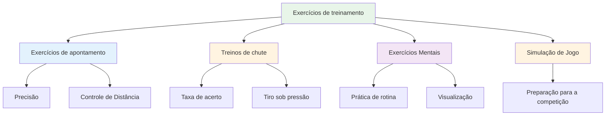

# Exercícios de treinamento
<AdBanner />

Aqui estão exercícios comprovados usados por jogadores de elite. Cada exercício tem um propósito específico - escolha com base no que você precisa desenvolver.

::: tip A Grande Ideia
**Cada exercício tem um propósito específico.** Não jogue as bolas aleatoriamente — escolha exercícios que visem suas fraquezas e apoiem seus objetivos. Acompanhe seu progresso para ver a melhora.
:::

## Exercícios de apontamento

### O Beco
**Objetivo:** Isolar o ângulo de liberação e a consistência da linha.

**Configurar:**
- Coloque dois marcadores a 30-40 cm de distância um do outro, a cerca de 1 metro do círculo.
- O alvo está a 7-9 metros de distância.

**Furar:**
- Arremesse pelo &quot;corredor&quot; (entre os marcadores)
- Qualquer arremesso que atinja um marcador é considerado &quot;morto&quot;.
- Foque em um ponto de liberação consistente.

**Progressão:**
- Estreite o beco à medida que você melhora.
- Varie a distância do alvo
- Adicionar uma zona de aterrissagem específica

### Zonas de Precisão
**Objetivo:** Desenvolver a precisão em áreas específicas.

**Configurar:**
- Delimite zonas em torno de um alvo (por exemplo, círculos a 20 cm, 40 cm, 60 cm).
- Ou utilize marcadores naturais no terreno.

**Pontuação:**
- Dentro de 20 cm: 3 pontos
- Dentro de 40 cm: 2 pontos
- Dentro de 60 cm: 1 ponto
- Exterior: 0 pontos

**Furar:**
- Lance 10 bolas e anote sua pontuação.
- Objetivo: Melhoria consistente ao longo das sessões

### Variação de distância
**Objetivo:** Desenvolver o controle de profundidade

**Configurar:**
- Coloque alvos a 6m, 7m, 8m, 9m e 10m.

**Furar:**
- Arremesse para cada distância em ordem aleatória.
- O parceiro indica a distância.
- Concentre-se em ajustar o peso, não a técnica.

**Variação:**
- Adicione chamadas &quot;curtas&quot; e &quot;longas&quot; após liberar.
- É preciso ajustar durante o voo (desenvolve a sensibilidade).

## Treinos de chute

### A Escada de Tiro
**Objetivo:** Desenvolver a precisão sob pressão progressiva

**Configurar:**
- Coloque uma bola alvo a 6 metros.
- Marque distâncias em 7m, 8m, 9m, 10m

**Furar:**
- Comece em 6 metros
- Golpe = recue um metro
- Erro = avançar um metro (ou reiniciar)
- Objetivo: Alcançar 10 metros

**Variações:**
- Versão rigorosa: Qualquer erro retorna a 6m
- Versão cronometrada: Até onde você consegue chegar em 10 minutos?
- Versão em equipe: Alternar com o parceiro

<AdInArticle />

### A Barreira (Blox)
**Objetivo:** Forçar disparos em arco alto

**Configurar:**
- Coloque uma barreira (vara, barbante ou obstáculo) entre você e o alvo.
- A barreira deve ser alta o suficiente para exigir um passe por cima da defesa.

**Furar:**
- É preciso ultrapassar a barreira para atingir o alvo.
- Qualquer arremesso que atinja a barreira é considerado &quot;inválido&quot;.
- Desenvolve um ponto de liberação elevado

**Por que isso é importante:**
- A competição muitas vezes exige tiro sobre obstáculos.
- Aumenta a versatilidade nos seus disparos.

### Pista de Obstáculos
**Objetivo:** Desenvolver a técnica de filmagem a partir de diferentes ângulos.

**Configurar:**
- Coloque a bola alvo no centro.
- Adicione obstáculos (outras bolas, marcadores) ao redor.

**Furar:**
- Fotografe de diferentes posições ao redor do círculo.
- É preciso encontrar o ângulo que funcione.
- Desenvolve a leitura das linhas de tiro.

## Exercícios de Treinamento Mental

### Repetição de rotina
**Objetivo:** Automatizar sua rotina pré-injeção

**Furar:**
- Pratique sua rotina completa sem arremessar
- Analise cada etapa cuidadosamente.
- Faça de 10 a 20 repetições.
- Em seguida, adicione o arremesso.

**Foco:**
- Cronometragem consistente
- Transição clara do pensamento à execução.
- A mesma rotina sempre.

### Pontos de pressão
**Objetivo:** Praticar o desempenho sob pressão

**Configurar:**
- Crie um cenário &quot;obrigatório&quot;
- Estabelecer consequências para o não comparecimento.

**Exemplos:**
- &quot;Faça 3 em linha ou comece de novo&quot;
- &quot;Erre e faça 10 flexões&quot;
- &quot;Anuncie seu alvo antes de arremessar&quot;

**Chave:**
- A pressão deve ser sentida como real.
- Pratique sua resposta mental à pressão.
- Use sua rotina exatamente como na competição.

### Prática de recuperação
**Objetivo:** Desenvolver o hábito de reiniciar a mente rapidamente

**Furar:**
- Lançar intencionalmente uma bola ruim
- Pratique imediatamente o SOAS (Parar, Observar, Aceitar, Deslizar).
- Lance a próxima bola com total empenho.

**Foco:**
- Não se prenda ao erro.
- Reinicie completamente antes do próximo lançamento.
- Mantenha uma linguagem corporal positiva.

## Exercícios de simulação de jogos

### O deleite de Millieu
**Objetivo:** Quebrar a rigidez rítmica, desenvolver versatilidade

**Furar:**
- Alterne entre apontar e atirar a cada arremesso.
- Não podem ocorrer dois lançamentos consecutivos do mesmo tipo.
- Desenvolve a capacidade de alternar entre modos.

### Jogo de Cenário
**Objetivo:** Praticar a tomada de decisões táticas

**Configurar:**
- Crie situações de jogo realistas
- Atribua pontuações e contagens de bolas.

**Exemplos:**
- &quot;Você está perdendo por 10 a 8, seu oponente tem 2 pontos e você tem 2 bolas.&quot;
- &quot;Empate de 6 a 6, você tem a última bola, eles têm 1 ponto&quot;

**Furar:**
- Decida o que fazer
- Executar com total comprometimento
- Reavalie a decisão posteriormente.

### Jogo de Partida com Regras
**Objetivo:** Simulação de competição

**Variações:**
- Jogar até 13 (jogo completo)
- Jogar até 7 (menos partidas, mais jogos)
- &quot;Pontos de pressão&quot; - certas extremidades valem o dobro
- &quot;Morte súbita&quot; - quem perder um end primeiro perde o jogo.

## Acompanhando seus exercícios

Mantenha um registro para cada exercício:

| Data | Furar | Pontuação/Resultado | Notas |
|------|-------|--------------|-------|
| | | | |

**Acompanhamento ao longo do tempo:**
- Você está melhorando?
- Quais exercícios são mais úteis?
- Onde você encontra dificuldades?

## Como criar uma sessão de treinamento

### Aquecimento (10 min)
- Arremessos fáceis para soltar o corpo
- Sem pressão, apenas sinta

### Foco técnico (20-30 min)
- Um ou dois exercícios focados em habilidades específicas
- Prática em blocos para o desenvolvimento de novas habilidades
- Prática aleatória para habilidades já estabelecidas

### Simulação de pressão/jogo (20-30 min)
- Adicionar consequências
- Criar cenários realistas
- Pratique habilidades mentais

### Resfriamento (10 min)
- Lançamentos fáceis
- Reflita sobre a sessão.
- Anote em que trabalhar a seguir.

## Ponto-chave

> Furadeiras são ferramentas. Escolha a ferramenta certa para o que você precisa construir.

Não se limite a lançar bolas aleatoriamente. Treine com propósito.

<AdBanner />
