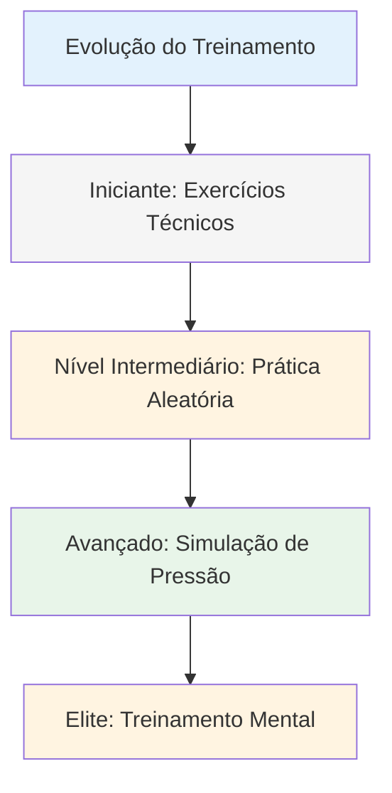
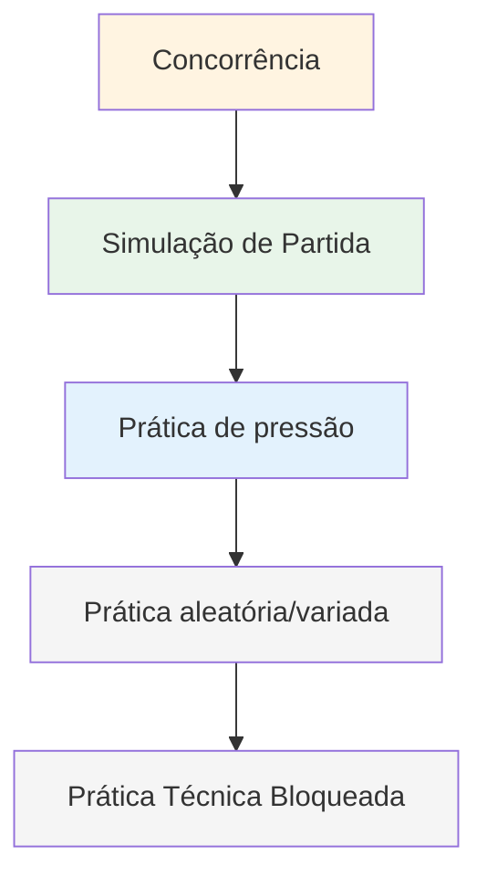

# Métodos de treinamento

Quando sua técnica está sólida, o que você pratica? É aqui que muitos jogadores estagnam — eles continuam treinando a técnica quando o verdadeiro crescimento está em outra área.

::: tip A Grande Ideia
**A maioria dos jogadores estagna porque continua treinando a técnica quando o verdadeiro crescimento está em outras áreas.** Jogadores de elite treinam adaptabilidade, tomada de decisão e resistência mental — não apenas mecânica.
:::

## Além da Repetição Técnica

A maioria dos jogadores treina repetindo arremessos. Isso é importante para iniciantes, mas jogadores avançados precisam de mais:

| Tipo de treinamento | O que desenvolve | Quando usar |
|--------------|------------------|-------------|
| exercícios técnicos | Mecânica, forma | Aprender novas habilidades, resolver problemas |
| Prática aleatória | Adaptabilidade, tomada de decisões | Preparação para a competição |
| Simulação de pressão | resistência mental | Antes de eventos importantes |
| Treinamento mental | Foco, recuperação, confiança | Em andamento, frequentemente negligenciado |

## A Pirâmide de Treinamento

::: warning Erro comum
**A maioria dos jogadores passa muito tempo na base da pirâmide.** Jogadores de elite atuam em todos os níveis, com ênfase nos níveis mais altos à medida que progridem.
:::

## Prática em blocos versus prática aleatória

### Prática em Blocos
Repita o mesmo arremesso várias vezes:
- 20 pontos a 7 metros
- 20 tiros no mesmo alvo
- Mesma distância, mesmo arremesso

**Ideal para:** Aprendizado inicial, desenvolvimento da confiança, aquecimento
**Limitação:** Não se adapta bem à competição.

### Prática aleatória
Varie tudo:
- Distâncias diferentes a cada lançamento
- Alternar apontar e disparar
- Mude os objetivos constantemente.

**Indicado para:** Preparação para competições, desenvolvimento da adaptabilidade
**Sensações:** Mais difícil, mais erros, menos &quot;produtivo&quot;
**Realidade:** Melhor retenção e transferência a longo prazo

### A pesquisa

Estudos demonstram consistentemente:
- A prática em blocos proporciona uma sensação melhor (melhora rápida visível).
- A prática aleatória produz um melhor desempenho em competições.
- É na &quot;luta&quot; da prática aleatória que ocorre a aprendizagem.

## Simulação de pressão

Você não consegue lidar com a pressão da competição se nunca a experimentou nos treinos.

### Criando pressão nos treinos

**Consequências:**
- Flexões para mulheres
- Quem perde compra café
- Os pontos contam para alguma coisa.

**Cenários:**
- Situações &quot;imperdíveis&quot;
- Perdendo por 12 a 10, preciso marcar.
- Última bola do jogo

**Público:**
- Pratique com pessoas observando.
- Grave um vídeo de você mesmo
- Anuncie o que você está tentando fazer.

**Fadiga:**
- Pratique quando estiver cansado
- Fim da longa sessão
- Após exercícios físicos

### A Escada de Tiro

Um exercício clássico de pressão:
1. Comece em 6 metros
2. Acertar o alvo = recuar um metro
3. Erro = avançar um metro (ou recomeçar)
4. Objetivo: Alcançar 10 metros

Isso cria uma pressão natural à medida que você progride.

## Sessões de Treinamento Mental

Dedique tempo especificamente ao desenvolvimento de habilidades mentais:

### Sessão de Visualização (15-20 min)
1. Encontre um lugar tranquilo
2. Feche os olhos
3. Imagine-se em uma competição.
4. Veja os lançamentos bem-sucedidos em detalhes.
5. Sinta a confiança e a fluidez.
6. Pratique como lidar com momentos de pressão

### Prática de rotina pré-arremesso
- Pratique sua rotina sem arremessar
- Concentre-se nas transições mentais
- Cultive o hábito da preparação consistente.

### Prática de recuperação
- Cometer erros intencionalmente na prática
- Pratique sua resposta SOAS
- Crie o hábito de reiniciar a mente rapidamente.

## Estruturando sua semana de treinamento

### Exemplo: Amador Dedicado (6 horas/semana)

| Dia | Duração | Foco |
|-----|----------|-------|
| Segunda-feira | 1,5 hora | Técnico: Exercícios de apontamento |
| Quarta-feira | 1,5 hora | Técnico: Treinos de arremesso |
| Sexta-feira | 1 hora | Mental: Visualização, prática rotineira |
| Sábado | 2 horas | Jogo de partidas com elementos de pressão |

### Exemplo: Jogador competitivo (10 horas/semana)

| Dia | Duração | Foco |
|-----|----------|-------|
| Segunda-feira | 2 horas | Técnico: Apontamento (bloqueado → aleatório) |
| Terça-feira | 1 hora | Treinamento mental + visualização |
| Quarta-feira | 2 horas | Técnico: Tiro (bloqueado → aleatório) |
| Quinta-feira | 1 hora | Análise em vídeo + trabalho mental |
| Sexta-feira | 2 horas | Simulação de pressão, cenários de jogos |
| Sábado | 2 horas | Competição ou jogo de partidas |

## Princípios de treinamento

### 1. Qualidade acima de quantidade
- 30 minutos de concentração são melhores do que 2 horas de repetição mecânica.
- Pare quando a concentração cair.
- É melhor terminar cedo do que adquirir maus hábitos.

### 2. Prática Deliberada
- Tenha um objetivo específico para cada sessão.
- Trabalhe no limite das suas capacidades.
- Obtenha feedback (vídeo, parceiro, resultados)
- Ajuste com base no que você aprender.

### 3. A recuperação é importante
- Os dias de descanso fazem parte do treinamento.
- O sono afeta significativamente o desempenho.
- A fadiga mental é real - respeite-a.

### 4. Monitore tudo
- Mantenha um registro de treinamento
- Observe o que funciona e o que não funciona.
- Revise regularmente
- Ajuste seu plano com base nos dados.

## Nesta seção

- **[Exercícios de Treinamento](/en/education/training/drills)** - Exercícios específicos para diferentes habilidades

## Ponto-chave

> A forma como você treina determina seu desempenho. Treine como se quisesse jogar.

Varie seu treino. Inclua trabalho mental. Crie pressão. Acompanhe seu progresso.

