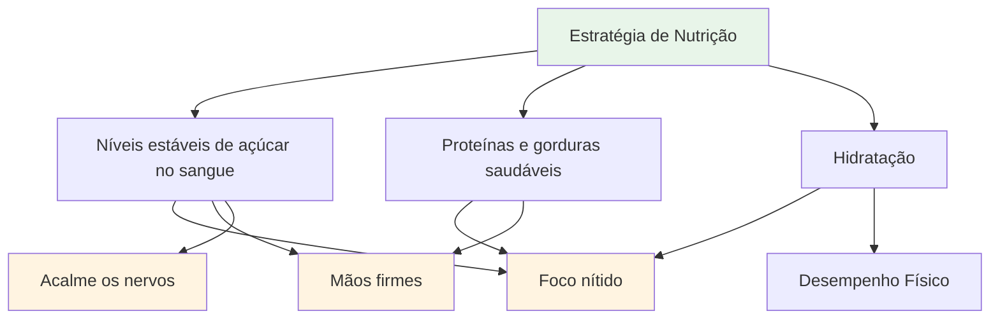
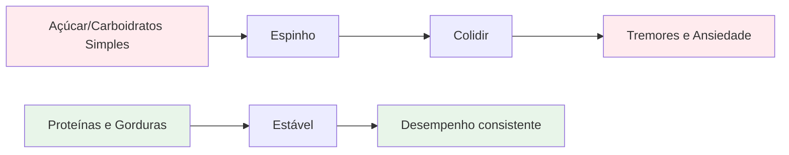
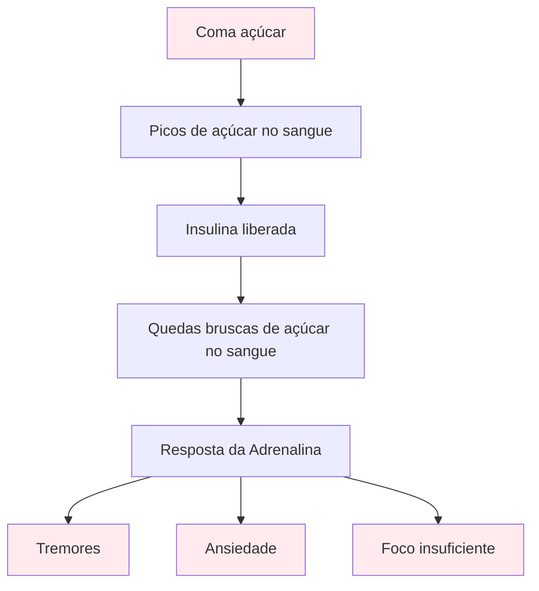

# Alimentação e Nutrição

## Abastecendo o Desempenho de Precisão

A petanca é um esporte de precisão. Seu cérebro é sua ferramenta mais importante – alimente-o com combustível estável, não com energia instável.

::: tip O princípio fundamental
**Níveis estáveis de açúcar no sangue = Concentração apurada + Mãos firmes**

Evite picos de açúcar. Priorize proteínas e gorduras saudáveis. Mantenha-se hidratado.
:::

## Princípios-chave

### Níveis estáveis de açúcar no sangue são fundamentais.

::: warning Impacto da queda de açúcar no sangue
O açúcar e os carboidratos simples causam picos e quedas de glicose no sangue, o que impacta diretamente:
- ❌ Foco e clareza mental
- ❌ Mãos firmes (tremores devido à queda de açúcar no sangue)
- ❌ Capacidade de tomada de decisões
- ❌ Estabilidade emocional e compostura
:::

### Priorize proteínas e gorduras saudáveis.

::: tip Os melhores alimentos para precisão
Gorduras e proteínas fornecem energia sustentada sem quedas bruscas de energia:
- ✅ Nozes, abacate, azeite, ovos, queijo
- ✅ Digestão lenta = energia constante durante todo o dia
- ✅ Sem queda de rendimento à tarde durante torneios longos
:::

### Evite a armadilha do açúcar

::: danger Alimentos a evitar
Tenha especial cuidado com:
- ❌ Barras e bebidas &quot;energéticas&quot; (geralmente com alto teor de açúcar)
- ❌ Sucos de frutas e smoothies (açúcar concentrado)
- ❌ Pão branco, doces, salgadinhos de máquina de venda automática
:::

## Guia rápido para o dia da competição

| Tempo | O que comer | Por que |
|--------|-------------|-----|
| **2 a 3 horas antes** | Refeição equilibrada: proteína, gordura, vegetais | Energia estável sem causar sonolência. |
| **Durante a competição** | Água + pequenos lanches proteicos (nozes, queijo, carne seca) | Mantenha o foco e as mãos firmes. |
| **Evite o dia todo** | Lanches e bebidas açucaradas | Prevenir colisões e tremores |

::: tip Lanches rápidos para competição
**Traga estes itens:**
- Mix de frutos secos (sem sal)
- Ovos cozidos
- Cubos de queijo
- Carne seca de boi ou de peru
- Legumes com húmus

**Deixe estes itens em casa:**
- Doces e chocolate
- Bebidas energéticas
- Pastéis
- Suco de frutas
:::

## A Ciência

::: info Por que isso é importante para a petanca?
Ao contrário dos esportes de resistência, a petanca requer:
- **Precisão** - Mãos firmes, sem tremores
- **Clareza mental** - Capacidade de tomar decisões assertivas durante todo o dia.
- **Nervos calmos** - Baixa ansiedade sob pressão

Energia à base de açúcar contraria todos esses objetivos.
:::

## Saber mais

Para estratégias nutricionais detalhadas, protocolos para o dia da competição e a ciência por trás da energia estável:

::: tip Guia completo de nutrição
→ **[Nutrição para Desempenho de Precisão](/en/education/nutrition/)** - Guia completo em nossa seção de Educação

Inclui:
- Planejamento detalhado de refeições
- Protocolos do dia da competição
- A opção com baixo teor de carboidratos para atletas de precisão.
- Estratégias de hidratação
- Alimentos que ajudam versus alimentos que prejudicam
:::

