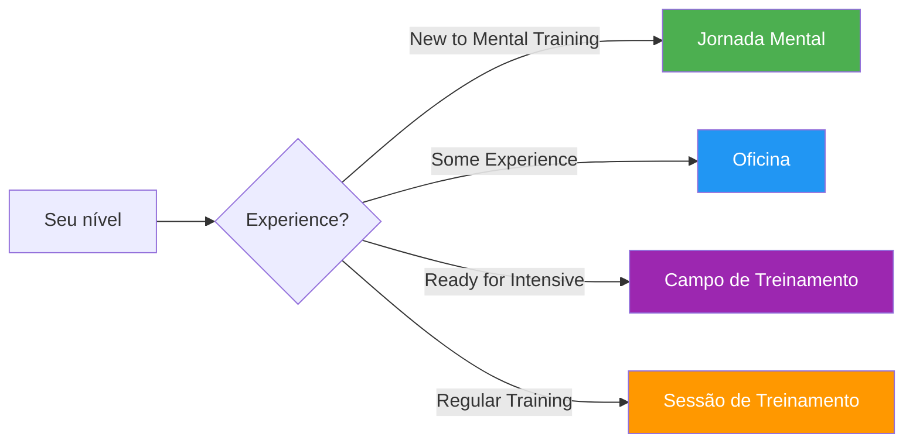

# Guias e ferramentas

Recursos práticos para jogadores, treinadores e clubes implementarem programas estruturados de treinamento mental.

## Escolha o seu formato

## Formatos de guia

### 🌱 [Jornada Mental](/en/guides/mental-journey/)
**Para Iniciantes** — Introdução de 2 a 3 horas

Ideal para jogadores iniciantes no treinamento mental. Uma introdução suave aos conceitos básicos com exercícios práticos.

- Duração: 2 a 3 horas
- Tamanho do grupo: 4 a 12 jogadores
- Materiais: Fornecidos
- [Ver guia →](/en/guides/mental-journey/)

---

### 🎯 [Workshop](/en/guides/workshop/)
**Para nível intermediário** — Imersão de 3 a 4 horas

Formato de workshop estruturado para clubes e equipes que desejam explorar o treinamento mental de forma mais aprofundada.

- Duração: 3-4 horas
- Tamanho do grupo: 6-8 jogadores
- Inclui: Guia do coordenador + materiais para download
- [Ver guia →](/en/guides/workshop/)

---

### 🏕️ [Campo de Treinamento](/en/guides/training-camp/)
**Para Equipes Comprometidas** — Curso intensivo de fim de semana

Programa completo de fim de semana que combina teoria, prática e competição. Ideal para equipes que se preparam para torneios importantes.

- Duração: 2 a 3 dias
- Tamanho do grupo: 10-20 jogadores
- Inclui: Programa completo + materiais de organização
- [Ver guia →](/en/guides/training-camp/)

---

### 🔄 [Sessão de Treinamento](/en/guides/training-session/)
**Para prática regular** — sessões estruturadas de 2 a 4 horas

Estrutura para sessões de treinamento regulares que incorporam habilidades mentais juntamente com a prática técnica.

- Duração: 2 a 4 horas
- Tamanho do grupo: 4 jogadores (uma equipe)
- Foco: Simulação de competição com reflexão
- [Ver guia →](/en/guides/training-session/)

---

## Modelos e ferramentas

Modelos para download que auxiliarão no seu desenvolvimento:

### 📋 [Modelo de Meta](/en/guides/templates/goal-template)
Planilha estruturada para definir e acompanhar suas metas na petanca usando a metodologia SMART.

### 📓 [Modelo de Diário](/en/guides/templates/diary-template)
Modelo de diário de treinos e competições para acompanhar o progresso, as percepções e as áreas de melhoria.

---

## Qual formato é o ideal para você?

| Formatar | Ideal para | Compromisso de tempo | Profundidade |
|--------|----------|-----------------|-------|
| **Jornada Mental** | Primeira introdução | 2 a 3 horas | ⭐ |
| **Oficina** | Dias de treino do clube | 3-4 horas | ⭐⭐ |
| **Campo de Treinamento** | Preparação da equipe | Fim de semana | ⭐⭐⭐ |
| **Sessão de Treinamento** | Desenvolvimento em andamento | Regular 2-4h | ⭐⭐ |

::: tip Para treinadores e líderes de clubes
Cada guia inclui materiais tanto para participantes quanto para facilitadores/organizadores. Procure as seções &quot;Para Coordenadores&quot; com PDFs para download e slides de apresentação.
:::

## Recursos relacionados

- [🎯 Avaliação](/en/assessment/) — Avalie seus 8 fatores e encontre prioridades
- [📚 Centro de Educação](/en/education/) — Análise detalhada dos 8 fatores de desempenho
- [📝 Artigos](/en/articles/) — Pesquisa e insights

