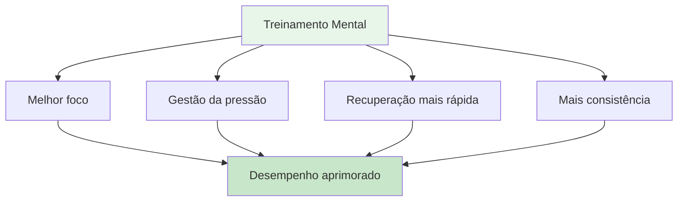

# Jornada Mental para Iniciantes

## Bem-vindo à sua jornada de jogo mental.

Seja você um jogador buscando aprimorar seu jogo mental ou um treinador querendo introduzir o treinamento mental em sua equipe, este guia o ajudará a dar os primeiros passos no mundo da psicologia esportiva aplicada à petanca.

::: tip Para quem é isto?
- **Jogadores** que desejam compreender o jogo mental
- **Técnicos** introduzindo treinamento mental em suas equipes
- **Clubes** que organizam workshops de jogos mentais
- **Alguém** tem curiosidade sobre a psicologia da petanca?
:::

## Acesso rápido

| Recurso | Propósito | Acesso |
|----------|---------|--------|
| **Começando** | Introdução aos conceitos de jogos mentais | [Leia abaixo](#porque-o-treinamento-mental-é-importante) |
| **Guia da Sessão** | Guia completo para facilitadores de workshops de 2 a 3 horas. | [Ver guia](/pt/guides/mental-journey/session-guide) |
| **Materiais** | Guias para participantes, slides e folhas de exercícios. | [Ver Materiais](/pt/guides/mental-journey/materials) |
| **Guias relacionados** | Formatos avançados | [Workshop](/pt/guides/workshop/) • [Campo de Treinamento](/pt/guides/training-camp/) |

## Por que o treinamento mental é importante

Em todos os níveis da petanca, sua mente influencia seu desempenho. Mas a maioria dos jogadores se concentra 90% na técnica e apenas 10% nas habilidades mentais. Este guia ajuda você a começar a equilibrar essa equação.

## O que você aprenderá

### Para jogadores

**Conceitos básicos:**
1. **A Zona** - Compreendendo os estados de fluxo e como acessá-los.
2. **O Crítico Interior** - Reconhecendo e gerenciando a autocrítica negativa
3. **Resposta à Pressão** - Por que você joga de forma diferente em competições
4. **A Mudança** - Da reflexão à ação

**Habilidades práticas:**
- rotina simples antes da foto
- Técnica de reinicialização de 3 respirações
- Protocolo de recuperação de erros
- Âncoras de foco para competição

### Para treinadores/guias

**Como facilitar:**
1. Criar segurança psicológica
2. Liderar discussões em grupo
3. Conectando a teoria à prática.
4. Gerenciar diferentes personalidades

**Estrutura da sessão:**
- Formato de workshop de 2 a 3 horas
- Sugestões e exercícios para discussão
- Materiais para download
- Atividades de acompanhamento

## Começando

### Opção 1: Estudo individual (para jogadores)

**Semana 1: Entendendo o básico**
1. Leia o módulo [The Zone](/pt/education/mental-game/the-zone/)
2. Experimente a técnica de reinicialização de 3 respirações.
3. Preste atenção quando você estiver no &quot;modo técnico&quot; em vez do &quot;modo fluxo&quot;.

**Semana 2: Desenvolvendo a Conscientização**
1. Leia o módulo [Força Mental](/pt/education/mental-game/mental-strength/)
2. Identifique seus padrões de autocrítica.
3. Pratique a observação neutra após cometer erros.

**Semana 3: Criando Estrutura**
1. Leia o módulo [Mindfulness](/pt/education/mental-game/mindfulness/)
2. Comece com uma prática diária de 5 minutos.
3. Desenvolva uma rotina simples antes da foto.

**Semana 4: Integração**
1. Use sua rotina na prática.
2. Acompanhe o desempenho mental no [Modelo de Diário](/pt/guides/templates/diary-template)
3. Defina metas de jogo mental usando o [Modelo de Meta](/pt/guides/templates/goal-template)

### Opção 2: Workshop em grupo (para treinadores)

**Realizar uma sessão de 2 a 3 horas:**

Utilize nosso [Guia de Sessão](/pt/guides/mental-journey/session-guide) completo, que inclui:
- Estrutura completa da sessão
- Sugestões para discussão
- Exercícios em grupo
- Materiais para download

**O que você vai precisar:**
- 6 a 12 participantes
- Sala tranquila com assentos em círculo.
- Quadro branco ou flipchart
- Tela ou projetor para compartilhar materiais
- 2 a 3 horas de tempo ininterrupto

## Os três pilares do treinamento mental

### 1. Conscientização
**O que é:** Observar seus pensamentos, sentimentos e padrões.

**Por que isso importa:** Você não pode mudar o que não percebe.

**Como desenvolver:**
- Prática diária de mindfulness (5 a 10 minutos)
- Reflexão pós-jogo
- Manter um diário de treinamento

### 2. Aceitação
**O que é:** Permitir que pensamentos e sentimentos existam sem julgamento.

**Por que isso importa:** Lutar contra sua experiência interna cria tensão.

**Como desenvolver:**
- prática de observação neutra
- Trabalho entre o treinador interior e o crítico interior
- Abandonar o perfeccionismo

### 3. Ação
**O que é:** Escolher respostas úteis apesar de pensamentos difíceis

**Por que isso é importante:** O treinamento mental consiste em ter um bom desempenho apesar do nervosismo.

**Como desenvolver:**
- Rotinas pré-filmagem
- Redefinir protocolos
- Simulação de pressão no treinamento

## Perguntas frequentes

### &quot;Não sou bom o suficiente para me preocupar com treinamento mental&quot;
O treinamento mental é benéfico em todos os níveis. Aliás, começar cedo ajuda a criar hábitos melhores. Você não precisa ser um gênio para se beneficiar do conhecimento sobre a sua mente.

### &quot;Isso não seria simplesmente &#39;pensar positivo&#39;?&quot;
Não. O treinamento mental consiste em ter um bom desempenho apesar dos pensamentos negativos, não em eliminá-los. Trata-se de habilidades práticas, não de pensamento positivo.

### &quot;Quanto tempo leva para ver os resultados?&quot;
Algumas técnicas (como o reset de 3 respirações) funcionam imediatamente. Mudanças mais profundas (como estados de fluxo consistentes) levam de 2 a 3 meses de prática.

### &quot;Preciso de um psicólogo esportivo?&quot;
Não necessariamente. Este guia fornece ferramentas práticas que você pode usar imediatamente. A ajuda profissional é valiosa para questões mais complexas, mas a maioria dos jogadores consegue começar por conta própria.

### &quot;Isso vai melhorar minha técnica?&quot;
O treinamento mental não substitui a prática técnica. Mas ajuda você a acessar sua técnica de forma consistente, especialmente sob pressão.

## Recursos disponíveis

### Para jogadores
- [Módulos de Educação](/pt/education/) - 8 guias abrangentes
- [Modelo de Meta](/pt/guides/templates/goal-template) - Estruture seu desenvolvimento
- [Modelo de Diário](/pt/guides/templates/diary-template) - Acompanhe seu progresso
- [Estudos de Caso](/pt/articles/case-studies) - Exemplos reais

### Para treinadores/guias
- [Guia da Sessão](/pt/guides/mental-journey/session-guide) - Workshop completo de 2 a 3 horas
- [Materiais para o Facilitador](/pt/guides/mental-journey/materials) - Guias e slides digitais
- [Guia do Workshop](/pt/guides/workshop/) - Formato avançado de 3 a 4 horas
- [Guia do Campo de Treinamento](/pt/guides/training-camp/) - Programa de fim de semana

## Próximos passos

### Para jogadores individuais
1. **Comece com a consciência** - Leia [O Jogo da Zona](/pt/education/mental-game/the-zone/)
2. **Experimente uma técnica** - Use o reset de 3 respirações esta semana.
3. **Acompanhe sua experiência** - Observe as mudanças
4. **Aumente gradualmente** - Adicione uma nova habilidade por semana

### Para treinadores/grupos
1. **Consulte o Guia da Sessão** - Compreenda a estrutura
2. **Baixe os materiais** - Obtenha apostilas e slides
3. **Agende uma sessão** - Reserve de 2 a 3 horas
4. **Prepare-se** - Leia as notas do facilitador
5. **Realize o workshop** - Siga o guia

## Apoiar

**Dúvidas sobre como começar?**
- E-mail: [patrik.wiik@gmail.com](mailto:patrik.wiik@gmail.com)
- Consulte os [Estudos de Caso](/pt/articles/case-studies) para ver exemplos.
- Participe das discussões em seu clube.

---

::: tip Pronto para começar?
**Jogadores:** Comecem com o módulo [The Zone](/pt/education/mental-game/the-zone/)

**Treinadores:** Acessem o [Guia da Sessão](/pt/guides/mental-journey/session-guide)

**Baixe os materiais:** Visite [Materiais do facilitador](/pt/guides/mental-journey/materials)
:::

