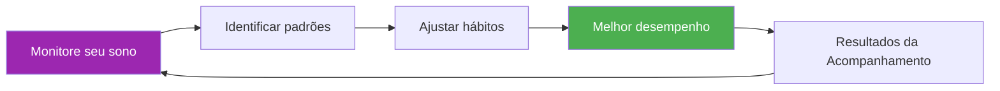

# Modelo de rastreador de sono

> &quot;O jogador que dormiu melhor costuma vencer.&quot;

Monitore seus padrões de sono e correlacione-os com o desempenho para otimizar a recuperação.

::: tip Por que monitorar o sono?
**O sono é a principal ferramenta de recuperação.** Atletas de elite que monitoram o sono regularmente relatam mais energia, tempos de reação mais rápidos e melhor tomada de decisões sob pressão.
:::

---

## Entrada diária rápida

### Copie isto para cada dia

---

**Data:** ________

| **Hora de dormir:** ________ | **Horário de despertar:** ________ |
**Total de horas de sono:** ________ horas

**Qualidade do sono (1-10):** _____

**Fatores que afetam o sono:**
- [ ] Cafeína depois das 14h
- [ ] Álcool
- [ ] Tempo de tela antes de dormir
- [ ] Estresse/preocupação
- [ ] Perturbação sonora/luminosa
- [ ] problemas de temperatura
- [ ] Refeição tardia
- [ ] Outro: ________

**Energia matinal (1-10):** _____

**Observações:**

---

## Resumo semanal do sono

### Copie isto todas as semanas.

---

**Semana de:** ________

| Dia | Hora de dormir | Acordar | Horas | Qualidade | Energia | Notas |
|-----|---------|------|-------|---------|--------|-------|
| seg | /10 | /10 |
| ter | /10 | /10 |
| qua | /10 | /10 |
| qui | /10 | /10 |
| sex | /10 | /10 |
| Sentado | /10 | /10 |
| Sol | /10 | /10 |

| **Média semanal:** _____ horas | Qualidade: _____/10 | Energia: _____/10 |

**Melhor noite:** ________ Por quê? ________

**Pior noite:** ________ Por quê? ________

**Padrão observado:**

---

## Protocolo de sono pré-competição

### 3 dias antes da competição

| Noite | Hora de dormir da Target | Real | Horas | Qualidade | Notas |
|-------|----------------|--------|-------|---------|-------|
| -3 dias |
| -2 dias |
| -1 dia |

**Nível de energia no dia da competição (1-10):** _____

**Correlação de desempenho:**
- O sono afetou meu desempenho? Sim / Não / Talvez
- Como?

---

## Lista de verificação do ambiente de sono

Avalie seu ambiente de sono:

| Fator | Pontuação (1-10) | É preciso fazer melhorias? |
|--------|--------------|---------------------|
| **Escuridão** |
| **Temperatura** (16-19°C ideal) |
| **Nível de ruído** |
| **Conforto do colchão** |
| **Suporte para travesseiro** |
| **Qualidade do ar** |
| **Telefone fora do quarto** |

---

## Hábitos de higiene do sono

Acompanhe os hábitos que você está seguindo:

### Rotina noturna (2 horas antes de dormir)

- [ ] Sem cafeína após as 14h.
- [ ] Sem álcool (ou limite-se a 1 bebida, 3 horas ou mais antes de dormir)
- [ ] Jantar leve, não muito tarde.
- [ ] Luzes fracas em casa
- [ ] Sem exercícios intensos
- [ ] Toque de recolher (1 hora antes de dormir)
- [ ] Atividade de relaxamento (leitura, alongamento, respiração)

### Regras do quarto

- [ ] Temperatura ambiente 16-19°C
- [ ] Escuridão total (ou máscara de dormir)
- [ ] Telefone no silencioso, com a tela virada para baixo (ou fora do cômodo).
- [ ] Horário de dormir consistente (±30 min)
- [ ] Cama apenas para dormir (não para trabalhar/navegar na internet)

**Hábitos seguidos esta semana:** _____/12

---

## Correlação entre sono e desempenho

Acompanhe durante 4 semanas para identificar padrões:

| Semana | Sono médio | Qualidade média | Desempenho no treinamento | Resultado da competição |
|------|-----------|-------------|---------------------|-------------------|
| 1 | horas | /10 | /10 |
| 2 | horas | /10 | /10 |
| 3 | horas | /10 | /10 |
| 4 | horas | /10 | /10 |

**Correlação descoberta:**

---

## Protocolo de sono para viagens

Para competições fora de casa:

**Antes da viagem:**
- [ ] Ajuste o horário de dormir em 30 minutos mais cedo ou mais tarde, de acordo com o seu fuso horário.
- [ ] Leve itens essenciais para dormir (máscara, tampões de ouvido, travesseiro)
- [ ] Reserve um quarto silencioso (longe do elevador/rua).

**No destino:**
- [ ] Ajuste a temperatura do quarto imediatamente.
- [ ] Bloquear fontes de luz
- [ ] Mantenha a rotina da hora de dormir em casa.
- [ ] Evite cochilos por mais de 20 minutos após a viagem.

**Anotações para a próxima viagem:**

---

---

## Vitória Rápida: Comece Hoje à Noite

::: info O Desafio de 3 Dias
Monitore seu sono por apenas 3 dias. É provável que você descubra um padrão que desconhecia.
:::

1. **Hoje à noite** — Anote seu horário de dormir e quaisquer fatores.
2. **Amanhã de manhã** — Avalie a qualidade e a energia imediatamente
3. **Repita por 3 dias** — Procure por padrões

---

## Recursos relacionados

- [Educação sobre Sono e Recuperação](/en/education/sleep/) — A ciência por trás do sono
- [Lista de verificação para competição](/en/guides/templates/pre-competition-checklist) — Guia completo de preparação
- [Diário de Treinamento](/en/guides/templates/diary-template) — Registre todos os aspectos do treinamento

